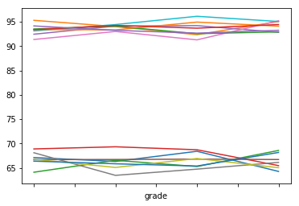
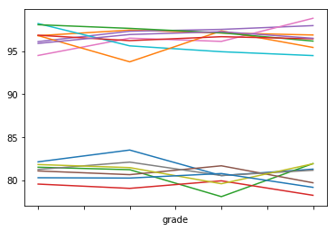

## Py City Schools - Final Data Analysis
#### By: Mike Suomi 6/6/2018

- Observed Trend 1: From the data, it is impossible to determine whether the type of school (Charter vs District), the size of school, or some combination of both factors is most critical for student passing data because of how the data overlaps.  Small and Medium schools have an approximately 95% pass rate, wherease Large schools have an approximately 74% pass rate, which is substantially lower.  However, every single Small and Medium school is a Charter school and every single Large school is a District school.  So, with the dataset we have, it is impossible to tease out which of those variables may have the most important influence on passing rate.


- Observed Trend 2: School spending per student trends appear to indicate an inverse relationship between student spending and passing rate (meaning the more schools spend per student, the lower their test scores).  However, yet again, as indicated from the first observation these results are so tied into Charter/District schools, which also ties in school size.  The two lowest spending categories are all Charter schools (which are also small/medium schools). Do we really think that the if we reduced per student spending on the District schools that we would magically increase test scores? - No, of course not.  However, based on student test results, it may be more equitable to give Charter schools a higher per student budget that matches District school levels since they are getting some of the best test scores for our School System.


- Observed Trend 3: In each school, there is no real trend for %passsing or score by grade level.  In each school they stay relatively consistent for each grade level.  This is actually a positive thing because typically around the country there is a trend of the % passing decreasing as students get in higher grade levels, so the fact it is staying relatively constant actually bucks that bigger trend.


```python
import pandas as pd
import numpy as np
```


```python
#could change to an input variable for future files to run, but hard code for now
school_file_name = 'schools_complete.csv' #input('What is the name of the school file? (make sure it is saved to raw_data folder)\n')
student_file_name = 'students_complete.csv' #input('What is the name of the student file? (make sure it is saved to raw_data folder)\n')

school_data_path = 'raw_data\\' + school_file_name
student_data_path = 'raw_data\\' + student_file_name

df_school = pd.read_csv(school_data_path)
df_student = pd.read_csv(student_data_path)
```


```python
df_school.rename(columns={'name':'school'}, inplace=True)

df = pd.merge(df_school, df_student, how='inner', on='school')
```

### District Summary


```python
total_schools = len(df.school.unique())
total_students = len(df['Student ID'].unique())
total_budget = df_school.budget.sum()
average_math_score = df.math_score.mean()
average_reading_score = df.reading_score.mean()

#create pass/fail column for both math and reading in df
#assuming a 70% is passing
df['math_pass'] = df.math_score.map(lambda x: 'pass' if x >= 70 else 'fail')
df['reading_pass'] = df.reading_score.map(lambda x: 'pass' if x >= 70 else 'fail')

percent_math_pass = df.math_pass.value_counts()['pass'] / total_students * 100
percent_reading_pass = df.reading_pass.value_counts()['pass'] / total_students * 100
percent_pass_average = np.mean([percent_math_pass, percent_reading_pass])
```


```python
#create dataframe with a tuple of row values and column labels list so df ordered how we want
district_summ_col_labels = ['Total Schools',
                            'Total Students',
                            'Total Budget',
                            'Average Math Score',
                            'Average Reading Score',
                            '% Passing Math',
                            '% Passing Reading',
                            '% Overall Passing Rate']

#the formatting is embedded on entry - this does change them to string values
district_summ_values = [(total_schools,
                       '{:,}'.format(total_students),
                       '${:,}'.format(total_budget),
                       '{:.1f}'.format(average_math_score),
                       '{:.1f}'.format(average_reading_score),
                       '{:.2f}%'.format(percent_math_pass),
                       '{:.2f}%'.format(percent_reading_pass),
                       '{:.2f}%'.format(percent_pass_average))]

df_district_summ = pd.DataFrame(data=district_summ_values,
                                columns=district_summ_col_labels)

df_district_summ
```


<div>
<style scoped>
    .dataframe tbody tr th:only-of-type {
        vertical-align: middle;
    }

    .dataframe tbody tr th {
        vertical-align: top;
    }

    .dataframe thead th {
        text-align: right;
    }
</style>
<table border="1" class="dataframe">
  <thead>
    <tr style="text-align: right;">
      <th></th>
      <th>Total Schools</th>
      <th>Total Students</th>
      <th>Total Budget</th>
      <th>Average Math Score</th>
      <th>Average Reading Score</th>
      <th>% Passing Math</th>
      <th>% Passing Reading</th>
      <th>% Overall Passing Rate</th>
    </tr>
  </thead>
  <tbody>
    <tr>
      <th>0</th>
      <td>15</td>
      <td>39,170</td>
      <td>$24,649,428</td>
      <td>79.0</td>
      <td>81.9</td>
      <td>74.98%</td>
      <td>85.81%</td>
      <td>80.39%</td>
    </tr>
  </tbody>
</table>
</div>


### School Summary


```python
#can put groupby methods in quotes to reference them
df_school_summ = df.groupby('school').agg({'type': 'first', #School Type
                         'size': 'first', #Total Students 
                         'budget': 'first', #Total School Budget
                         #'', #Per Student Budget
                         'math_score': 'mean', #Average Math Score
                         'reading_score': 'mean' #Average Reading Score
                         #'', #% Passing Math
                         #'', #%Passing Reading 
                         #'', #Overall Passing Rate (avg of two) 
                         }).rename(columns={'type': 'School Type',
                                    'size': 'Total Students',
                                    'budget': 'Total School Budget',
                                    'math_score': 'Average Math Score',
                                    'reading_score': 'Average Reading Score'})

#df.insert(loc=idx, column='A', value=new_col)
df_school_summ.insert(loc=3, column='Per Student Budget', 
                      value= df_school_summ['Total School Budget'] / df_school_summ['Total Students'])
```


```python
#for math and reading pass rate, first groupby school, then just get the column for pass/fail
#then use value_counts and set normalize = True so that gets percent value
#make sure to set sort=False for value_counts so always arranges alphabetically fail then pass for each school grouping
#the output is fail and pass score for each school, we only want pass rate so from this series
#select only every other value (starting on the 1st index) to then insert into the df_school_summ columns
#multiply by 100 to get it to common percentage viewing form
math_pass_grp = df.groupby('school')['math_pass']
math_pass_school = math_pass_grp.value_counts(sort=False, normalize=True)[1::2] * 100
#print(math_pass_school) #temporary check
df_school_summ['% Passing Math'] = list(math_pass_school)

reading_pass_grp = df.groupby('school')['reading_pass']
reading_pass_school = reading_pass_grp.value_counts(sort=False, normalize=True)[1::2] * 100
#print(reading_pass_school) #temporary check
df_school_summ['% Passing Reading'] = list(reading_pass_school)

df_school_summ['% Overall Passing Rate'] = df_school_summ[['% Passing Math', '% Passing Reading']].mean(axis=1)
```


```python
##dataframe formatting for output

##temporarily format the style of the whole data table, so can use the numbers later
df_school_summ.style.format({'Total Students': '{:,}'.format,
                              'Total School Budget': '${:,}'.format,
                              'Per Student Budget': '${:.2f}'.format,
                              'Average Math Score': '{:.1f}'.format,
                              'Average Reading Score': '{:.1f}'.format,
                              '% Passing Math': '{:.2f}%'.format,
                              '% Passing Reading': '{:.2f}%'.format,
                              '% Overall Passing Rate': '{:.2f}%'.format,})
```


<style  type="text/css" >
</style>  
<table id="T_1faba562_68d3_11e8_965b_809dfe0d35e7" > 
<thead>    <tr> 
        <th class="blank level0" ></th> 
        <th class="col_heading level0 col0" >School Type</th> 
        <th class="col_heading level0 col1" >Total Students</th> 
        <th class="col_heading level0 col2" >Total School Budget</th> 
        <th class="col_heading level0 col3" >Per Student Budget</th> 
        <th class="col_heading level0 col4" >Average Math Score</th> 
        <th class="col_heading level0 col5" >Average Reading Score</th> 
        <th class="col_heading level0 col6" >% Passing Math</th> 
        <th class="col_heading level0 col7" >% Passing Reading</th> 
        <th class="col_heading level0 col8" >% Overall Passing Rate</th> 
    </tr>    <tr> 
        <th class="index_name level0" >school</th> 
        <th class="blank" ></th> 
        <th class="blank" ></th> 
        <th class="blank" ></th> 
        <th class="blank" ></th> 
        <th class="blank" ></th> 
        <th class="blank" ></th> 
        <th class="blank" ></th> 
        <th class="blank" ></th> 
        <th class="blank" ></th> 
    </tr></thead> 
<tbody>    <tr> 
        <th id="T_1faba562_68d3_11e8_965b_809dfe0d35e7level0_row0" class="row_heading level0 row0" >Bailey High School</th> 
        <td id="T_1faba562_68d3_11e8_965b_809dfe0d35e7row0_col0" class="data row0 col0" >District</td> 
        <td id="T_1faba562_68d3_11e8_965b_809dfe0d35e7row0_col1" class="data row0 col1" >4,976</td> 
        <td id="T_1faba562_68d3_11e8_965b_809dfe0d35e7row0_col2" class="data row0 col2" >$3,124,928</td> 
        <td id="T_1faba562_68d3_11e8_965b_809dfe0d35e7row0_col3" class="data row0 col3" >$628.00</td> 
        <td id="T_1faba562_68d3_11e8_965b_809dfe0d35e7row0_col4" class="data row0 col4" >77.0</td> 
        <td id="T_1faba562_68d3_11e8_965b_809dfe0d35e7row0_col5" class="data row0 col5" >81.0</td> 
        <td id="T_1faba562_68d3_11e8_965b_809dfe0d35e7row0_col6" class="data row0 col6" >66.68%</td> 
        <td id="T_1faba562_68d3_11e8_965b_809dfe0d35e7row0_col7" class="data row0 col7" >81.93%</td> 
        <td id="T_1faba562_68d3_11e8_965b_809dfe0d35e7row0_col8" class="data row0 col8" >74.31%</td> 
    </tr>    <tr> 
        <th id="T_1faba562_68d3_11e8_965b_809dfe0d35e7level0_row1" class="row_heading level0 row1" >Cabrera High School</th> 
        <td id="T_1faba562_68d3_11e8_965b_809dfe0d35e7row1_col0" class="data row1 col0" >Charter</td> 
        <td id="T_1faba562_68d3_11e8_965b_809dfe0d35e7row1_col1" class="data row1 col1" >1,858</td> 
        <td id="T_1faba562_68d3_11e8_965b_809dfe0d35e7row1_col2" class="data row1 col2" >$1,081,356</td> 
        <td id="T_1faba562_68d3_11e8_965b_809dfe0d35e7row1_col3" class="data row1 col3" >$582.00</td> 
        <td id="T_1faba562_68d3_11e8_965b_809dfe0d35e7row1_col4" class="data row1 col4" >83.1</td> 
        <td id="T_1faba562_68d3_11e8_965b_809dfe0d35e7row1_col5" class="data row1 col5" >84.0</td> 
        <td id="T_1faba562_68d3_11e8_965b_809dfe0d35e7row1_col6" class="data row1 col6" >94.13%</td> 
        <td id="T_1faba562_68d3_11e8_965b_809dfe0d35e7row1_col7" class="data row1 col7" >97.04%</td> 
        <td id="T_1faba562_68d3_11e8_965b_809dfe0d35e7row1_col8" class="data row1 col8" >95.59%</td> 
    </tr>    <tr> 
        <th id="T_1faba562_68d3_11e8_965b_809dfe0d35e7level0_row2" class="row_heading level0 row2" >Figueroa High School</th> 
        <td id="T_1faba562_68d3_11e8_965b_809dfe0d35e7row2_col0" class="data row2 col0" >District</td> 
        <td id="T_1faba562_68d3_11e8_965b_809dfe0d35e7row2_col1" class="data row2 col1" >2,949</td> 
        <td id="T_1faba562_68d3_11e8_965b_809dfe0d35e7row2_col2" class="data row2 col2" >$1,884,411</td> 
        <td id="T_1faba562_68d3_11e8_965b_809dfe0d35e7row2_col3" class="data row2 col3" >$639.00</td> 
        <td id="T_1faba562_68d3_11e8_965b_809dfe0d35e7row2_col4" class="data row2 col4" >76.7</td> 
        <td id="T_1faba562_68d3_11e8_965b_809dfe0d35e7row2_col5" class="data row2 col5" >81.2</td> 
        <td id="T_1faba562_68d3_11e8_965b_809dfe0d35e7row2_col6" class="data row2 col6" >65.99%</td> 
        <td id="T_1faba562_68d3_11e8_965b_809dfe0d35e7row2_col7" class="data row2 col7" >80.74%</td> 
        <td id="T_1faba562_68d3_11e8_965b_809dfe0d35e7row2_col8" class="data row2 col8" >73.36%</td> 
    </tr>    <tr> 
        <th id="T_1faba562_68d3_11e8_965b_809dfe0d35e7level0_row3" class="row_heading level0 row3" >Ford High School</th> 
        <td id="T_1faba562_68d3_11e8_965b_809dfe0d35e7row3_col0" class="data row3 col0" >District</td> 
        <td id="T_1faba562_68d3_11e8_965b_809dfe0d35e7row3_col1" class="data row3 col1" >2,739</td> 
        <td id="T_1faba562_68d3_11e8_965b_809dfe0d35e7row3_col2" class="data row3 col2" >$1,763,916</td> 
        <td id="T_1faba562_68d3_11e8_965b_809dfe0d35e7row3_col3" class="data row3 col3" >$644.00</td> 
        <td id="T_1faba562_68d3_11e8_965b_809dfe0d35e7row3_col4" class="data row3 col4" >77.1</td> 
        <td id="T_1faba562_68d3_11e8_965b_809dfe0d35e7row3_col5" class="data row3 col5" >80.7</td> 
        <td id="T_1faba562_68d3_11e8_965b_809dfe0d35e7row3_col6" class="data row3 col6" >68.31%</td> 
        <td id="T_1faba562_68d3_11e8_965b_809dfe0d35e7row3_col7" class="data row3 col7" >79.30%</td> 
        <td id="T_1faba562_68d3_11e8_965b_809dfe0d35e7row3_col8" class="data row3 col8" >73.80%</td> 
    </tr>    <tr> 
        <th id="T_1faba562_68d3_11e8_965b_809dfe0d35e7level0_row4" class="row_heading level0 row4" >Griffin High School</th> 
        <td id="T_1faba562_68d3_11e8_965b_809dfe0d35e7row4_col0" class="data row4 col0" >Charter</td> 
        <td id="T_1faba562_68d3_11e8_965b_809dfe0d35e7row4_col1" class="data row4 col1" >1,468</td> 
        <td id="T_1faba562_68d3_11e8_965b_809dfe0d35e7row4_col2" class="data row4 col2" >$917,500</td> 
        <td id="T_1faba562_68d3_11e8_965b_809dfe0d35e7row4_col3" class="data row4 col3" >$625.00</td> 
        <td id="T_1faba562_68d3_11e8_965b_809dfe0d35e7row4_col4" class="data row4 col4" >83.4</td> 
        <td id="T_1faba562_68d3_11e8_965b_809dfe0d35e7row4_col5" class="data row4 col5" >83.8</td> 
        <td id="T_1faba562_68d3_11e8_965b_809dfe0d35e7row4_col6" class="data row4 col6" >93.39%</td> 
        <td id="T_1faba562_68d3_11e8_965b_809dfe0d35e7row4_col7" class="data row4 col7" >97.14%</td> 
        <td id="T_1faba562_68d3_11e8_965b_809dfe0d35e7row4_col8" class="data row4 col8" >95.27%</td> 
    </tr>    <tr> 
        <th id="T_1faba562_68d3_11e8_965b_809dfe0d35e7level0_row5" class="row_heading level0 row5" >Hernandez High School</th> 
        <td id="T_1faba562_68d3_11e8_965b_809dfe0d35e7row5_col0" class="data row5 col0" >District</td> 
        <td id="T_1faba562_68d3_11e8_965b_809dfe0d35e7row5_col1" class="data row5 col1" >4,635</td> 
        <td id="T_1faba562_68d3_11e8_965b_809dfe0d35e7row5_col2" class="data row5 col2" >$3,022,020</td> 
        <td id="T_1faba562_68d3_11e8_965b_809dfe0d35e7row5_col3" class="data row5 col3" >$652.00</td> 
        <td id="T_1faba562_68d3_11e8_965b_809dfe0d35e7row5_col4" class="data row5 col4" >77.3</td> 
        <td id="T_1faba562_68d3_11e8_965b_809dfe0d35e7row5_col5" class="data row5 col5" >80.9</td> 
        <td id="T_1faba562_68d3_11e8_965b_809dfe0d35e7row5_col6" class="data row5 col6" >66.75%</td> 
        <td id="T_1faba562_68d3_11e8_965b_809dfe0d35e7row5_col7" class="data row5 col7" >80.86%</td> 
        <td id="T_1faba562_68d3_11e8_965b_809dfe0d35e7row5_col8" class="data row5 col8" >73.81%</td> 
    </tr>    <tr> 
        <th id="T_1faba562_68d3_11e8_965b_809dfe0d35e7level0_row6" class="row_heading level0 row6" >Holden High School</th> 
        <td id="T_1faba562_68d3_11e8_965b_809dfe0d35e7row6_col0" class="data row6 col0" >Charter</td> 
        <td id="T_1faba562_68d3_11e8_965b_809dfe0d35e7row6_col1" class="data row6 col1" >427</td> 
        <td id="T_1faba562_68d3_11e8_965b_809dfe0d35e7row6_col2" class="data row6 col2" >$248,087</td> 
        <td id="T_1faba562_68d3_11e8_965b_809dfe0d35e7row6_col3" class="data row6 col3" >$581.00</td> 
        <td id="T_1faba562_68d3_11e8_965b_809dfe0d35e7row6_col4" class="data row6 col4" >83.8</td> 
        <td id="T_1faba562_68d3_11e8_965b_809dfe0d35e7row6_col5" class="data row6 col5" >83.8</td> 
        <td id="T_1faba562_68d3_11e8_965b_809dfe0d35e7row6_col6" class="data row6 col6" >92.51%</td> 
        <td id="T_1faba562_68d3_11e8_965b_809dfe0d35e7row6_col7" class="data row6 col7" >96.25%</td> 
        <td id="T_1faba562_68d3_11e8_965b_809dfe0d35e7row6_col8" class="data row6 col8" >94.38%</td> 
    </tr>    <tr> 
        <th id="T_1faba562_68d3_11e8_965b_809dfe0d35e7level0_row7" class="row_heading level0 row7" >Huang High School</th> 
        <td id="T_1faba562_68d3_11e8_965b_809dfe0d35e7row7_col0" class="data row7 col0" >District</td> 
        <td id="T_1faba562_68d3_11e8_965b_809dfe0d35e7row7_col1" class="data row7 col1" >2,917</td> 
        <td id="T_1faba562_68d3_11e8_965b_809dfe0d35e7row7_col2" class="data row7 col2" >$1,910,635</td> 
        <td id="T_1faba562_68d3_11e8_965b_809dfe0d35e7row7_col3" class="data row7 col3" >$655.00</td> 
        <td id="T_1faba562_68d3_11e8_965b_809dfe0d35e7row7_col4" class="data row7 col4" >76.6</td> 
        <td id="T_1faba562_68d3_11e8_965b_809dfe0d35e7row7_col5" class="data row7 col5" >81.2</td> 
        <td id="T_1faba562_68d3_11e8_965b_809dfe0d35e7row7_col6" class="data row7 col6" >65.68%</td> 
        <td id="T_1faba562_68d3_11e8_965b_809dfe0d35e7row7_col7" class="data row7 col7" >81.32%</td> 
        <td id="T_1faba562_68d3_11e8_965b_809dfe0d35e7row7_col8" class="data row7 col8" >73.50%</td> 
    </tr>    <tr> 
        <th id="T_1faba562_68d3_11e8_965b_809dfe0d35e7level0_row8" class="row_heading level0 row8" >Johnson High School</th> 
        <td id="T_1faba562_68d3_11e8_965b_809dfe0d35e7row8_col0" class="data row8 col0" >District</td> 
        <td id="T_1faba562_68d3_11e8_965b_809dfe0d35e7row8_col1" class="data row8 col1" >4,761</td> 
        <td id="T_1faba562_68d3_11e8_965b_809dfe0d35e7row8_col2" class="data row8 col2" >$3,094,650</td> 
        <td id="T_1faba562_68d3_11e8_965b_809dfe0d35e7row8_col3" class="data row8 col3" >$650.00</td> 
        <td id="T_1faba562_68d3_11e8_965b_809dfe0d35e7row8_col4" class="data row8 col4" >77.1</td> 
        <td id="T_1faba562_68d3_11e8_965b_809dfe0d35e7row8_col5" class="data row8 col5" >81.0</td> 
        <td id="T_1faba562_68d3_11e8_965b_809dfe0d35e7row8_col6" class="data row8 col6" >66.06%</td> 
        <td id="T_1faba562_68d3_11e8_965b_809dfe0d35e7row8_col7" class="data row8 col7" >81.22%</td> 
        <td id="T_1faba562_68d3_11e8_965b_809dfe0d35e7row8_col8" class="data row8 col8" >73.64%</td> 
    </tr>    <tr> 
        <th id="T_1faba562_68d3_11e8_965b_809dfe0d35e7level0_row9" class="row_heading level0 row9" >Pena High School</th> 
        <td id="T_1faba562_68d3_11e8_965b_809dfe0d35e7row9_col0" class="data row9 col0" >Charter</td> 
        <td id="T_1faba562_68d3_11e8_965b_809dfe0d35e7row9_col1" class="data row9 col1" >962</td> 
        <td id="T_1faba562_68d3_11e8_965b_809dfe0d35e7row9_col2" class="data row9 col2" >$585,858</td> 
        <td id="T_1faba562_68d3_11e8_965b_809dfe0d35e7row9_col3" class="data row9 col3" >$609.00</td> 
        <td id="T_1faba562_68d3_11e8_965b_809dfe0d35e7row9_col4" class="data row9 col4" >83.8</td> 
        <td id="T_1faba562_68d3_11e8_965b_809dfe0d35e7row9_col5" class="data row9 col5" >84.0</td> 
        <td id="T_1faba562_68d3_11e8_965b_809dfe0d35e7row9_col6" class="data row9 col6" >94.59%</td> 
        <td id="T_1faba562_68d3_11e8_965b_809dfe0d35e7row9_col7" class="data row9 col7" >95.95%</td> 
        <td id="T_1faba562_68d3_11e8_965b_809dfe0d35e7row9_col8" class="data row9 col8" >95.27%</td> 
    </tr>    <tr> 
        <th id="T_1faba562_68d3_11e8_965b_809dfe0d35e7level0_row10" class="row_heading level0 row10" >Rodriguez High School</th> 
        <td id="T_1faba562_68d3_11e8_965b_809dfe0d35e7row10_col0" class="data row10 col0" >District</td> 
        <td id="T_1faba562_68d3_11e8_965b_809dfe0d35e7row10_col1" class="data row10 col1" >3,999</td> 
        <td id="T_1faba562_68d3_11e8_965b_809dfe0d35e7row10_col2" class="data row10 col2" >$2,547,363</td> 
        <td id="T_1faba562_68d3_11e8_965b_809dfe0d35e7row10_col3" class="data row10 col3" >$637.00</td> 
        <td id="T_1faba562_68d3_11e8_965b_809dfe0d35e7row10_col4" class="data row10 col4" >76.8</td> 
        <td id="T_1faba562_68d3_11e8_965b_809dfe0d35e7row10_col5" class="data row10 col5" >80.7</td> 
        <td id="T_1faba562_68d3_11e8_965b_809dfe0d35e7row10_col6" class="data row10 col6" >66.37%</td> 
        <td id="T_1faba562_68d3_11e8_965b_809dfe0d35e7row10_col7" class="data row10 col7" >80.22%</td> 
        <td id="T_1faba562_68d3_11e8_965b_809dfe0d35e7row10_col8" class="data row10 col8" >73.29%</td> 
    </tr>    <tr> 
        <th id="T_1faba562_68d3_11e8_965b_809dfe0d35e7level0_row11" class="row_heading level0 row11" >Shelton High School</th> 
        <td id="T_1faba562_68d3_11e8_965b_809dfe0d35e7row11_col0" class="data row11 col0" >Charter</td> 
        <td id="T_1faba562_68d3_11e8_965b_809dfe0d35e7row11_col1" class="data row11 col1" >1,761</td> 
        <td id="T_1faba562_68d3_11e8_965b_809dfe0d35e7row11_col2" class="data row11 col2" >$1,056,600</td> 
        <td id="T_1faba562_68d3_11e8_965b_809dfe0d35e7row11_col3" class="data row11 col3" >$600.00</td> 
        <td id="T_1faba562_68d3_11e8_965b_809dfe0d35e7row11_col4" class="data row11 col4" >83.4</td> 
        <td id="T_1faba562_68d3_11e8_965b_809dfe0d35e7row11_col5" class="data row11 col5" >83.7</td> 
        <td id="T_1faba562_68d3_11e8_965b_809dfe0d35e7row11_col6" class="data row11 col6" >93.87%</td> 
        <td id="T_1faba562_68d3_11e8_965b_809dfe0d35e7row11_col7" class="data row11 col7" >95.85%</td> 
        <td id="T_1faba562_68d3_11e8_965b_809dfe0d35e7row11_col8" class="data row11 col8" >94.86%</td> 
    </tr>    <tr> 
        <th id="T_1faba562_68d3_11e8_965b_809dfe0d35e7level0_row12" class="row_heading level0 row12" >Thomas High School</th> 
        <td id="T_1faba562_68d3_11e8_965b_809dfe0d35e7row12_col0" class="data row12 col0" >Charter</td> 
        <td id="T_1faba562_68d3_11e8_965b_809dfe0d35e7row12_col1" class="data row12 col1" >1,635</td> 
        <td id="T_1faba562_68d3_11e8_965b_809dfe0d35e7row12_col2" class="data row12 col2" >$1,043,130</td> 
        <td id="T_1faba562_68d3_11e8_965b_809dfe0d35e7row12_col3" class="data row12 col3" >$638.00</td> 
        <td id="T_1faba562_68d3_11e8_965b_809dfe0d35e7row12_col4" class="data row12 col4" >83.4</td> 
        <td id="T_1faba562_68d3_11e8_965b_809dfe0d35e7row12_col5" class="data row12 col5" >83.8</td> 
        <td id="T_1faba562_68d3_11e8_965b_809dfe0d35e7row12_col6" class="data row12 col6" >93.27%</td> 
        <td id="T_1faba562_68d3_11e8_965b_809dfe0d35e7row12_col7" class="data row12 col7" >97.31%</td> 
        <td id="T_1faba562_68d3_11e8_965b_809dfe0d35e7row12_col8" class="data row12 col8" >95.29%</td> 
    </tr>    <tr> 
        <th id="T_1faba562_68d3_11e8_965b_809dfe0d35e7level0_row13" class="row_heading level0 row13" >Wilson High School</th> 
        <td id="T_1faba562_68d3_11e8_965b_809dfe0d35e7row13_col0" class="data row13 col0" >Charter</td> 
        <td id="T_1faba562_68d3_11e8_965b_809dfe0d35e7row13_col1" class="data row13 col1" >2,283</td> 
        <td id="T_1faba562_68d3_11e8_965b_809dfe0d35e7row13_col2" class="data row13 col2" >$1,319,574</td> 
        <td id="T_1faba562_68d3_11e8_965b_809dfe0d35e7row13_col3" class="data row13 col3" >$578.00</td> 
        <td id="T_1faba562_68d3_11e8_965b_809dfe0d35e7row13_col4" class="data row13 col4" >83.3</td> 
        <td id="T_1faba562_68d3_11e8_965b_809dfe0d35e7row13_col5" class="data row13 col5" >84.0</td> 
        <td id="T_1faba562_68d3_11e8_965b_809dfe0d35e7row13_col6" class="data row13 col6" >93.87%</td> 
        <td id="T_1faba562_68d3_11e8_965b_809dfe0d35e7row13_col7" class="data row13 col7" >96.54%</td> 
        <td id="T_1faba562_68d3_11e8_965b_809dfe0d35e7row13_col8" class="data row13 col8" >95.20%</td> 
    </tr>    <tr> 
        <th id="T_1faba562_68d3_11e8_965b_809dfe0d35e7level0_row14" class="row_heading level0 row14" >Wright High School</th> 
        <td id="T_1faba562_68d3_11e8_965b_809dfe0d35e7row14_col0" class="data row14 col0" >Charter</td> 
        <td id="T_1faba562_68d3_11e8_965b_809dfe0d35e7row14_col1" class="data row14 col1" >1,800</td> 
        <td id="T_1faba562_68d3_11e8_965b_809dfe0d35e7row14_col2" class="data row14 col2" >$1,049,400</td> 
        <td id="T_1faba562_68d3_11e8_965b_809dfe0d35e7row14_col3" class="data row14 col3" >$583.00</td> 
        <td id="T_1faba562_68d3_11e8_965b_809dfe0d35e7row14_col4" class="data row14 col4" >83.7</td> 
        <td id="T_1faba562_68d3_11e8_965b_809dfe0d35e7row14_col5" class="data row14 col5" >84.0</td> 
        <td id="T_1faba562_68d3_11e8_965b_809dfe0d35e7row14_col6" class="data row14 col6" >93.33%</td> 
        <td id="T_1faba562_68d3_11e8_965b_809dfe0d35e7row14_col7" class="data row14 col7" >96.61%</td> 
        <td id="T_1faba562_68d3_11e8_965b_809dfe0d35e7row14_col8" class="data row14 col8" >94.97%</td> 
    </tr></tbody> 
</table> 


### Top Performing Schools (By Passing Rate)


```python
top_5_schools_pass_rate = df_school_summ.nlargest(5, '% Overall Passing Rate')
##temporarily format the style of the whole data table, so can use the numbers later
top_5_schools_pass_rate.style.format({'Total Students': '{:,}'.format,
                              'Total School Budget': '${:,}'.format,
                              'Per Student Budget': '${:.2f}'.format,
                              'Average Math Score': '{:.1f}'.format,
                              'Average Reading Score': '{:.1f}'.format,
                              '% Passing Math': '{:.2f}%'.format,
                              '% Passing Reading': '{:.2f}%'.format,
                              '% Overall Passing Rate': '{:.2f}%'.format,})
```


<style  type="text/css" >
</style>  
<table id="T_26154dc0_68d3_11e8_8653_809dfe0d35e7" > 
<thead>    <tr> 
        <th class="blank level0" ></th> 
        <th class="col_heading level0 col0" >School Type</th> 
        <th class="col_heading level0 col1" >Total Students</th> 
        <th class="col_heading level0 col2" >Total School Budget</th> 
        <th class="col_heading level0 col3" >Per Student Budget</th> 
        <th class="col_heading level0 col4" >Average Math Score</th> 
        <th class="col_heading level0 col5" >Average Reading Score</th> 
        <th class="col_heading level0 col6" >% Passing Math</th> 
        <th class="col_heading level0 col7" >% Passing Reading</th> 
        <th class="col_heading level0 col8" >% Overall Passing Rate</th> 
    </tr>    <tr> 
        <th class="index_name level0" >school</th> 
        <th class="blank" ></th> 
        <th class="blank" ></th> 
        <th class="blank" ></th> 
        <th class="blank" ></th> 
        <th class="blank" ></th> 
        <th class="blank" ></th> 
        <th class="blank" ></th> 
        <th class="blank" ></th> 
        <th class="blank" ></th> 
    </tr></thead> 
<tbody>    <tr> 
        <th id="T_26154dc0_68d3_11e8_8653_809dfe0d35e7level0_row0" class="row_heading level0 row0" >Cabrera High School</th> 
        <td id="T_26154dc0_68d3_11e8_8653_809dfe0d35e7row0_col0" class="data row0 col0" >Charter</td> 
        <td id="T_26154dc0_68d3_11e8_8653_809dfe0d35e7row0_col1" class="data row0 col1" >1,858</td> 
        <td id="T_26154dc0_68d3_11e8_8653_809dfe0d35e7row0_col2" class="data row0 col2" >$1,081,356</td> 
        <td id="T_26154dc0_68d3_11e8_8653_809dfe0d35e7row0_col3" class="data row0 col3" >$582.00</td> 
        <td id="T_26154dc0_68d3_11e8_8653_809dfe0d35e7row0_col4" class="data row0 col4" >83.1</td> 
        <td id="T_26154dc0_68d3_11e8_8653_809dfe0d35e7row0_col5" class="data row0 col5" >84.0</td> 
        <td id="T_26154dc0_68d3_11e8_8653_809dfe0d35e7row0_col6" class="data row0 col6" >94.13%</td> 
        <td id="T_26154dc0_68d3_11e8_8653_809dfe0d35e7row0_col7" class="data row0 col7" >97.04%</td> 
        <td id="T_26154dc0_68d3_11e8_8653_809dfe0d35e7row0_col8" class="data row0 col8" >95.59%</td> 
    </tr>    <tr> 
        <th id="T_26154dc0_68d3_11e8_8653_809dfe0d35e7level0_row1" class="row_heading level0 row1" >Thomas High School</th> 
        <td id="T_26154dc0_68d3_11e8_8653_809dfe0d35e7row1_col0" class="data row1 col0" >Charter</td> 
        <td id="T_26154dc0_68d3_11e8_8653_809dfe0d35e7row1_col1" class="data row1 col1" >1,635</td> 
        <td id="T_26154dc0_68d3_11e8_8653_809dfe0d35e7row1_col2" class="data row1 col2" >$1,043,130</td> 
        <td id="T_26154dc0_68d3_11e8_8653_809dfe0d35e7row1_col3" class="data row1 col3" >$638.00</td> 
        <td id="T_26154dc0_68d3_11e8_8653_809dfe0d35e7row1_col4" class="data row1 col4" >83.4</td> 
        <td id="T_26154dc0_68d3_11e8_8653_809dfe0d35e7row1_col5" class="data row1 col5" >83.8</td> 
        <td id="T_26154dc0_68d3_11e8_8653_809dfe0d35e7row1_col6" class="data row1 col6" >93.27%</td> 
        <td id="T_26154dc0_68d3_11e8_8653_809dfe0d35e7row1_col7" class="data row1 col7" >97.31%</td> 
        <td id="T_26154dc0_68d3_11e8_8653_809dfe0d35e7row1_col8" class="data row1 col8" >95.29%</td> 
    </tr>    <tr> 
        <th id="T_26154dc0_68d3_11e8_8653_809dfe0d35e7level0_row2" class="row_heading level0 row2" >Pena High School</th> 
        <td id="T_26154dc0_68d3_11e8_8653_809dfe0d35e7row2_col0" class="data row2 col0" >Charter</td> 
        <td id="T_26154dc0_68d3_11e8_8653_809dfe0d35e7row2_col1" class="data row2 col1" >962</td> 
        <td id="T_26154dc0_68d3_11e8_8653_809dfe0d35e7row2_col2" class="data row2 col2" >$585,858</td> 
        <td id="T_26154dc0_68d3_11e8_8653_809dfe0d35e7row2_col3" class="data row2 col3" >$609.00</td> 
        <td id="T_26154dc0_68d3_11e8_8653_809dfe0d35e7row2_col4" class="data row2 col4" >83.8</td> 
        <td id="T_26154dc0_68d3_11e8_8653_809dfe0d35e7row2_col5" class="data row2 col5" >84.0</td> 
        <td id="T_26154dc0_68d3_11e8_8653_809dfe0d35e7row2_col6" class="data row2 col6" >94.59%</td> 
        <td id="T_26154dc0_68d3_11e8_8653_809dfe0d35e7row2_col7" class="data row2 col7" >95.95%</td> 
        <td id="T_26154dc0_68d3_11e8_8653_809dfe0d35e7row2_col8" class="data row2 col8" >95.27%</td> 
    </tr>    <tr> 
        <th id="T_26154dc0_68d3_11e8_8653_809dfe0d35e7level0_row3" class="row_heading level0 row3" >Griffin High School</th> 
        <td id="T_26154dc0_68d3_11e8_8653_809dfe0d35e7row3_col0" class="data row3 col0" >Charter</td> 
        <td id="T_26154dc0_68d3_11e8_8653_809dfe0d35e7row3_col1" class="data row3 col1" >1,468</td> 
        <td id="T_26154dc0_68d3_11e8_8653_809dfe0d35e7row3_col2" class="data row3 col2" >$917,500</td> 
        <td id="T_26154dc0_68d3_11e8_8653_809dfe0d35e7row3_col3" class="data row3 col3" >$625.00</td> 
        <td id="T_26154dc0_68d3_11e8_8653_809dfe0d35e7row3_col4" class="data row3 col4" >83.4</td> 
        <td id="T_26154dc0_68d3_11e8_8653_809dfe0d35e7row3_col5" class="data row3 col5" >83.8</td> 
        <td id="T_26154dc0_68d3_11e8_8653_809dfe0d35e7row3_col6" class="data row3 col6" >93.39%</td> 
        <td id="T_26154dc0_68d3_11e8_8653_809dfe0d35e7row3_col7" class="data row3 col7" >97.14%</td> 
        <td id="T_26154dc0_68d3_11e8_8653_809dfe0d35e7row3_col8" class="data row3 col8" >95.27%</td> 
    </tr>    <tr> 
        <th id="T_26154dc0_68d3_11e8_8653_809dfe0d35e7level0_row4" class="row_heading level0 row4" >Wilson High School</th> 
        <td id="T_26154dc0_68d3_11e8_8653_809dfe0d35e7row4_col0" class="data row4 col0" >Charter</td> 
        <td id="T_26154dc0_68d3_11e8_8653_809dfe0d35e7row4_col1" class="data row4 col1" >2,283</td> 
        <td id="T_26154dc0_68d3_11e8_8653_809dfe0d35e7row4_col2" class="data row4 col2" >$1,319,574</td> 
        <td id="T_26154dc0_68d3_11e8_8653_809dfe0d35e7row4_col3" class="data row4 col3" >$578.00</td> 
        <td id="T_26154dc0_68d3_11e8_8653_809dfe0d35e7row4_col4" class="data row4 col4" >83.3</td> 
        <td id="T_26154dc0_68d3_11e8_8653_809dfe0d35e7row4_col5" class="data row4 col5" >84.0</td> 
        <td id="T_26154dc0_68d3_11e8_8653_809dfe0d35e7row4_col6" class="data row4 col6" >93.87%</td> 
        <td id="T_26154dc0_68d3_11e8_8653_809dfe0d35e7row4_col7" class="data row4 col7" >96.54%</td> 
        <td id="T_26154dc0_68d3_11e8_8653_809dfe0d35e7row4_col8" class="data row4 col8" >95.20%</td> 
    </tr></tbody> 
</table> 


### Bottom Performing Schools (By Passing Rate)


```python
bottom_5_schools_pass_rate = df_school_summ.nsmallest(5, '% Overall Passing Rate')
bottom_5_schools_pass_rate.style.format({'Total Students': '{:,}'.format,
                              'Total School Budget': '${:,}'.format,
                              'Per Student Budget': '${:.2f}'.format,
                              'Average Math Score': '{:.1f}'.format,
                              'Average Reading Score': '{:.1f}'.format,
                              '% Passing Math': '{:.2f}%'.format,
                              '% Passing Reading': '{:.2f}%'.format,
                              '% Overall Passing Rate': '{:.2f}%'.format,})
```


<style  type="text/css" >
</style>  
<table id="T_2efbd50a_68d3_11e8_a396_809dfe0d35e7" > 
<thead>    <tr> 
        <th class="blank level0" ></th> 
        <th class="col_heading level0 col0" >School Type</th> 
        <th class="col_heading level0 col1" >Total Students</th> 
        <th class="col_heading level0 col2" >Total School Budget</th> 
        <th class="col_heading level0 col3" >Per Student Budget</th> 
        <th class="col_heading level0 col4" >Average Math Score</th> 
        <th class="col_heading level0 col5" >Average Reading Score</th> 
        <th class="col_heading level0 col6" >% Passing Math</th> 
        <th class="col_heading level0 col7" >% Passing Reading</th> 
        <th class="col_heading level0 col8" >% Overall Passing Rate</th> 
    </tr>    <tr> 
        <th class="index_name level0" >school</th> 
        <th class="blank" ></th> 
        <th class="blank" ></th> 
        <th class="blank" ></th> 
        <th class="blank" ></th> 
        <th class="blank" ></th> 
        <th class="blank" ></th> 
        <th class="blank" ></th> 
        <th class="blank" ></th> 
        <th class="blank" ></th> 
    </tr></thead> 
<tbody>    <tr> 
        <th id="T_2efbd50a_68d3_11e8_a396_809dfe0d35e7level0_row0" class="row_heading level0 row0" >Rodriguez High School</th> 
        <td id="T_2efbd50a_68d3_11e8_a396_809dfe0d35e7row0_col0" class="data row0 col0" >District</td> 
        <td id="T_2efbd50a_68d3_11e8_a396_809dfe0d35e7row0_col1" class="data row0 col1" >3,999</td> 
        <td id="T_2efbd50a_68d3_11e8_a396_809dfe0d35e7row0_col2" class="data row0 col2" >$2,547,363</td> 
        <td id="T_2efbd50a_68d3_11e8_a396_809dfe0d35e7row0_col3" class="data row0 col3" >$637.00</td> 
        <td id="T_2efbd50a_68d3_11e8_a396_809dfe0d35e7row0_col4" class="data row0 col4" >76.8</td> 
        <td id="T_2efbd50a_68d3_11e8_a396_809dfe0d35e7row0_col5" class="data row0 col5" >80.7</td> 
        <td id="T_2efbd50a_68d3_11e8_a396_809dfe0d35e7row0_col6" class="data row0 col6" >66.37%</td> 
        <td id="T_2efbd50a_68d3_11e8_a396_809dfe0d35e7row0_col7" class="data row0 col7" >80.22%</td> 
        <td id="T_2efbd50a_68d3_11e8_a396_809dfe0d35e7row0_col8" class="data row0 col8" >73.29%</td> 
    </tr>    <tr> 
        <th id="T_2efbd50a_68d3_11e8_a396_809dfe0d35e7level0_row1" class="row_heading level0 row1" >Figueroa High School</th> 
        <td id="T_2efbd50a_68d3_11e8_a396_809dfe0d35e7row1_col0" class="data row1 col0" >District</td> 
        <td id="T_2efbd50a_68d3_11e8_a396_809dfe0d35e7row1_col1" class="data row1 col1" >2,949</td> 
        <td id="T_2efbd50a_68d3_11e8_a396_809dfe0d35e7row1_col2" class="data row1 col2" >$1,884,411</td> 
        <td id="T_2efbd50a_68d3_11e8_a396_809dfe0d35e7row1_col3" class="data row1 col3" >$639.00</td> 
        <td id="T_2efbd50a_68d3_11e8_a396_809dfe0d35e7row1_col4" class="data row1 col4" >76.7</td> 
        <td id="T_2efbd50a_68d3_11e8_a396_809dfe0d35e7row1_col5" class="data row1 col5" >81.2</td> 
        <td id="T_2efbd50a_68d3_11e8_a396_809dfe0d35e7row1_col6" class="data row1 col6" >65.99%</td> 
        <td id="T_2efbd50a_68d3_11e8_a396_809dfe0d35e7row1_col7" class="data row1 col7" >80.74%</td> 
        <td id="T_2efbd50a_68d3_11e8_a396_809dfe0d35e7row1_col8" class="data row1 col8" >73.36%</td> 
    </tr>    <tr> 
        <th id="T_2efbd50a_68d3_11e8_a396_809dfe0d35e7level0_row2" class="row_heading level0 row2" >Huang High School</th> 
        <td id="T_2efbd50a_68d3_11e8_a396_809dfe0d35e7row2_col0" class="data row2 col0" >District</td> 
        <td id="T_2efbd50a_68d3_11e8_a396_809dfe0d35e7row2_col1" class="data row2 col1" >2,917</td> 
        <td id="T_2efbd50a_68d3_11e8_a396_809dfe0d35e7row2_col2" class="data row2 col2" >$1,910,635</td> 
        <td id="T_2efbd50a_68d3_11e8_a396_809dfe0d35e7row2_col3" class="data row2 col3" >$655.00</td> 
        <td id="T_2efbd50a_68d3_11e8_a396_809dfe0d35e7row2_col4" class="data row2 col4" >76.6</td> 
        <td id="T_2efbd50a_68d3_11e8_a396_809dfe0d35e7row2_col5" class="data row2 col5" >81.2</td> 
        <td id="T_2efbd50a_68d3_11e8_a396_809dfe0d35e7row2_col6" class="data row2 col6" >65.68%</td> 
        <td id="T_2efbd50a_68d3_11e8_a396_809dfe0d35e7row2_col7" class="data row2 col7" >81.32%</td> 
        <td id="T_2efbd50a_68d3_11e8_a396_809dfe0d35e7row2_col8" class="data row2 col8" >73.50%</td> 
    </tr>    <tr> 
        <th id="T_2efbd50a_68d3_11e8_a396_809dfe0d35e7level0_row3" class="row_heading level0 row3" >Johnson High School</th> 
        <td id="T_2efbd50a_68d3_11e8_a396_809dfe0d35e7row3_col0" class="data row3 col0" >District</td> 
        <td id="T_2efbd50a_68d3_11e8_a396_809dfe0d35e7row3_col1" class="data row3 col1" >4,761</td> 
        <td id="T_2efbd50a_68d3_11e8_a396_809dfe0d35e7row3_col2" class="data row3 col2" >$3,094,650</td> 
        <td id="T_2efbd50a_68d3_11e8_a396_809dfe0d35e7row3_col3" class="data row3 col3" >$650.00</td> 
        <td id="T_2efbd50a_68d3_11e8_a396_809dfe0d35e7row3_col4" class="data row3 col4" >77.1</td> 
        <td id="T_2efbd50a_68d3_11e8_a396_809dfe0d35e7row3_col5" class="data row3 col5" >81.0</td> 
        <td id="T_2efbd50a_68d3_11e8_a396_809dfe0d35e7row3_col6" class="data row3 col6" >66.06%</td> 
        <td id="T_2efbd50a_68d3_11e8_a396_809dfe0d35e7row3_col7" class="data row3 col7" >81.22%</td> 
        <td id="T_2efbd50a_68d3_11e8_a396_809dfe0d35e7row3_col8" class="data row3 col8" >73.64%</td> 
    </tr>    <tr> 
        <th id="T_2efbd50a_68d3_11e8_a396_809dfe0d35e7level0_row4" class="row_heading level0 row4" >Ford High School</th> 
        <td id="T_2efbd50a_68d3_11e8_a396_809dfe0d35e7row4_col0" class="data row4 col0" >District</td> 
        <td id="T_2efbd50a_68d3_11e8_a396_809dfe0d35e7row4_col1" class="data row4 col1" >2,739</td> 
        <td id="T_2efbd50a_68d3_11e8_a396_809dfe0d35e7row4_col2" class="data row4 col2" >$1,763,916</td> 
        <td id="T_2efbd50a_68d3_11e8_a396_809dfe0d35e7row4_col3" class="data row4 col3" >$644.00</td> 
        <td id="T_2efbd50a_68d3_11e8_a396_809dfe0d35e7row4_col4" class="data row4 col4" >77.1</td> 
        <td id="T_2efbd50a_68d3_11e8_a396_809dfe0d35e7row4_col5" class="data row4 col5" >80.7</td> 
        <td id="T_2efbd50a_68d3_11e8_a396_809dfe0d35e7row4_col6" class="data row4 col6" >68.31%</td> 
        <td id="T_2efbd50a_68d3_11e8_a396_809dfe0d35e7row4_col7" class="data row4 col7" >79.30%</td> 
        <td id="T_2efbd50a_68d3_11e8_a396_809dfe0d35e7row4_col8" class="data row4 col8" >73.80%</td> 
    </tr></tbody> 
</table> 


### Math Scores by Grade


```python
math_scores_school_grade = df.groupby(['school', 'grade'])['math_score'].mean()
#the grouby results give us the info we want but are in a series with multiple levels
#use unstack command to conver the leveled info into a new df with columns of the data
math_scores_school = math_scores_school_grade.unstack(level=-1) 
#reorder columns
math_scores_school = math_scores_school[['9th', '10th', '11th', '12th']]
#provide temporary formatting on the test score means for the output
math_scores_school.applymap('{:.1f}'.format) 
```


<div>
<style scoped>
    .dataframe tbody tr th:only-of-type {
        vertical-align: middle;
    }

    .dataframe tbody tr th {
        vertical-align: top;
    }

    .dataframe thead th {
        text-align: right;
    }
</style>
<table border="1" class="dataframe">
  <thead>
    <tr style="text-align: right;">
      <th>grade</th>
      <th>9th</th>
      <th>10th</th>
      <th>11th</th>
      <th>12th</th>
    </tr>
    <tr>
      <th>school</th>
      <th></th>
      <th></th>
      <th></th>
      <th></th>
    </tr>
  </thead>
  <tbody>
    <tr>
      <th>Bailey High School</th>
      <td>77.1</td>
      <td>77.0</td>
      <td>77.5</td>
      <td>76.5</td>
    </tr>
    <tr>
      <th>Cabrera High School</th>
      <td>83.1</td>
      <td>83.2</td>
      <td>82.8</td>
      <td>83.3</td>
    </tr>
    <tr>
      <th>Figueroa High School</th>
      <td>76.4</td>
      <td>76.5</td>
      <td>76.9</td>
      <td>77.2</td>
    </tr>
    <tr>
      <th>Ford High School</th>
      <td>77.4</td>
      <td>77.7</td>
      <td>76.9</td>
      <td>76.2</td>
    </tr>
    <tr>
      <th>Griffin High School</th>
      <td>82.0</td>
      <td>84.2</td>
      <td>83.8</td>
      <td>83.4</td>
    </tr>
    <tr>
      <th>Hernandez High School</th>
      <td>77.4</td>
      <td>77.3</td>
      <td>77.1</td>
      <td>77.2</td>
    </tr>
    <tr>
      <th>Holden High School</th>
      <td>83.8</td>
      <td>83.4</td>
      <td>85.0</td>
      <td>82.9</td>
    </tr>
    <tr>
      <th>Huang High School</th>
      <td>77.0</td>
      <td>75.9</td>
      <td>76.4</td>
      <td>77.2</td>
    </tr>
    <tr>
      <th>Johnson High School</th>
      <td>77.2</td>
      <td>76.7</td>
      <td>77.5</td>
      <td>76.9</td>
    </tr>
    <tr>
      <th>Pena High School</th>
      <td>83.6</td>
      <td>83.4</td>
      <td>84.3</td>
      <td>84.1</td>
    </tr>
    <tr>
      <th>Rodriguez High School</th>
      <td>76.9</td>
      <td>76.6</td>
      <td>76.4</td>
      <td>77.7</td>
    </tr>
    <tr>
      <th>Shelton High School</th>
      <td>83.4</td>
      <td>82.9</td>
      <td>83.4</td>
      <td>83.8</td>
    </tr>
    <tr>
      <th>Thomas High School</th>
      <td>83.6</td>
      <td>83.1</td>
      <td>83.5</td>
      <td>83.5</td>
    </tr>
    <tr>
      <th>Wilson High School</th>
      <td>83.1</td>
      <td>83.7</td>
      <td>83.2</td>
      <td>83.0</td>
    </tr>
    <tr>
      <th>Wright High School</th>
      <td>83.3</td>
      <td>84.0</td>
      <td>83.8</td>
      <td>83.6</td>
    </tr>
  </tbody>
</table>
</div>


### Reading Scores by Grade


```python
reading_scores_school_grade = df.groupby(['school', 'grade'])['reading_score'].mean()
#the grouby results give us the info we want but are in a series with multiple levels
#use unstack command to convert the leveled info into a new df with columns of the data
reading_scores_school = reading_scores_school_grade.unstack(level=-1) 
#reorder columns
reading_scores_school = reading_scores_school[['9th', '10th', '11th', '12th']]
#provide temporary formatting on the test score means for the output
reading_scores_school.applymap('{:.1f}'.format) 
```


<div>
<style scoped>
    .dataframe tbody tr th:only-of-type {
        vertical-align: middle;
    }

    .dataframe tbody tr th {
        vertical-align: top;
    }

    .dataframe thead th {
        text-align: right;
    }
</style>
<table border="1" class="dataframe">
  <thead>
    <tr style="text-align: right;">
      <th>grade</th>
      <th>9th</th>
      <th>10th</th>
      <th>11th</th>
      <th>12th</th>
    </tr>
    <tr>
      <th>school</th>
      <th></th>
      <th></th>
      <th></th>
      <th></th>
    </tr>
  </thead>
  <tbody>
    <tr>
      <th>Bailey High School</th>
      <td>81.3</td>
      <td>80.9</td>
      <td>80.9</td>
      <td>80.9</td>
    </tr>
    <tr>
      <th>Cabrera High School</th>
      <td>83.7</td>
      <td>84.3</td>
      <td>83.8</td>
      <td>84.3</td>
    </tr>
    <tr>
      <th>Figueroa High School</th>
      <td>81.2</td>
      <td>81.4</td>
      <td>80.6</td>
      <td>81.4</td>
    </tr>
    <tr>
      <th>Ford High School</th>
      <td>80.6</td>
      <td>81.3</td>
      <td>80.4</td>
      <td>80.7</td>
    </tr>
    <tr>
      <th>Griffin High School</th>
      <td>83.4</td>
      <td>83.7</td>
      <td>84.3</td>
      <td>84.0</td>
    </tr>
    <tr>
      <th>Hernandez High School</th>
      <td>80.9</td>
      <td>80.7</td>
      <td>81.4</td>
      <td>80.9</td>
    </tr>
    <tr>
      <th>Holden High School</th>
      <td>83.7</td>
      <td>83.3</td>
      <td>83.8</td>
      <td>84.7</td>
    </tr>
    <tr>
      <th>Huang High School</th>
      <td>81.3</td>
      <td>81.5</td>
      <td>81.4</td>
      <td>80.3</td>
    </tr>
    <tr>
      <th>Johnson High School</th>
      <td>81.3</td>
      <td>80.8</td>
      <td>80.6</td>
      <td>81.2</td>
    </tr>
    <tr>
      <th>Pena High School</th>
      <td>83.8</td>
      <td>83.6</td>
      <td>84.3</td>
      <td>84.6</td>
    </tr>
    <tr>
      <th>Rodriguez High School</th>
      <td>81.0</td>
      <td>80.6</td>
      <td>80.9</td>
      <td>80.4</td>
    </tr>
    <tr>
      <th>Shelton High School</th>
      <td>84.1</td>
      <td>83.4</td>
      <td>84.4</td>
      <td>82.8</td>
    </tr>
    <tr>
      <th>Thomas High School</th>
      <td>83.7</td>
      <td>84.3</td>
      <td>83.6</td>
      <td>83.8</td>
    </tr>
    <tr>
      <th>Wilson High School</th>
      <td>83.9</td>
      <td>84.0</td>
      <td>83.8</td>
      <td>84.3</td>
    </tr>
    <tr>
      <th>Wright High School</th>
      <td>83.8</td>
      <td>83.8</td>
      <td>84.2</td>
      <td>84.1</td>
    </tr>
  </tbody>
</table>
</div>


### Scores by School Spending


```python
df_school_spending = df_school_summ #don't want to change the original school summ data frame with new columns

# pd.cut(x, bins, right=True, labels=None, retbins=False, precision=3, include_lowest=False)
# If `bins` is an int, it defines the number of equal-width bins in the
#     range of `x`. However, in this case, the range of `x` is extended
#     by .1% on each side to include the min or max values of `x`

#this auto-binning option is good if we were to get future data sets so automatically rearranges
df_school_spending['Spending Ranges (Per Student)'] = pd.cut(df_school_spending['Per Student Budget'],
                                                    4, precision=0)

#now change labels to something more user friendly than the default bin labels - do this after because
#using the autobin values, not sure what the range will actually be ahead of time
#the default return label is a pandas interval, so use the.left and .right attributes
def pandas_interval_to_label(pandas_interval):
    label = '${:.0f} - {:.0f}'.format(pandas_interval.left, pandas_interval.right)
    return label

df_school_spending['Spending Ranges (Per Student)'] = \
    df_school_spending['Spending Ranges (Per Student)'].apply(pandas_interval_to_label)
```


```python
df_school_spending_summ = df_school_spending.groupby('Spending Ranges (Per Student)')[ 
                             'Average Math Score', 'Average Reading Score', 
                             '% Passing Math', '% Passing Reading',
                             '% Overall Passing Rate'].mean()
#insert a column that shows the count of how many schools in each grouping
#df.insert(loc=idx, column='A', value=new_col)
df_school_spending_summ.insert(loc=0, column='# of Schools', value= \
            df_school_spending.groupby('Spending Ranges (Per Student)')['Per Student Budget'].count())

df_school_spending_summ.style.format({'Average Math Score': '{:.1f}'.format,
                                      'Average Reading Score': '{:.1f}'.format,
                                      '% Passing Math': '{:.2f}%'.format,
                                      '% Passing Reading': '{:.2f}%'.format,
                                      '% Overall Passing Rate': '{:.2f}%'.format,})
```


<style  type="text/css" >
</style>  
<table id="T_7f906008_68d3_11e8_9631_809dfe0d35e7" > 
<thead>    <tr> 
        <th class="blank level0" ></th> 
        <th class="col_heading level0 col0" ># of Schools</th> 
        <th class="col_heading level0 col1" >Average Math Score</th> 
        <th class="col_heading level0 col2" >Average Reading Score</th> 
        <th class="col_heading level0 col3" >% Passing Math</th> 
        <th class="col_heading level0 col4" >% Passing Reading</th> 
        <th class="col_heading level0 col5" >% Overall Passing Rate</th> 
    </tr>    <tr> 
        <th class="index_name level0" >Spending Ranges (Per Student)</th> 
        <th class="blank" ></th> 
        <th class="blank" ></th> 
        <th class="blank" ></th> 
        <th class="blank" ></th> 
        <th class="blank" ></th> 
        <th class="blank" ></th> 
    </tr></thead> 
<tbody>    <tr> 
        <th id="T_7f906008_68d3_11e8_9631_809dfe0d35e7level0_row0" class="row_heading level0 row0" >$578 - 597</th> 
        <td id="T_7f906008_68d3_11e8_9631_809dfe0d35e7row0_col0" class="data row0 col0" >4</td> 
        <td id="T_7f906008_68d3_11e8_9631_809dfe0d35e7row0_col1" class="data row0 col1" >83.5</td> 
        <td id="T_7f906008_68d3_11e8_9631_809dfe0d35e7row0_col2" class="data row0 col2" >83.9</td> 
        <td id="T_7f906008_68d3_11e8_9631_809dfe0d35e7row0_col3" class="data row0 col3" >93.46%</td> 
        <td id="T_7f906008_68d3_11e8_9631_809dfe0d35e7row0_col4" class="data row0 col4" >96.61%</td> 
        <td id="T_7f906008_68d3_11e8_9631_809dfe0d35e7row0_col5" class="data row0 col5" >95.04%</td> 
    </tr>    <tr> 
        <th id="T_7f906008_68d3_11e8_9631_809dfe0d35e7level0_row1" class="row_heading level0 row1" >$597 - 616</th> 
        <td id="T_7f906008_68d3_11e8_9631_809dfe0d35e7row1_col0" class="data row1 col0" >2</td> 
        <td id="T_7f906008_68d3_11e8_9631_809dfe0d35e7row1_col1" class="data row1 col1" >83.6</td> 
        <td id="T_7f906008_68d3_11e8_9631_809dfe0d35e7row1_col2" class="data row1 col2" >83.9</td> 
        <td id="T_7f906008_68d3_11e8_9631_809dfe0d35e7row1_col3" class="data row1 col3" >94.23%</td> 
        <td id="T_7f906008_68d3_11e8_9631_809dfe0d35e7row1_col4" class="data row1 col4" >95.90%</td> 
        <td id="T_7f906008_68d3_11e8_9631_809dfe0d35e7row1_col5" class="data row1 col5" >95.07%</td> 
    </tr>    <tr> 
        <th id="T_7f906008_68d3_11e8_9631_809dfe0d35e7level0_row2" class="row_heading level0 row2" >$616 - 636</th> 
        <td id="T_7f906008_68d3_11e8_9631_809dfe0d35e7row2_col0" class="data row2 col0" >2</td> 
        <td id="T_7f906008_68d3_11e8_9631_809dfe0d35e7row2_col1" class="data row2 col1" >80.2</td> 
        <td id="T_7f906008_68d3_11e8_9631_809dfe0d35e7row2_col2" class="data row2 col2" >82.4</td> 
        <td id="T_7f906008_68d3_11e8_9631_809dfe0d35e7row2_col3" class="data row2 col3" >80.04%</td> 
        <td id="T_7f906008_68d3_11e8_9631_809dfe0d35e7row2_col4" class="data row2 col4" >89.54%</td> 
        <td id="T_7f906008_68d3_11e8_9631_809dfe0d35e7row2_col5" class="data row2 col5" >84.79%</td> 
    </tr>    <tr> 
        <th id="T_7f906008_68d3_11e8_9631_809dfe0d35e7level0_row3" class="row_heading level0 row3" >$636 - 655</th> 
        <td id="T_7f906008_68d3_11e8_9631_809dfe0d35e7row3_col0" class="data row3 col0" >7</td> 
        <td id="T_7f906008_68d3_11e8_9631_809dfe0d35e7row3_col1" class="data row3 col1" >77.9</td> 
        <td id="T_7f906008_68d3_11e8_9631_809dfe0d35e7row3_col2" class="data row3 col2" >81.4</td> 
        <td id="T_7f906008_68d3_11e8_9631_809dfe0d35e7row3_col3" class="data row3 col3" >70.35%</td> 
        <td id="T_7f906008_68d3_11e8_9631_809dfe0d35e7row3_col4" class="data row3 col4" >83.00%</td> 
        <td id="T_7f906008_68d3_11e8_9631_809dfe0d35e7row3_col5" class="data row3 col5" >76.67%</td> 
    </tr></tbody> 
</table> 


### Scores by School Size


```python
df_school_size = df_school_summ #don't want to change the original school summ data frame with new columns

#set school size ranges
max_size = df_school_size['Total Students'].max()
bins_size = [0, 1000, 2500, max_size]
labels_size = ['Small (<1000)', 'Medium (1000-2500)', 'Large (>2500)']
df_school_size['School Size'] = pd.cut(df_school_size['Total Students'],
                                       bins=bins_size, labels=labels_size)
```


```python
df_school_size_summ = df_school_size.groupby('School Size')[ 
                             'Average Math Score', 'Average Reading Score', 
                             '% Passing Math', '% Passing Reading',
                             '% Overall Passing Rate'].mean()
#insert a column that shows the count of how many schools in each grouping
#df.insert(loc=idx, column='A', value=new_col)
df_school_size_summ.insert(loc=0, column='# of Schools', value= \
            df_school_size.groupby('School Size')['Per Student Budget'].count())

df_school_size_summ.style.format({'Average Math Score': '{:.1f}'.format,
                                  'Average Reading Score': '{:.1f}'.format,
                                  '% Passing Math': '{:.2f}%'.format,
                                  '% Passing Reading': '{:.2f}%'.format,
                                  '% Overall Passing Rate': '{:.2f}%'.format,})
```


<style  type="text/css" >
</style>  
<table id="T_7be2820c_69a2_11e8_b34c_809dfe0d35e7" > 
<thead>    <tr> 
        <th class="blank level0" ></th> 
        <th class="col_heading level0 col0" ># of Schools</th> 
        <th class="col_heading level0 col1" >Average Math Score</th> 
        <th class="col_heading level0 col2" >Average Reading Score</th> 
        <th class="col_heading level0 col3" >% Passing Math</th> 
        <th class="col_heading level0 col4" >% Passing Reading</th> 
        <th class="col_heading level0 col5" >% Overall Passing Rate</th> 
    </tr>    <tr> 
        <th class="index_name level0" >School Size</th> 
        <th class="blank" ></th> 
        <th class="blank" ></th> 
        <th class="blank" ></th> 
        <th class="blank" ></th> 
        <th class="blank" ></th> 
        <th class="blank" ></th> 
    </tr></thead> 
<tbody>    <tr> 
        <th id="T_7be2820c_69a2_11e8_b34c_809dfe0d35e7level0_row0" class="row_heading level0 row0" >Small (<1000)</th> 
        <td id="T_7be2820c_69a2_11e8_b34c_809dfe0d35e7row0_col0" class="data row0 col0" >2</td> 
        <td id="T_7be2820c_69a2_11e8_b34c_809dfe0d35e7row0_col1" class="data row0 col1" >83.8</td> 
        <td id="T_7be2820c_69a2_11e8_b34c_809dfe0d35e7row0_col2" class="data row0 col2" >83.9</td> 
        <td id="T_7be2820c_69a2_11e8_b34c_809dfe0d35e7row0_col3" class="data row0 col3" >93.55%</td> 
        <td id="T_7be2820c_69a2_11e8_b34c_809dfe0d35e7row0_col4" class="data row0 col4" >96.10%</td> 
        <td id="T_7be2820c_69a2_11e8_b34c_809dfe0d35e7row0_col5" class="data row0 col5" >94.82%</td> 
    </tr>    <tr> 
        <th id="T_7be2820c_69a2_11e8_b34c_809dfe0d35e7level0_row1" class="row_heading level0 row1" >Medium (1000-2500)</th> 
        <td id="T_7be2820c_69a2_11e8_b34c_809dfe0d35e7row1_col0" class="data row1 col0" >6</td> 
        <td id="T_7be2820c_69a2_11e8_b34c_809dfe0d35e7row1_col1" class="data row1 col1" >83.4</td> 
        <td id="T_7be2820c_69a2_11e8_b34c_809dfe0d35e7row1_col2" class="data row1 col2" >83.9</td> 
        <td id="T_7be2820c_69a2_11e8_b34c_809dfe0d35e7row1_col3" class="data row1 col3" >93.64%</td> 
        <td id="T_7be2820c_69a2_11e8_b34c_809dfe0d35e7row1_col4" class="data row1 col4" >96.75%</td> 
        <td id="T_7be2820c_69a2_11e8_b34c_809dfe0d35e7row1_col5" class="data row1 col5" >95.20%</td> 
    </tr>    <tr> 
        <th id="T_7be2820c_69a2_11e8_b34c_809dfe0d35e7level0_row2" class="row_heading level0 row2" >Large (>2500)</th> 
        <td id="T_7be2820c_69a2_11e8_b34c_809dfe0d35e7row2_col0" class="data row2 col0" >7</td> 
        <td id="T_7be2820c_69a2_11e8_b34c_809dfe0d35e7row2_col1" class="data row2 col1" >77.0</td> 
        <td id="T_7be2820c_69a2_11e8_b34c_809dfe0d35e7row2_col2" class="data row2 col2" >81.0</td> 
        <td id="T_7be2820c_69a2_11e8_b34c_809dfe0d35e7row2_col3" class="data row2 col3" >66.55%</td> 
        <td id="T_7be2820c_69a2_11e8_b34c_809dfe0d35e7row2_col4" class="data row2 col4" >80.80%</td> 
        <td id="T_7be2820c_69a2_11e8_b34c_809dfe0d35e7row2_col5" class="data row2 col5" >73.67%</td> 
    </tr></tbody> 
</table> 


### Scores by School Type


```python
df_school_type_summ = df_school_summ.groupby('School Type')[ 
                             'Average Math Score', 'Average Reading Score', 
                             '% Passing Math', '% Passing Reading',
                             '% Overall Passing Rate'].mean()
#insert a column that shows the count of how many schools in each grouping
#df.insert(loc=idx, column='A', value=new_col)
df_school_type_summ.insert(loc=0, column='# of Schools', value= \
            df_school_summ.groupby('School Type')['Per Student Budget'].count())
df_school_type_summ.style.format({'Average Math Score': '{:.1f}'.format,
                                  'Average Reading Score': '{:.1f}'.format,
                                  '% Passing Math': '{:.2f}%'.format,
                                  '% Passing Reading': '{:.2f}%'.format,
                                  '% Overall Passing Rate': '{:.2f}%'.format,})
```


<style  type="text/css" >
</style>  
<table id="T_7d6f1a8c_69a2_11e8_ae4f_809dfe0d35e7" > 
<thead>    <tr> 
        <th class="blank level0" ></th> 
        <th class="col_heading level0 col0" ># of Schools</th> 
        <th class="col_heading level0 col1" >Average Math Score</th> 
        <th class="col_heading level0 col2" >Average Reading Score</th> 
        <th class="col_heading level0 col3" >% Passing Math</th> 
        <th class="col_heading level0 col4" >% Passing Reading</th> 
        <th class="col_heading level0 col5" >% Overall Passing Rate</th> 
    </tr>    <tr> 
        <th class="index_name level0" >School Type</th> 
        <th class="blank" ></th> 
        <th class="blank" ></th> 
        <th class="blank" ></th> 
        <th class="blank" ></th> 
        <th class="blank" ></th> 
        <th class="blank" ></th> 
    </tr></thead> 
<tbody>    <tr> 
        <th id="T_7d6f1a8c_69a2_11e8_ae4f_809dfe0d35e7level0_row0" class="row_heading level0 row0" >Charter</th> 
        <td id="T_7d6f1a8c_69a2_11e8_ae4f_809dfe0d35e7row0_col0" class="data row0 col0" >8</td> 
        <td id="T_7d6f1a8c_69a2_11e8_ae4f_809dfe0d35e7row0_col1" class="data row0 col1" >83.5</td> 
        <td id="T_7d6f1a8c_69a2_11e8_ae4f_809dfe0d35e7row0_col2" class="data row0 col2" >83.9</td> 
        <td id="T_7d6f1a8c_69a2_11e8_ae4f_809dfe0d35e7row0_col3" class="data row0 col3" >93.62%</td> 
        <td id="T_7d6f1a8c_69a2_11e8_ae4f_809dfe0d35e7row0_col4" class="data row0 col4" >96.59%</td> 
        <td id="T_7d6f1a8c_69a2_11e8_ae4f_809dfe0d35e7row0_col5" class="data row0 col5" >95.10%</td> 
    </tr>    <tr> 
        <th id="T_7d6f1a8c_69a2_11e8_ae4f_809dfe0d35e7level0_row1" class="row_heading level0 row1" >District</th> 
        <td id="T_7d6f1a8c_69a2_11e8_ae4f_809dfe0d35e7row1_col0" class="data row1 col0" >7</td> 
        <td id="T_7d6f1a8c_69a2_11e8_ae4f_809dfe0d35e7row1_col1" class="data row1 col1" >77.0</td> 
        <td id="T_7d6f1a8c_69a2_11e8_ae4f_809dfe0d35e7row1_col2" class="data row1 col2" >81.0</td> 
        <td id="T_7d6f1a8c_69a2_11e8_ae4f_809dfe0d35e7row1_col3" class="data row1 col3" >66.55%</td> 
        <td id="T_7d6f1a8c_69a2_11e8_ae4f_809dfe0d35e7row1_col4" class="data row1 col4" >80.80%</td> 
        <td id="T_7d6f1a8c_69a2_11e8_ae4f_809dfe0d35e7row1_col5" class="data row1 col5" >73.67%</td> 
    </tr></tbody> 
</table> 


### Additional Quick Data Analysis (not asked for in homework)

#### School Size vs. School Type


```python
#check school size and charter/district correlations to try to infer more observations from data
df_school_size.groupby(['School Size','School Type'])['School Type'].count()
```


    School Size         School Type
    Small (<1000)       Charter        2
    Medium (1000-2500)  Charter        6
    Large (>2500)       District       7
    Name: School Type, dtype: int64


#### School Spending vs. School Type


```python
#check school spending vs charter/district correlations to try to infer more observations from data
df_school_spending.groupby(['Spending Ranges (Per Student)', 'School Type'])['School Type'].count()
```


    Spending Ranges (Per Student)  School Type
    $578 - 597                     Charter        4
    $597 - 616                     Charter        2
    $616 - 636                     Charter        1
                                   District       1
    $636 - 655                     Charter        1
                                   District       6
    Name: School Type, dtype: int64


#### Math Pass Rate by Grade, School


```python
math_passing_school_grade = df.groupby(['school', 'grade'])['math_pass'].value_counts(normalize=True)
#use unstack command to convert the leveled info into a new df with columns of pass and fail, only keep pass column
math_passing_school = math_passing_school_grade.unstack(level=-1)['pass']*100
#use unstack command again on the pass data to get grade levels into columns
math_passing_school = math_passing_school.unstack(level=-1)

#reorder columns
math_passing_school = math_passing_school[['9th', '10th', '11th', '12th']]
#provide temporary formatting on the test score means for the output
math_passing_school.applymap('{:.2f}%'.format) 
```


<div>
<style scoped>
    .dataframe tbody tr th:only-of-type {
        vertical-align: middle;
    }

    .dataframe tbody tr th {
        vertical-align: top;
    }

    .dataframe thead th {
        text-align: right;
    }
</style>
<table border="1" class="dataframe">
  <thead>
    <tr style="text-align: right;">
      <th>grade</th>
      <th>9th</th>
      <th>10th</th>
      <th>11th</th>
      <th>12th</th>
    </tr>
    <tr>
      <th>school</th>
      <th></th>
      <th></th>
      <th></th>
      <th></th>
    </tr>
  </thead>
  <tbody>
    <tr>
      <th>Bailey High School</th>
      <td>67.15%</td>
      <td>66.34%</td>
      <td>68.43%</td>
      <td>64.30%</td>
    </tr>
    <tr>
      <th>Cabrera High School</th>
      <td>95.27%</td>
      <td>93.99%</td>
      <td>92.32%</td>
      <td>95.03%</td>
    </tr>
    <tr>
      <th>Figueroa High School</th>
      <td>64.14%</td>
      <td>66.58%</td>
      <td>65.30%</td>
      <td>68.60%</td>
    </tr>
    <tr>
      <th>Ford High School</th>
      <td>68.91%</td>
      <td>69.35%</td>
      <td>68.74%</td>
      <td>65.49%</td>
    </tr>
    <tr>
      <th>Griffin High School</th>
      <td>92.42%</td>
      <td>94.09%</td>
      <td>94.18%</td>
      <td>92.81%</td>
    </tr>
    <tr>
      <th>Hernandez High School</th>
      <td>66.71%</td>
      <td>66.75%</td>
      <td>66.82%</td>
      <td>66.74%</td>
    </tr>
    <tr>
      <th>Holden High School</th>
      <td>91.34%</td>
      <td>92.98%</td>
      <td>91.26%</td>
      <td>95.18%</td>
    </tr>
    <tr>
      <th>Huang High School</th>
      <td>68.13%</td>
      <td>63.49%</td>
      <td>64.77%</td>
      <td>66.15%</td>
    </tr>
    <tr>
      <th>Johnson High School</th>
      <td>66.79%</td>
      <td>65.12%</td>
      <td>66.94%</td>
      <td>65.06%</td>
    </tr>
    <tr>
      <th>Pena High School</th>
      <td>93.09%</td>
      <td>94.40%</td>
      <td>96.09%</td>
      <td>95.03%</td>
    </tr>
    <tr>
      <th>Rodriguez High School</th>
      <td>66.41%</td>
      <td>65.87%</td>
      <td>65.41%</td>
      <td>68.19%</td>
    </tr>
    <tr>
      <th>Shelton High School</th>
      <td>93.40%</td>
      <td>93.30%</td>
      <td>94.90%</td>
      <td>94.07%</td>
    </tr>
    <tr>
      <th>Thomas High School</th>
      <td>93.49%</td>
      <td>94.06%</td>
      <td>92.53%</td>
      <td>92.90%</td>
    </tr>
    <tr>
      <th>Wilson High School</th>
      <td>93.34%</td>
      <td>94.22%</td>
      <td>93.66%</td>
      <td>94.41%</td>
    </tr>
    <tr>
      <th>Wright High School</th>
      <td>94.12%</td>
      <td>93.21%</td>
      <td>92.64%</td>
      <td>93.22%</td>
    </tr>
  </tbody>
</table>
</div>


```python
import matplotlib.pyplot as plt
% matplotlib inline
math_passing_school.transpose().plot(legend=False)
```


    <matplotlib.axes._subplots.AxesSubplot at 0x138c19a82e8>





#### Reading Pass Rate by Grade, School


```python
reading_passing_school_grade = df.groupby(['school', 'grade'])['reading_pass'].value_counts(normalize=True)
#use unstack command to convert the leveled info into a new df with columns of pass and fail, only keep pass column
reading_passing_school = reading_passing_school_grade.unstack(level=-1)['pass']*100
#use unstack command again on the pass data to get grade levels into columns
reading_passing_school = reading_passing_school.unstack(level=-1)

#reorder columns
reading_passing_school = reading_passing_school[['9th', '10th', '11th', '12th']]
#provide temporary formatting on the test score means for the output
reading_passing_school.applymap('{:.2f}%'.format) 
```


<div>
<style scoped>
    .dataframe tbody tr th:only-of-type {
        vertical-align: middle;
    }

    .dataframe tbody tr th {
        vertical-align: top;
    }

    .dataframe thead th {
        text-align: right;
    }
</style>
<table border="1" class="dataframe">
  <thead>
    <tr style="text-align: right;">
      <th>grade</th>
      <th>9th</th>
      <th>10th</th>
      <th>11th</th>
      <th>12th</th>
    </tr>
    <tr>
      <th>school</th>
      <th></th>
      <th></th>
      <th></th>
      <th></th>
    </tr>
  </thead>
  <tbody>
    <tr>
      <th>Bailey High School</th>
      <td>82.17%</td>
      <td>83.54%</td>
      <td>80.58%</td>
      <td>81.32%</td>
    </tr>
    <tr>
      <th>Cabrera High School</th>
      <td>96.78%</td>
      <td>97.42%</td>
      <td>97.10%</td>
      <td>96.86%</td>
    </tr>
    <tr>
      <th>Figueroa High School</th>
      <td>81.54%</td>
      <td>81.26%</td>
      <td>78.14%</td>
      <td>81.96%</td>
    </tr>
    <tr>
      <th>Ford High School</th>
      <td>79.59%</td>
      <td>79.10%</td>
      <td>79.97%</td>
      <td>78.29%</td>
    </tr>
    <tr>
      <th>Griffin High School</th>
      <td>96.09%</td>
      <td>97.29%</td>
      <td>97.51%</td>
      <td>97.95%</td>
    </tr>
    <tr>
      <th>Hernandez High School</th>
      <td>81.11%</td>
      <td>80.68%</td>
      <td>81.71%</td>
      <td>79.74%</td>
    </tr>
    <tr>
      <th>Holden High School</th>
      <td>94.49%</td>
      <td>96.49%</td>
      <td>96.12%</td>
      <td>98.80%</td>
    </tr>
    <tr>
      <th>Huang High School</th>
      <td>81.28%</td>
      <td>82.14%</td>
      <td>80.58%</td>
      <td>81.20%</td>
    </tr>
    <tr>
      <th>Johnson High School</th>
      <td>81.86%</td>
      <td>81.50%</td>
      <td>79.63%</td>
      <td>81.94%</td>
    </tr>
    <tr>
      <th>Pena High School</th>
      <td>98.18%</td>
      <td>95.60%</td>
      <td>94.92%</td>
      <td>94.48%</td>
    </tr>
    <tr>
      <th>Rodriguez High School</th>
      <td>80.33%</td>
      <td>80.29%</td>
      <td>80.82%</td>
      <td>79.21%</td>
    </tr>
    <tr>
      <th>Shelton High School</th>
      <td>96.79%</td>
      <td>93.75%</td>
      <td>97.33%</td>
      <td>95.42%</td>
    </tr>
    <tr>
      <th>Thomas High School</th>
      <td>98.05%</td>
      <td>97.62%</td>
      <td>97.11%</td>
      <td>96.15%</td>
    </tr>
    <tr>
      <th>Wilson High School</th>
      <td>96.83%</td>
      <td>96.20%</td>
      <td>96.66%</td>
      <td>96.42%</td>
    </tr>
    <tr>
      <th>Wright High School</th>
      <td>95.88%</td>
      <td>96.91%</td>
      <td>97.24%</td>
      <td>96.48%</td>
    </tr>
  </tbody>
</table>
</div>


```python
reading_passing_school.transpose().plot(legend=False)
```


    <matplotlib.axes._subplots.AxesSubplot at 0x138c20e64a8>




