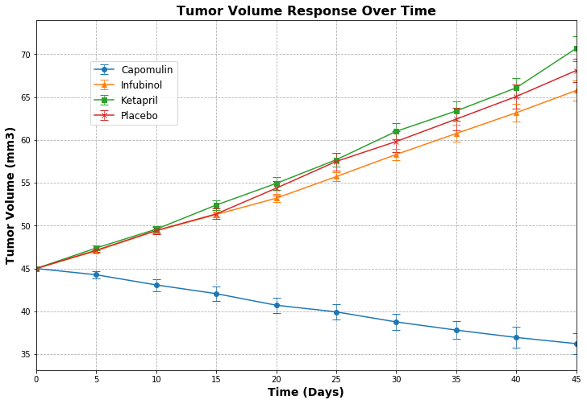
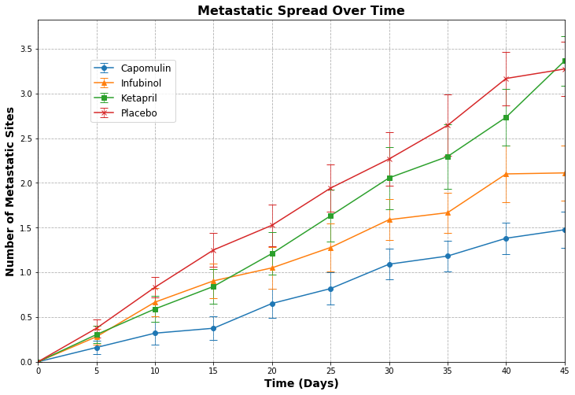
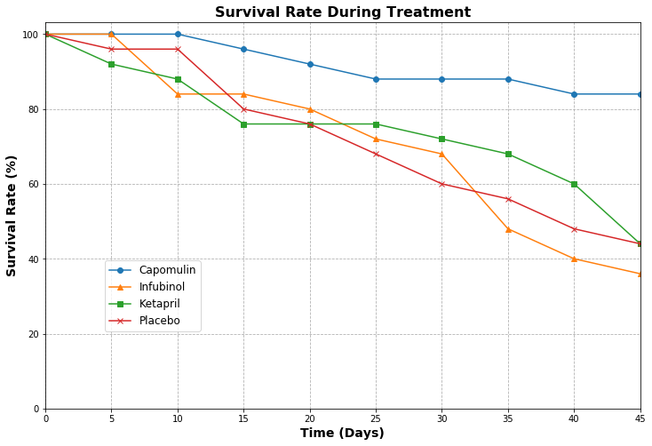
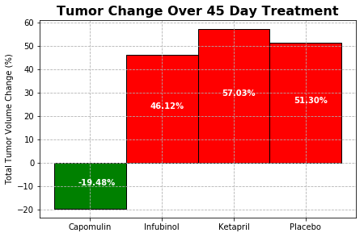

## Pymaceuticals Inc. Matplotlib Homework #5
#### By: Mike Suomi 6/16/2018
- Observed Trend 1: Capomulin is the only drug that really had signficant effects beyond the Placebo - this is the drug that should be mass produced and sold to help decrease this type of cancer.
- Observed Trend 2:  One of the drugs in the data, Ramicane, was the only other drug that was effective beyond the Placebo, but it was not one of the four treatments we were analyzing (maybe it is a competitor drug or something?).
- Observed Trend 3: The survival rate of many of the drugs/placebo is only around 40% over the full 45 days of the trial.  This seems to distort some of the data a bit as we show the average tumor size and metastatic sites for only living mice - so even the drugs that do have a positive effect still are ignoring the mice that have already died.

#### Matplotlib Homework Description

Pymaceuticals specializes in drug-based, anti-cancer pharmaceuticals. In their most recent efforts, 
they've since begun screening for potential treatments to squamous cell carcinoma (SCC), a commonly 
occurring form of skin cancer.

As their Chief Data Analyst, you've been given access to the complete data from their most recent 
animal study. In this study, 250 mice were treated through a variety of drug regimes over the course
of 45 days. Their physiological responses were then monitored over the course of that time. Your 
objective is to analyze the data to show how four treatments (Capomulin, Infubinol, Ketapril, 
and Placebo) compare.

To do this you are tasked with:

- Creating a scatter plot that shows how the tumor volume changes over time for each treatment.
- Creating a scatter plot that shows how the number of metastatic (cancer spreading) sites changes over time for each treatment.
- Creating a scatter plot that shows the number of mice still alive through the course of treatment (Survival Rate)
- Creating a bar graph that compares the total % tumor volume change for each drug across the full 45 days.


```python
import pandas as pd
import numpy as np
import matplotlib.pyplot as plt
import seaborn as sns
%matplotlib inline
from scipy.stats import sem, ttest_ind
```


```python
#import raw data - make sure files are saved in raw_data subfolder
path = "raw_data\\"
file1 = "clinicaltrial_data.csv"
file2 = "mouse_drug_data.csv"
file1_path = "{}{}".format(path, file1)
file2_path = "{}{}".format(path, file2)

df_clinicaltrial = pd.read_csv(file1_path)
df_mousedata = pd.read_csv(file2_path)
```


```python
#clean data

#remove the error mouse ID of g989 from drug database before more merging - it had two drugs assigned
df_mousedata = df_mousedata[df_mousedata['Mouse ID'] != 'g989']

######they want us to keep in the mice that died for later reference, so don't remove this stuff
# #seems like many mice aren't lasting the full testing regime as they have less than 10 time data
# #points recorded - try to figure out how many exactly
# print("total number of mice in study =", len(df_clinicaltrial['Mouse ID'].unique()))
# mice_incomplete_data = df_clinicaltrial['Mouse ID'].value_counts().reset_index()
# mice_incomplete_data.rename(columns={'index': 'Mouse ID', 'Mouse ID': 'Timepoint Count'}, inplace=True)
# mice_incomplete_data = mice_incomplete_data[mice_incomplete_data['Timepoint Count'] < 10]
# print("number of mice that didn't last all 45 days =", len(mice_incomplete_data['Mouse ID']))
# mice_incomplete_data.head()
# ######they want us to keep in the mice that died for later reference, so don't remove this stuff
# #remove the number of mice that didn't last all 45 days from mousedata as that doesn't seem
# #like legitimate research if they count for data at beginning but not end
# #remove from mousedata dataframe and then when merge won't be included
# df_mousedata = df_mousedata[~df_mousedata['Mouse ID'].isin(mice_incomplete_data['Mouse ID'])]
# print("total number of mice with full time data, correctly labeled =", len(df_mousedata['Mouse ID']))
# df_mousedata.head()
```


```python
#merge data by inner so that the deleted mousedata g989 that was an error doesn't get included
#also prevents extra drug data from getting entered and any potential mouse id's with unassigned drug
df = pd.merge(df_mousedata, df_clinicaltrial, how='inner', on='Mouse ID')
print(df.shape)
df.head()
```

    (1880, 5)
    


<div>
<style scoped>
    .dataframe tbody tr th:only-of-type {
        vertical-align: middle;
    }

    .dataframe tbody tr th {
        vertical-align: top;
    }

    .dataframe thead th {
        text-align: right;
    }
</style>
<table border="1" class="dataframe">
  <thead>
    <tr style="text-align: right;">
      <th></th>
      <th>Mouse ID</th>
      <th>Drug</th>
      <th>Timepoint</th>
      <th>Tumor Volume (mm3)</th>
      <th>Metastatic Sites</th>
    </tr>
  </thead>
  <tbody>
    <tr>
      <th>0</th>
      <td>f234</td>
      <td>Stelasyn</td>
      <td>0</td>
      <td>45.000000</td>
      <td>0</td>
    </tr>
    <tr>
      <th>1</th>
      <td>f234</td>
      <td>Stelasyn</td>
      <td>5</td>
      <td>47.313491</td>
      <td>0</td>
    </tr>
    <tr>
      <th>2</th>
      <td>f234</td>
      <td>Stelasyn</td>
      <td>10</td>
      <td>47.904324</td>
      <td>0</td>
    </tr>
    <tr>
      <th>3</th>
      <td>f234</td>
      <td>Stelasyn</td>
      <td>15</td>
      <td>48.735197</td>
      <td>1</td>
    </tr>
    <tr>
      <th>4</th>
      <td>f234</td>
      <td>Stelasyn</td>
      <td>20</td>
      <td>51.112713</td>
      <td>2</td>
    </tr>
  </tbody>
</table>
</div>


### Tumor Volume Response Over Time
Create a scatter plot that shows how the tumor volume changes over time for Capomulin, Infubinol, Ketapril, and Placebo.


```python
#get the mean Tumor volume and number of metastitic sites by each drug for each timpeoint
drug_averages = df.groupby(['Drug', 'Timepoint'])['Tumor Volume (mm3)', 'Metastatic Sites'].mean()
drug_averages
```


<div>
<style scoped>
    .dataframe tbody tr th:only-of-type {
        vertical-align: middle;
    }

    .dataframe tbody tr th {
        vertical-align: top;
    }

    .dataframe thead th {
        text-align: right;
    }
</style>
<table border="1" class="dataframe">
  <thead>
    <tr style="text-align: right;">
      <th></th>
      <th></th>
      <th>Tumor Volume (mm3)</th>
      <th>Metastatic Sites</th>
    </tr>
    <tr>
      <th>Drug</th>
      <th>Timepoint</th>
      <th></th>
      <th></th>
    </tr>
  </thead>
  <tbody>
    <tr>
      <th rowspan="10" valign="top">Capomulin</th>
      <th>0</th>
      <td>45.000000</td>
      <td>0.000000</td>
    </tr>
    <tr>
      <th>5</th>
      <td>44.266086</td>
      <td>0.160000</td>
    </tr>
    <tr>
      <th>10</th>
      <td>43.084291</td>
      <td>0.320000</td>
    </tr>
    <tr>
      <th>15</th>
      <td>42.064317</td>
      <td>0.375000</td>
    </tr>
    <tr>
      <th>20</th>
      <td>40.716325</td>
      <td>0.652174</td>
    </tr>
    <tr>
      <th>25</th>
      <td>39.939528</td>
      <td>0.818182</td>
    </tr>
    <tr>
      <th>30</th>
      <td>38.769339</td>
      <td>1.090909</td>
    </tr>
    <tr>
      <th>35</th>
      <td>37.816839</td>
      <td>1.181818</td>
    </tr>
    <tr>
      <th>40</th>
      <td>36.958001</td>
      <td>1.380952</td>
    </tr>
    <tr>
      <th>45</th>
      <td>36.236114</td>
      <td>1.476190</td>
    </tr>
    <tr>
      <th rowspan="10" valign="top">Ceftamin</th>
      <th>0</th>
      <td>45.000000</td>
      <td>0.000000</td>
    </tr>
    <tr>
      <th>5</th>
      <td>46.503051</td>
      <td>0.380952</td>
    </tr>
    <tr>
      <th>10</th>
      <td>48.285125</td>
      <td>0.600000</td>
    </tr>
    <tr>
      <th>15</th>
      <td>50.094055</td>
      <td>0.789474</td>
    </tr>
    <tr>
      <th>20</th>
      <td>52.157049</td>
      <td>1.111111</td>
    </tr>
    <tr>
      <th>25</th>
      <td>54.287674</td>
      <td>1.500000</td>
    </tr>
    <tr>
      <th>30</th>
      <td>56.769517</td>
      <td>1.937500</td>
    </tr>
    <tr>
      <th>35</th>
      <td>58.827548</td>
      <td>2.071429</td>
    </tr>
    <tr>
      <th>40</th>
      <td>61.467895</td>
      <td>2.357143</td>
    </tr>
    <tr>
      <th>45</th>
      <td>64.132421</td>
      <td>2.692308</td>
    </tr>
    <tr>
      <th rowspan="10" valign="top">Infubinol</th>
      <th>0</th>
      <td>45.000000</td>
      <td>0.000000</td>
    </tr>
    <tr>
      <th>5</th>
      <td>47.062001</td>
      <td>0.280000</td>
    </tr>
    <tr>
      <th>10</th>
      <td>49.403909</td>
      <td>0.666667</td>
    </tr>
    <tr>
      <th>15</th>
      <td>51.296397</td>
      <td>0.904762</td>
    </tr>
    <tr>
      <th>20</th>
      <td>53.197691</td>
      <td>1.050000</td>
    </tr>
    <tr>
      <th>25</th>
      <td>55.715252</td>
      <td>1.277778</td>
    </tr>
    <tr>
      <th>30</th>
      <td>58.299397</td>
      <td>1.588235</td>
    </tr>
    <tr>
      <th>35</th>
      <td>60.742461</td>
      <td>1.666667</td>
    </tr>
    <tr>
      <th>40</th>
      <td>63.162824</td>
      <td>2.100000</td>
    </tr>
    <tr>
      <th>45</th>
      <td>65.755562</td>
      <td>2.111111</td>
    </tr>
    <tr>
      <th>...</th>
      <th>...</th>
      <td>...</td>
      <td>...</td>
    </tr>
    <tr>
      <th rowspan="10" valign="top">Ramicane</th>
      <th>0</th>
      <td>45.000000</td>
      <td>0.000000</td>
    </tr>
    <tr>
      <th>5</th>
      <td>43.944859</td>
      <td>0.120000</td>
    </tr>
    <tr>
      <th>10</th>
      <td>42.531957</td>
      <td>0.250000</td>
    </tr>
    <tr>
      <th>15</th>
      <td>41.495061</td>
      <td>0.333333</td>
    </tr>
    <tr>
      <th>20</th>
      <td>40.238325</td>
      <td>0.347826</td>
    </tr>
    <tr>
      <th>25</th>
      <td>38.974300</td>
      <td>0.652174</td>
    </tr>
    <tr>
      <th>30</th>
      <td>38.703137</td>
      <td>0.782609</td>
    </tr>
    <tr>
      <th>35</th>
      <td>37.451996</td>
      <td>0.952381</td>
    </tr>
    <tr>
      <th>40</th>
      <td>36.574081</td>
      <td>1.100000</td>
    </tr>
    <tr>
      <th>45</th>
      <td>34.955595</td>
      <td>1.250000</td>
    </tr>
    <tr>
      <th rowspan="10" valign="top">Stelasyn</th>
      <th>0</th>
      <td>45.000000</td>
      <td>0.000000</td>
    </tr>
    <tr>
      <th>5</th>
      <td>47.470830</td>
      <td>0.260870</td>
    </tr>
    <tr>
      <th>10</th>
      <td>49.335368</td>
      <td>0.523810</td>
    </tr>
    <tr>
      <th>15</th>
      <td>51.448025</td>
      <td>0.809524</td>
    </tr>
    <tr>
      <th>20</th>
      <td>53.970080</td>
      <td>0.947368</td>
    </tr>
    <tr>
      <th>25</th>
      <td>56.172821</td>
      <td>1.166667</td>
    </tr>
    <tr>
      <th>30</th>
      <td>59.870528</td>
      <td>1.411765</td>
    </tr>
    <tr>
      <th>35</th>
      <td>62.432021</td>
      <td>1.533333</td>
    </tr>
    <tr>
      <th>40</th>
      <td>65.356386</td>
      <td>1.583333</td>
    </tr>
    <tr>
      <th>45</th>
      <td>68.438310</td>
      <td>1.727273</td>
    </tr>
    <tr>
      <th rowspan="10" valign="top">Zoniferol</th>
      <th>0</th>
      <td>45.000000</td>
      <td>0.000000</td>
    </tr>
    <tr>
      <th>5</th>
      <td>46.851818</td>
      <td>0.166667</td>
    </tr>
    <tr>
      <th>10</th>
      <td>48.689881</td>
      <td>0.500000</td>
    </tr>
    <tr>
      <th>15</th>
      <td>50.779059</td>
      <td>0.809524</td>
    </tr>
    <tr>
      <th>20</th>
      <td>53.170334</td>
      <td>1.294118</td>
    </tr>
    <tr>
      <th>25</th>
      <td>55.432935</td>
      <td>1.687500</td>
    </tr>
    <tr>
      <th>30</th>
      <td>57.713531</td>
      <td>1.933333</td>
    </tr>
    <tr>
      <th>35</th>
      <td>60.089372</td>
      <td>2.285714</td>
    </tr>
    <tr>
      <th>40</th>
      <td>62.916692</td>
      <td>2.785714</td>
    </tr>
    <tr>
      <th>45</th>
      <td>65.960888</td>
      <td>3.071429</td>
    </tr>
  </tbody>
</table>
<p>100 rows × 2 columns</p>
</div>


```python
#create dataframe with just average tumor volume for each drug for each timepoint
drug_average_volume = drug_averages['Tumor Volume (mm3)'].unstack(level=-2)
drug_average_volume
```


<div>
<style scoped>
    .dataframe tbody tr th:only-of-type {
        vertical-align: middle;
    }

    .dataframe tbody tr th {
        vertical-align: top;
    }

    .dataframe thead th {
        text-align: right;
    }
</style>
<table border="1" class="dataframe">
  <thead>
    <tr style="text-align: right;">
      <th>Drug</th>
      <th>Capomulin</th>
      <th>Ceftamin</th>
      <th>Infubinol</th>
      <th>Ketapril</th>
      <th>Naftisol</th>
      <th>Placebo</th>
      <th>Propriva</th>
      <th>Ramicane</th>
      <th>Stelasyn</th>
      <th>Zoniferol</th>
    </tr>
    <tr>
      <th>Timepoint</th>
      <th></th>
      <th></th>
      <th></th>
      <th></th>
      <th></th>
      <th></th>
      <th></th>
      <th></th>
      <th></th>
      <th></th>
    </tr>
  </thead>
  <tbody>
    <tr>
      <th>0</th>
      <td>45.000000</td>
      <td>45.000000</td>
      <td>45.000000</td>
      <td>45.000000</td>
      <td>45.000000</td>
      <td>45.000000</td>
      <td>45.000000</td>
      <td>45.000000</td>
      <td>45.000000</td>
      <td>45.000000</td>
    </tr>
    <tr>
      <th>5</th>
      <td>44.266086</td>
      <td>46.503051</td>
      <td>47.062001</td>
      <td>47.389175</td>
      <td>46.796098</td>
      <td>47.125589</td>
      <td>47.168130</td>
      <td>43.944859</td>
      <td>47.470830</td>
      <td>46.851818</td>
    </tr>
    <tr>
      <th>10</th>
      <td>43.084291</td>
      <td>48.285125</td>
      <td>49.403909</td>
      <td>49.582269</td>
      <td>48.694210</td>
      <td>49.423329</td>
      <td>48.938560</td>
      <td>42.531957</td>
      <td>49.335368</td>
      <td>48.689881</td>
    </tr>
    <tr>
      <th>15</th>
      <td>42.064317</td>
      <td>50.094055</td>
      <td>51.296397</td>
      <td>52.399974</td>
      <td>50.933018</td>
      <td>51.359742</td>
      <td>50.891769</td>
      <td>41.495061</td>
      <td>51.448025</td>
      <td>50.779059</td>
    </tr>
    <tr>
      <th>20</th>
      <td>40.716325</td>
      <td>52.157049</td>
      <td>53.197691</td>
      <td>54.920935</td>
      <td>53.644087</td>
      <td>54.364417</td>
      <td>53.127384</td>
      <td>40.238325</td>
      <td>53.970080</td>
      <td>53.170334</td>
    </tr>
    <tr>
      <th>25</th>
      <td>39.939528</td>
      <td>54.287674</td>
      <td>55.715252</td>
      <td>57.678982</td>
      <td>56.731968</td>
      <td>57.482574</td>
      <td>55.462490</td>
      <td>38.974300</td>
      <td>56.172821</td>
      <td>55.432935</td>
    </tr>
    <tr>
      <th>30</th>
      <td>38.769339</td>
      <td>56.769517</td>
      <td>58.299397</td>
      <td>60.994507</td>
      <td>59.559509</td>
      <td>59.809063</td>
      <td>58.122548</td>
      <td>38.703137</td>
      <td>59.870528</td>
      <td>57.713531</td>
    </tr>
    <tr>
      <th>35</th>
      <td>37.816839</td>
      <td>58.827548</td>
      <td>60.742461</td>
      <td>63.371686</td>
      <td>62.685087</td>
      <td>62.420615</td>
      <td>60.103457</td>
      <td>37.451996</td>
      <td>62.432021</td>
      <td>60.089372</td>
    </tr>
    <tr>
      <th>40</th>
      <td>36.958001</td>
      <td>61.467895</td>
      <td>63.162824</td>
      <td>66.068580</td>
      <td>65.600754</td>
      <td>65.052675</td>
      <td>63.045537</td>
      <td>36.574081</td>
      <td>65.356386</td>
      <td>62.916692</td>
    </tr>
    <tr>
      <th>45</th>
      <td>36.236114</td>
      <td>64.132421</td>
      <td>65.755562</td>
      <td>70.662958</td>
      <td>69.265506</td>
      <td>68.084082</td>
      <td>66.258529</td>
      <td>34.955595</td>
      <td>68.438310</td>
      <td>65.960888</td>
    </tr>
  </tbody>
</table>
</div>


```python
#get the standard error of the mean Tumor volume and number of metastitic sites by each drug for each timpeoint
drug_sems = df.groupby(['Drug', 'Timepoint'])['Tumor Volume (mm3)', 'Metastatic Sites'].sem()
#create dataframe with just standard error of the means for tumor volume for each drug for each timepoint
drug_sem_volume = drug_sems['Tumor Volume (mm3)'].unstack(level=-2)
```


```python
#Plot only the Capomulin, Infubinol, Ketapril, and Placebo values
plt.figure(figsize=(12,8))

plt.errorbar(drug_average_volume.index, drug_average_volume.Capomulin, label='Capomulin', marker='o', 
            yerr=drug_sem_volume.Capomulin, capsize=5, elinewidth=0.7)
plt.errorbar(drug_average_volume.index, drug_average_volume.Infubinol, label='Infubinol', marker='^',
            yerr=drug_sem_volume.Infubinol, capsize=5, elinewidth=0.7)
plt.errorbar(drug_average_volume.index, drug_average_volume.Ketapril, label='Ketapril', marker='s',
             yerr=drug_sem_volume.Ketapril, capsize=5, elinewidth=0.7)
plt.errorbar(drug_average_volume.index, drug_average_volume.Placebo, label='Placebo', marker='x',
             yerr=drug_sem_volume.Placebo, capsize=5, elinewidth=0.7)

plt.xlim(0,45)
#plt.ylim()

plt.xlabel('Time (Days)', size=14, fontweight='semibold')
plt.ylabel('Tumor Volume (mm3)', size=14, fontweight='semibold')
plt.grid(linestyle='--')

plt.title('Tumor Volume Response Over Time', size=16, fontweight='bold')

plt.legend(fontsize=12, loc=(0.1,0.7));
```





### Number of Metastatic Sites Response Over Time
Create a scatter plot that shows how the number of metastatic (cancer spreading) sites changes over time for Capomulin, Infubinol, Ketapril, and Placebo.


```python
#create dataframe with just average number of metastatic sites for each drug for each timepoint
drug_average_metsites = drug_averages['Metastatic Sites'].unstack(level=-2)
drug_average_metsites
```


<div>
<style scoped>
    .dataframe tbody tr th:only-of-type {
        vertical-align: middle;
    }

    .dataframe tbody tr th {
        vertical-align: top;
    }

    .dataframe thead th {
        text-align: right;
    }
</style>
<table border="1" class="dataframe">
  <thead>
    <tr style="text-align: right;">
      <th>Drug</th>
      <th>Capomulin</th>
      <th>Ceftamin</th>
      <th>Infubinol</th>
      <th>Ketapril</th>
      <th>Naftisol</th>
      <th>Placebo</th>
      <th>Propriva</th>
      <th>Ramicane</th>
      <th>Stelasyn</th>
      <th>Zoniferol</th>
    </tr>
    <tr>
      <th>Timepoint</th>
      <th></th>
      <th></th>
      <th></th>
      <th></th>
      <th></th>
      <th></th>
      <th></th>
      <th></th>
      <th></th>
      <th></th>
    </tr>
  </thead>
  <tbody>
    <tr>
      <th>0</th>
      <td>0.000000</td>
      <td>0.000000</td>
      <td>0.000000</td>
      <td>0.000000</td>
      <td>0.000000</td>
      <td>0.000000</td>
      <td>0.000000</td>
      <td>0.000000</td>
      <td>0.000000</td>
      <td>0.000000</td>
    </tr>
    <tr>
      <th>5</th>
      <td>0.160000</td>
      <td>0.380952</td>
      <td>0.280000</td>
      <td>0.304348</td>
      <td>0.260870</td>
      <td>0.375000</td>
      <td>0.347826</td>
      <td>0.120000</td>
      <td>0.260870</td>
      <td>0.166667</td>
    </tr>
    <tr>
      <th>10</th>
      <td>0.320000</td>
      <td>0.600000</td>
      <td>0.666667</td>
      <td>0.590909</td>
      <td>0.523810</td>
      <td>0.833333</td>
      <td>0.619048</td>
      <td>0.250000</td>
      <td>0.523810</td>
      <td>0.500000</td>
    </tr>
    <tr>
      <th>15</th>
      <td>0.375000</td>
      <td>0.789474</td>
      <td>0.904762</td>
      <td>0.842105</td>
      <td>0.857143</td>
      <td>1.250000</td>
      <td>0.800000</td>
      <td>0.333333</td>
      <td>0.809524</td>
      <td>0.809524</td>
    </tr>
    <tr>
      <th>20</th>
      <td>0.652174</td>
      <td>1.111111</td>
      <td>1.050000</td>
      <td>1.210526</td>
      <td>1.150000</td>
      <td>1.526316</td>
      <td>1.000000</td>
      <td>0.347826</td>
      <td>0.947368</td>
      <td>1.294118</td>
    </tr>
    <tr>
      <th>25</th>
      <td>0.818182</td>
      <td>1.500000</td>
      <td>1.277778</td>
      <td>1.631579</td>
      <td>1.500000</td>
      <td>1.941176</td>
      <td>1.384615</td>
      <td>0.652174</td>
      <td>1.166667</td>
      <td>1.687500</td>
    </tr>
    <tr>
      <th>30</th>
      <td>1.090909</td>
      <td>1.937500</td>
      <td>1.588235</td>
      <td>2.055556</td>
      <td>2.066667</td>
      <td>2.266667</td>
      <td>1.666667</td>
      <td>0.782609</td>
      <td>1.411765</td>
      <td>1.933333</td>
    </tr>
    <tr>
      <th>35</th>
      <td>1.181818</td>
      <td>2.071429</td>
      <td>1.666667</td>
      <td>2.294118</td>
      <td>2.266667</td>
      <td>2.642857</td>
      <td>2.333333</td>
      <td>0.952381</td>
      <td>1.533333</td>
      <td>2.285714</td>
    </tr>
    <tr>
      <th>40</th>
      <td>1.380952</td>
      <td>2.357143</td>
      <td>2.100000</td>
      <td>2.733333</td>
      <td>2.466667</td>
      <td>3.166667</td>
      <td>2.777778</td>
      <td>1.100000</td>
      <td>1.583333</td>
      <td>2.785714</td>
    </tr>
    <tr>
      <th>45</th>
      <td>1.476190</td>
      <td>2.692308</td>
      <td>2.111111</td>
      <td>3.363636</td>
      <td>2.538462</td>
      <td>3.272727</td>
      <td>2.571429</td>
      <td>1.250000</td>
      <td>1.727273</td>
      <td>3.071429</td>
    </tr>
  </tbody>
</table>
</div>


```python
#create dataframe with just standard error of means of metastatic sites for each drug for each timepoint
drug_sem_metsites = drug_sems['Metastatic Sites'].unstack(level=-2)
```


```python
#Plot only the Capomulin, Infubinol, Ketapril, and Placebo values
plt.figure(figsize=(12,8))

plt.errorbar(drug_average_metsites.index, drug_average_metsites.Capomulin, label='Capomulin', marker='o', 
            yerr=drug_sem_metsites.Capomulin, capsize=5, elinewidth=0.7)
plt.errorbar(drug_average_metsites.index, drug_average_metsites.Infubinol, label='Infubinol', marker='^',
            yerr=drug_sem_metsites.Infubinol, capsize=5, elinewidth=0.7)
plt.errorbar(drug_average_metsites.index, drug_average_metsites.Ketapril, label='Ketapril', marker='s',
             yerr=drug_sem_metsites.Ketapril, capsize=5, elinewidth=0.7)
plt.errorbar(drug_average_metsites.index, drug_average_metsites.Placebo, label='Placebo', marker='x',
             yerr=drug_sem_metsites.Placebo, capsize=5, elinewidth=0.7)

plt.xlim(0,45)
plt.ylim(0)

plt.xlabel('Time (Days)', size=14, fontweight='semibold')
plt.ylabel('Number of Metastatic Sites', size=14, fontweight='semibold')
plt.grid(linestyle='--')

plt.title('Metastatic Spread Over Time', size=16, fontweight='bold')

plt.legend(fontsize=12, loc=(0.1,0.7));
```





### Survival Rates
Create a scatter plot that shows the number of mice still alive through the course of treatment (Survival Rate).


```python
# number of mice alive (counted in each trial) - excludes the one mouse who was a duplicate in two drugs and excluded from df
drug_survival = df.groupby(['Drug', 'Timepoint'])['Tumor Volume (mm3)'].count()
drug_survival = drug_survival.unstack(level=-2)
drug_survival
```


<div>
<style scoped>
    .dataframe tbody tr th:only-of-type {
        vertical-align: middle;
    }

    .dataframe tbody tr th {
        vertical-align: top;
    }

    .dataframe thead th {
        text-align: right;
    }
</style>
<table border="1" class="dataframe">
  <thead>
    <tr style="text-align: right;">
      <th>Drug</th>
      <th>Capomulin</th>
      <th>Ceftamin</th>
      <th>Infubinol</th>
      <th>Ketapril</th>
      <th>Naftisol</th>
      <th>Placebo</th>
      <th>Propriva</th>
      <th>Ramicane</th>
      <th>Stelasyn</th>
      <th>Zoniferol</th>
    </tr>
    <tr>
      <th>Timepoint</th>
      <th></th>
      <th></th>
      <th></th>
      <th></th>
      <th></th>
      <th></th>
      <th></th>
      <th></th>
      <th></th>
      <th></th>
    </tr>
  </thead>
  <tbody>
    <tr>
      <th>0</th>
      <td>25</td>
      <td>25</td>
      <td>25</td>
      <td>25</td>
      <td>25</td>
      <td>25</td>
      <td>24</td>
      <td>25</td>
      <td>24</td>
      <td>25</td>
    </tr>
    <tr>
      <th>5</th>
      <td>25</td>
      <td>21</td>
      <td>25</td>
      <td>23</td>
      <td>23</td>
      <td>24</td>
      <td>23</td>
      <td>25</td>
      <td>23</td>
      <td>24</td>
    </tr>
    <tr>
      <th>10</th>
      <td>25</td>
      <td>20</td>
      <td>21</td>
      <td>22</td>
      <td>21</td>
      <td>24</td>
      <td>21</td>
      <td>24</td>
      <td>21</td>
      <td>22</td>
    </tr>
    <tr>
      <th>15</th>
      <td>24</td>
      <td>19</td>
      <td>21</td>
      <td>19</td>
      <td>21</td>
      <td>20</td>
      <td>15</td>
      <td>24</td>
      <td>21</td>
      <td>21</td>
    </tr>
    <tr>
      <th>20</th>
      <td>23</td>
      <td>18</td>
      <td>20</td>
      <td>19</td>
      <td>20</td>
      <td>19</td>
      <td>15</td>
      <td>23</td>
      <td>19</td>
      <td>17</td>
    </tr>
    <tr>
      <th>25</th>
      <td>22</td>
      <td>18</td>
      <td>18</td>
      <td>19</td>
      <td>18</td>
      <td>17</td>
      <td>13</td>
      <td>23</td>
      <td>18</td>
      <td>16</td>
    </tr>
    <tr>
      <th>30</th>
      <td>22</td>
      <td>16</td>
      <td>17</td>
      <td>18</td>
      <td>15</td>
      <td>15</td>
      <td>12</td>
      <td>23</td>
      <td>17</td>
      <td>15</td>
    </tr>
    <tr>
      <th>35</th>
      <td>22</td>
      <td>14</td>
      <td>12</td>
      <td>17</td>
      <td>15</td>
      <td>14</td>
      <td>9</td>
      <td>21</td>
      <td>15</td>
      <td>14</td>
    </tr>
    <tr>
      <th>40</th>
      <td>21</td>
      <td>14</td>
      <td>10</td>
      <td>15</td>
      <td>15</td>
      <td>12</td>
      <td>9</td>
      <td>20</td>
      <td>12</td>
      <td>14</td>
    </tr>
    <tr>
      <th>45</th>
      <td>21</td>
      <td>13</td>
      <td>9</td>
      <td>11</td>
      <td>13</td>
      <td>11</td>
      <td>7</td>
      <td>20</td>
      <td>11</td>
      <td>14</td>
    </tr>
  </tbody>
</table>
</div>


```python
#Plot only the Capomulin, Infubinol, Ketapril, and Placebo values
#example, wants percentage of survival, so calculate that within as well
plt.figure(figsize=(12,8))

plt.plot(drug_survival.index, drug_survival.Capomulin/drug_survival.Capomulin[0]*100, label='Capomulin', marker='o')
plt.plot(drug_survival.index, drug_survival.Infubinol/drug_survival.Infubinol[0]*100, label='Infubinol', marker='^')
plt.plot(drug_survival.index, drug_survival.Ketapril/drug_survival.Ketapril[0]*100, label='Ketapril', marker='s')
plt.plot(drug_survival.index, drug_survival.Placebo/drug_survival.Placebo[0]*100, label='Placebo', marker='x')

plt.xlim(0,45)
plt.ylim(0)

plt.xlabel('Time (Days)', size=14, fontweight='semibold')
plt.ylabel('Survival Rate (%)', size=14, fontweight='semibold')
plt.grid(linestyle='--')

plt.title('Survival Rate During Treatment', size=16, fontweight='bold')

plt.legend(fontsize=12, loc=(0.1,0.2));
```





### Total % Volume Change
Create a bar graph that compares the total % tumor volume change for each drug across the full 45 days


```python
tumor_volume_change = (drug_average_volume.iloc[-1] - drug_average_volume.iloc[0]) / drug_average_volume.iloc[0] *100
tumor_volume_change
```


    Drug
    Capomulin   -19.475303
    Ceftamin     42.516492
    Infubinol    46.123472
    Ketapril     57.028795
    Naftisol     53.923347
    Placebo      51.297960
    Propriva     47.241175
    Ramicane    -22.320900
    Stelasyn     52.085134
    Zoniferol    46.579751
    dtype: float64


```python
#Capomulin, Infubinol, Ketapril, and Placebo

print(colors_bars)
print(list(tumor_volume_change_dict_graph.values())[0])
```

    {'Capomulin': -19.475302667894173, 'Infubinol': 46.12347172785187, 'Ketapril': 57.028794686606076, 'Placebo': 51.29796048315153}
    ['green', 'red', 'red', 'red']
    -19.475302667894173
    


```python
#Plot only the Capomulin, Infubinol, Ketapril, and Placebo values - change to dict so can get keys,
#values for x-val and height value needed for plt.bar
tumor_volume_change_dict_graph = tumor_volume_change[['Capomulin', 'Infubinol', 'Ketapril', 'Placebo']].to_dict()
#define colors of each bar - red if tumor grew, green if tumor decreased
colors_bars = ['red' if drug>=0 else 'green' for drug in tumor_volume_change_dict_graph.values()]

plt.figure(figsize=(7,4.5))

#bar(x, height, width, bottom, *, align='center', **kwargs)

bars = plt.bar(tumor_volume_change_dict_graph.keys(), tumor_volume_change_dict_graph.values(), width=1.0,
           edgecolor='black', color=colors_bars, label=tumor_volume_change_dict_graph.values())

plt.ylabel('Total Tumor Volume Change (%)', size=10)
plt.grid(linestyle = '--')
plt.title('Tumor Change Over 45 Day Treatment', size=16, fontweight='bold');

#show the label of the values on the bars using the complicated plt.text by looking up each bar
#by saving the plt.bar as bars we can get the width, height, x and y locations of each bar
for bar in bars:
    xloc = bar.get_x() + bar.get_width()/3
    height = bar.get_height()
    yloc = height/2
    plt.text(xloc, yloc, '{:.2f}%'.format(height), color='w', fontweight='semibold')
```




