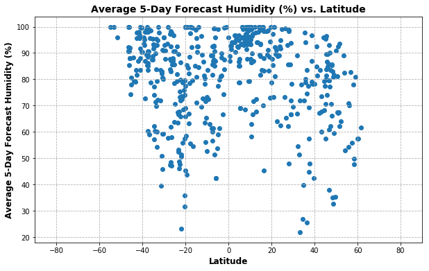
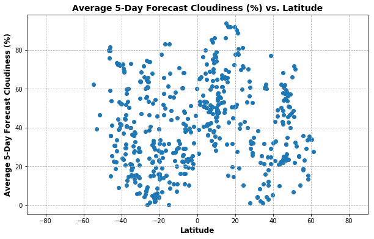
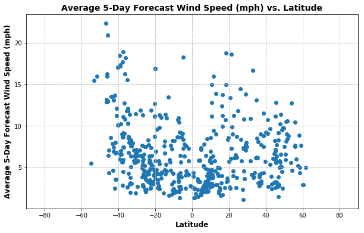

### Week 6 HW - What's the Weather Like? using APIs and JSON
#### by: Michael Suomi  6/23/2018
- Observation 1: Temperature does tend to get cooler when you move farther away from the equator - you notice  higher relative temperatures in northern latitudes relative to the southern latitudes because it is currently summer in northern hemisphere and winter in summer hemisphere.
- Observation 2: There are not any real discernable trends for Humidity Cloudiness or Wind Speed as you move away from the equator (although there is a slight uptick in wind speed around the -40 to -50 latitudes).
- Observation 3: CiityPy stores many more cities in Europe than any other locations around the world - when I first randomly chose from their dictionary of cities and create a google maps plot they were most dense in Europe.

#### WeatherPy Instructions:

In this example, you'll be creating a Python script to visualize the weather of 500+ cities across the world of varying distance from the equator. To accomplish this, you'll be utilizing a simple Python library, the OpenWeatherMap API, and a little common sense to create a representative model of weather across world cities.

Your objective is to build a series of scatter plots to showcase the following relationships:


- Temperature (F) vs. Latitude
- Humidity (%) vs. Latitude
- Cloudiness (%) vs. Latitude
- Wind Speed (mph) vs. Latitude


Your final notebook must:


- Randomly select at least 500 unique (non-repeat) cities based on latitude and longitude.
- Perform a weather check on each of the cities using a series of successive API calls.
- Include a print log of each city as it's being processed with the city number and city name.
- Save both a CSV of all data retrieved and png images for each scatter plot.


```python
import os
import pandas as pd
import numpy as np
import requests
import json
import matplotlib.pyplot as plt
from citipy import citipy
import random
import gmaps
gmaps.configure(api_key=os.environ.get('googlemaps_api_key'))
openweathermap_api_key = os.environ.get('openweathermap_api_key')
data_output_folder = "data_output\\"
```

#### Randomly select 500 unique cities based on latitude and longitude. 


```python
###in order to get better city distribution, make latitude bands of 5 degrees and then 
###choose 20 random cities from each of those latitude bands
random_lat_longs3 = []

for lat_search in list(range(-90,90,5)):
    lat_range_cities = [x for x in list(citipy.WORLD_CITIES_DICT.keys())
                        if (lat_search+5) > x[0] and lat_search >= x[0]]
    
    #determine number of random cities to get out of the range:
    #if number of cities is less than 20 then just select all cities
    #otherwise select 20 random cities and add to city list
    if len(lat_range_cities) > 20:
        num_random_cities = 20
        for num_cities in list(range(num_random_cities)):
            random_lat_longs3.append(random.choice(lat_range_cities))
    else:
        for city in lat_range_cities:
            random_lat_longs3.append(city)
            
random_city_citipy_encodings3 = [citipy.WORLD_CITIES_DICT[x] for x in random_lat_longs3]
random_city_names3 = [x.city_name for x in random_city_citipy_encodings3]
random_countries3 = [x.country_code for x in random_city_citipy_encodings3]
```


```python
#create dataframe of the random cities
df_random_cities3 = pd.DataFrame({'City': random_city_names3,
                                 'Country': random_countries3,
                                 'Lat, Long': random_lat_longs3, 
                                 'Lat': [x[0] for x in random_lat_longs3],
                                 'Lon': [x[1] for x in random_lat_longs3]})
df_random_cities3 = df_random_cities3[['City', 'Country', 'Lat, Long', 'Lat', 'Lon']]

#due to random chance there may be duplicate cities (especially if the number of
#cities in the lat, long range is short) so drop the duplicate cities
df_random_cities3.drop_duplicates(inplace=True)
#google maps errors out when reference the data frame columns if the index is not sequential, so reset index
df_random_cities3.reset_index(drop=True, inplace=True)
print(df_random_cities3.shape)
df_random_cities3.head()
```

    (517, 5)
    


<div>
<style scoped>
    .dataframe tbody tr th:only-of-type {
        vertical-align: middle;
    }

    .dataframe tbody tr th {
        vertical-align: top;
    }

    .dataframe thead th {
        text-align: right;
    }
</style>
<table border="1" class="dataframe">
  <thead>
    <tr style="text-align: right;">
      <th></th>
      <th>City</th>
      <th>Country</th>
      <th>Lat, Long</th>
      <th>Lat</th>
      <th>Lon</th>
    </tr>
  </thead>
  <tbody>
    <tr>
      <th>0</th>
      <td>rio gallegos</td>
      <td>ar</td>
      <td>(-51.622613, -69.218127)</td>
      <td>-51.622613</td>
      <td>-69.218127</td>
    </tr>
    <tr>
      <th>1</th>
      <td>ushuaia</td>
      <td>ar</td>
      <td>(-54.8, -68.3)</td>
      <td>-54.800000</td>
      <td>-68.300000</td>
    </tr>
    <tr>
      <th>2</th>
      <td>punta arenas</td>
      <td>cl</td>
      <td>(-53.15, -70.916667)</td>
      <td>-53.150000</td>
      <td>-70.916667</td>
    </tr>
    <tr>
      <th>3</th>
      <td>riverton</td>
      <td>nz</td>
      <td>(-46.35, 168.016667)</td>
      <td>-46.350000</td>
      <td>168.016667</td>
    </tr>
    <tr>
      <th>4</th>
      <td>wyndham</td>
      <td>nz</td>
      <td>(-46.333333, 168.85)</td>
      <td>-46.333333</td>
      <td>168.850000</td>
    </tr>
  </tbody>
</table>
</div>


```python
#create a google map of the locations to see how spread out the random cities really are and to 
#make sure it really covers various lat,longs
fig3 = gmaps.figure()

markers = gmaps.marker_layer(locations=df_random_cities3['Lat, Long'], 
                             info_box_content=df_random_cities3['Country']) #click will give country code

fig3.add_layer(markers)
fig3
```


<p>Failed to display Jupyter Widget of type <code>Figure</code>.</p>
<p>
  If you're reading this message in the Jupyter Notebook or JupyterLab Notebook, it may mean
  that the widgets JavaScript is still loading. If this message persists, it
  likely means that the widgets JavaScript library is either not installed or
  not enabled. See the <a href="https://ipywidgets.readthedocs.io/en/stable/user_install.html">Jupyter
  Widgets Documentation</a> for setup instructions.
</p>
<p>
  If you're reading this message in another frontend (for example, a static
  rendering on GitHub or <a href="https://nbviewer.jupyter.org/">NBViewer</a>),
  it may mean that your frontend doesn't currently support widgets.
</p>


#### Calling 5-Day Forecast Weather API


```python
#create a new dataframe and then overwrite the values
df_random_cities_forecast3 = df_random_cities3
# #if need to overwrite dataframe values when re-run df
# df_random_cities_forecast3[['OWM City #', 'OWM City Name', 'Temp (F)', 'Humidity (%)',
#                           'Cloudiness (%)', 'Wind Speed (mph)']] = ''
```


```python
## in order to get better picture of the weather data than just the exact moment we pull it, 
## use the 5 day forecast API (we can't use the historical data without paying for an account)
print('Beginning Data Retrieval \n-------------------------------')

for index, city_row in df_random_cities_forecast3.iterrows():
    print(f"Processing Record {index+1} of {len(df_random_cities_forecast3)}")
    #api.openweathermap.org/data/2.5/forecast?lat=35&lon=139
    #http://samples.openweathermap.org/data/2.5/forecast?lat=35&lon=139&appid=b6907d289e10d714a6e88b30761fae22

    base_url = 'http://api.openweathermap.org/data/2.5/forecast?'
    parameters = {'lat': city_row['Lat'], 
                 'lon': city_row['Lon'], 
                 'appid': openweathermap_api_key, 
                 'units': 'imperial'}
    
    #print url looking at, but hide the api key by replacing with #'s
    print((requests.get(base_url, parameters).url).replace(openweathermap_api_key, '#'*len(openweathermap_api_key)))
    #get json
    city_weather_data = requests.get(base_url, parameters).json()
    #print(city_weather_data) #temporary check
   
    ###for some reason city_row['column'] = did not work because its a copy of slice,
    ### so use .loc on dataframe instead
    ###get the city id and city name for the processing print records and save into dataframe
    df_random_cities_forecast3.loc[index, 'OWM City #'] = city_weather_data.get('city').get('id')
    df_random_cities_forecast3.loc[index, 'OWM City Name'] = city_weather_data.get('city').get('name')
    print(f"City ID = {city_weather_data.get('city').get('id')}, City Name = {city_weather_data.get('city').get('name')}")
    
    ###for all the forecast data, create a list that collects the weather values and
    ###then takes max temp of the forecasts, and takes the mean of the other forecasts
    df_random_cities_forecast3.loc[index, 'Temp (F)'] = max(
                [x.get('main').get('temp') for x in city_weather_data.get('list')])
    df_random_cities_forecast3.loc[index, 'Humidity (%)'] = np.mean(
                [x.get('main').get('humidity') for x in city_weather_data.get('list')])
    df_random_cities_forecast3.loc[index, 'Cloudiness (%)'] = np.mean(
                [x.get('clouds').get('all') for x in city_weather_data.get('list')])
    df_random_cities_forecast3.loc[index, 'Wind Speed (mph)'] = np.mean(
                [x.get('wind').get('speed') for x in city_weather_data.get('list')])

print('-------------------------------\n Data Retrieval Complete \n-------------------------------')
```

    Beginning Data Retrieval 
    -------------------------------
    Processing Record 1 of 517
    http://api.openweathermap.org/data/2.5/forecast?lat=-51.622613&lon=-69.218127&appid=################################&units=imperial
    City ID = 3838859, City Name = Rio Gallegos
    Processing Record 2 of 517
    http://api.openweathermap.org/data/2.5/forecast?lat=-54.8&lon=-68.3&appid=################################&units=imperial
    City ID = 3833367, City Name = Ushuaia
    Processing Record 3 of 517
    http://api.openweathermap.org/data/2.5/forecast?lat=-53.15&lon=-70.916667&appid=################################&units=imperial
    City ID = 3874787, City Name = Punta Arenas
    Processing Record 4 of 517
    http://api.openweathermap.org/data/2.5/forecast?lat=-46.35&lon=168.016667&appid=################################&units=imperial
    City ID = 2206957, City Name = Riverton
    Processing Record 5 of 517
    http://api.openweathermap.org/data/2.5/forecast?lat=-46.333333&lon=168.85&appid=################################&units=imperial
    City ID = 2178933, City Name = Wyndham
    Processing Record 6 of 517
    http://api.openweathermap.org/data/2.5/forecast?lat=-45.183333&lon=169.316667&appid=################################&units=imperial
    City ID = 2192264, City Name = Clyde
    Processing Record 7 of 517
    http://api.openweathermap.org/data/2.5/forecast?lat=-45.133333&lon=170.1&appid=################################&units=imperial
    City ID = 2183774, City Name = Ranfurly
    Processing Record 8 of 517
    http://api.openweathermap.org/data/2.5/forecast?lat=-45.566667&lon=-72.066667&appid=################################&units=imperial
    City ID = 3894426, City Name = Coihaique
    Processing Record 9 of 517
    http://api.openweathermap.org/data/2.5/forecast?lat=-45.866667&lon=170.233333&appid=################################&units=imperial
    City ID = 2186656, City Name = Momona
    Processing Record 10 of 517
    http://api.openweathermap.org/data/2.5/forecast?lat=-46.15&lon=168.333333&appid=################################&units=imperial
    City ID = 2206968, City Name = Winton
    Processing Record 11 of 517
    http://api.openweathermap.org/data/2.5/forecast?lat=-45.75&lon=170.566667&appid=################################&units=imperial
    City ID = 2179825, City Name = Waitati
    Processing Record 12 of 517
    http://api.openweathermap.org/data/2.5/forecast?lat=-45.866667&lon=170.5&appid=################################&units=imperial
    City ID = 2191562, City Name = Dunedin
    Processing Record 13 of 517
    http://api.openweathermap.org/data/2.5/forecast?lat=-46.133333&lon=167.683333&appid=################################&units=imperial
    City ID = 2180815, City Name = Tuatapere
    Processing Record 14 of 517
    http://api.openweathermap.org/data/2.5/forecast?lat=-46.316667&lon=168.783333&appid=################################&units=imperial
    City ID = 2178933, City Name = Wyndham
    Processing Record 15 of 517
    http://api.openweathermap.org/data/2.5/forecast?lat=-45.864135&lon=-67.496558&appid=################################&units=imperial
    City ID = 3860443, City Name = Comodoro Rivadavia
    Processing Record 16 of 517
    http://api.openweathermap.org/data/2.5/forecast?lat=-40.916667&lon=-73.166667&appid=################################&units=imperial
    City ID = 3874579, City Name = Purranque
    Processing Record 17 of 517
    http://api.openweathermap.org/data/2.5/forecast?lat=-43.65&lon=172.483333&appid=################################&units=imperial
    City ID = 2188371, City Name = Lincoln
    Processing Record 18 of 517
    http://api.openweathermap.org/data/2.5/forecast?lat=-41.140293&lon=-71.301369&appid=################################&units=imperial
    City ID = 7647007, City Name = San Carlos de Bariloche
    Processing Record 19 of 517
    http://api.openweathermap.org/data/2.5/forecast?lat=-40.959722&lon=175.6575&appid=################################&units=imperial
    City ID = 2206890, City Name = Masterton
    Processing Record 20 of 517
    http://api.openweathermap.org/data/2.5/forecast?lat=-41.666667&lon=174.083333&appid=################################&units=imperial
    City ID = 6243932, City Name = Riverlands
    Processing Record 21 of 517
    http://api.openweathermap.org/data/2.5/forecast?lat=-43.583333&lon=172.383333&appid=################################&units=imperial
    City ID = 2183310, City Name = Rolleston
    Processing Record 22 of 517
    http://api.openweathermap.org/data/2.5/forecast?lat=-46.6&lon=168.333333&appid=################################&units=imperial
    City ID = 2206939, City Name = Bluff
    Processing Record 23 of 517
    http://api.openweathermap.org/data/2.5/forecast?lat=-46.4&lon=168.35&appid=################################&units=imperial
    City ID = 2189529, City Name = Invercargill
    Processing Record 24 of 517
    http://api.openweathermap.org/data/2.5/forecast?lat=-46.120833&lon=169.969444&appid=################################&units=imperial
    City ID = 2208242, City Name = Milton
    Processing Record 25 of 517
    http://api.openweathermap.org/data/2.5/forecast?lat=-40.216667&lon=175.416667&appid=################################&units=imperial
    City ID = 2182968, City Name = Sanson
    Processing Record 26 of 517
    http://api.openweathermap.org/data/2.5/forecast?lat=-42.516667&lon=172.816667&appid=################################&units=imperial
    City ID = 2190299, City Name = Hanmer Springs
    Processing Record 27 of 517
    http://api.openweathermap.org/data/2.5/forecast?lat=-44.1&lon=170.833333&appid=################################&units=imperial
    City ID = 2184512, City Name = Pleasant Point
    Processing Record 28 of 517
    http://api.openweathermap.org/data/2.5/forecast?lat=-41.8&lon=172.333333&appid=################################&units=imperial
    City ID = 2186377, City Name = Murchison
    Processing Record 29 of 517
    http://api.openweathermap.org/data/2.5/forecast?lat=-41.469848&lon=-72.944745&appid=################################&units=imperial
    City ID = 3874960, City Name = Puerto Montt
    Processing Record 30 of 517
    http://api.openweathermap.org/data/2.5/forecast?lat=-42.463611&lon=-73.808333&appid=################################&units=imperial
    City ID = 3889146, City Name = Gamboa
    Processing Record 31 of 517
    http://api.openweathermap.org/data/2.5/forecast?lat=-38.02388&lon=144.406174&appid=################################&units=imperial
    City ID = 2160560, City Name = Lara
    Processing Record 32 of 517
    http://api.openweathermap.org/data/2.5/forecast?lat=-36.1&lon=174.366667&appid=################################&units=imperial
    City ID = 2187060, City Name = Maungaturoto
    Processing Record 33 of 517
    http://api.openweathermap.org/data/2.5/forecast?lat=-37.55&lon=175.916667&appid=################################&units=imperial
    City ID = 2189016, City Name = Katikati
    Processing Record 34 of 517
    http://api.openweathermap.org/data/2.5/forecast?lat=-36.4&lon=174.666667&appid=################################&units=imperial
    City ID = 2179639, City Name = Warkworth
    Processing Record 35 of 517
    http://api.openweathermap.org/data/2.5/forecast?lat=-38.65&lon=-72.233333&appid=################################&units=imperial
    City ID = 3868210, City Name = Vilcun
    Processing Record 36 of 517
    http://api.openweathermap.org/data/2.5/forecast?lat=-38.153461&lon=144.358093&appid=################################&units=imperial
    City ID = 2165798, City Name = Geelong
    Processing Record 37 of 517
    http://api.openweathermap.org/data/2.5/forecast?lat=-37.883333&lon=178.333333&appid=################################&units=imperial
    City ID = 2180991, City Name = Tolaga Bay
    Processing Record 38 of 517
    http://api.openweathermap.org/data/2.5/forecast?lat=-38.95&lon=-72.633333&appid=################################&units=imperial
    City ID = 3889322, City Name = Freire
    Processing Record 39 of 517
    http://api.openweathermap.org/data/2.5/forecast?lat=-43.616667&lon=172.316667&appid=################################&units=imperial
    City ID = 2192797, City Name = Burnham
    Processing Record 40 of 517
    http://api.openweathermap.org/data/2.5/forecast?lat=-37.083333&lon=-73.166667&appid=################################&units=imperial
    City ID = 3881276, City Name = Lota
    Processing Record 41 of 517
    http://api.openweathermap.org/data/2.5/forecast?lat=-38.35&lon=145.2&appid=################################&units=imperial
    City ID = 2169995, City Name = Crib Point
    Processing Record 42 of 517
    http://api.openweathermap.org/data/2.5/forecast?lat=-39.366667&lon=-72.633333&appid=################################&units=imperial
    City ID = 3882582, City Name = Loncoche
    Processing Record 43 of 517
    http://api.openweathermap.org/data/2.5/forecast?lat=-41.438759&lon=147.134674&appid=################################&units=imperial
    City ID = 2155392, City Name = Newstead
    Processing Record 44 of 517
    http://api.openweathermap.org/data/2.5/forecast?lat=-37.56266&lon=143.862579&appid=################################&units=imperial
    City ID = 8014922, City Name = Ballarat Central
    Processing Record 45 of 517
    http://api.openweathermap.org/data/2.5/forecast?lat=-35.1&lon=173.783333&appid=################################&units=imperial
    City ID = 2189343, City Name = Kaeo
    Processing Record 46 of 517
    http://api.openweathermap.org/data/2.5/forecast?lat=-36.892715&lon=-60.32254&appid=################################&units=imperial
    City ID = 3842670, City Name = Olavarria
    Processing Record 47 of 517
    http://api.openweathermap.org/data/2.5/forecast?lat=-40.3&lon=175.416667&appid=################################&units=imperial
    City ID = 2183299, City Name = Rongotea
    Processing Record 48 of 517
    http://api.openweathermap.org/data/2.5/forecast?lat=-42.883209&lon=147.331665&appid=################################&units=imperial
    City ID = 2163355, City Name = Hobart
    Processing Record 49 of 517
    http://api.openweathermap.org/data/2.5/forecast?lat=-39.033333&lon=177.366667&appid=################################&units=imperial
    City ID = 2206808, City Name = Wairoa
    Processing Record 50 of 517
    http://api.openweathermap.org/data/2.5/forecast?lat=-37.466667&lon=175.916667&appid=################################&units=imperial
    City ID = 2193747, City Name = Athenree
    Processing Record 51 of 517
    http://api.openweathermap.org/data/2.5/forecast?lat=-37.285419&lon=142.927277&appid=################################&units=imperial
    City ID = 2177756, City Name = Ararat
    Processing Record 52 of 517
    http://api.openweathermap.org/data/2.5/forecast?lat=-30.741369&lon=30.454992&appid=################################&units=imperial
    City ID = 964406, City Name = Port Shepstone
    Processing Record 53 of 517
    http://api.openweathermap.org/data/2.5/forecast?lat=-35.166667&lon=173.166667&appid=################################&units=imperial
    City ID = 2194098, City Name = Ahipara
    Processing Record 54 of 517
    http://api.openweathermap.org/data/2.5/forecast?lat=-30.693664&lon=26.711407&appid=################################&units=imperial
    City ID = 1023309, City Name = Aliwal North
    Processing Record 55 of 517
    http://api.openweathermap.org/data/2.5/forecast?lat=-30.983333&lon=-54.666667&appid=################################&units=imperial
    City ID = 3464547, City Name = Dom Pedrito
    Processing Record 56 of 517
    http://api.openweathermap.org/data/2.5/forecast?lat=-34.651455&lon=-59.430676&appid=################################&units=imperial
    City ID = 3430708, City Name = Mercedes
    Processing Record 57 of 517
    http://api.openweathermap.org/data/2.5/forecast?lat=-37.6&lon=144.95&appid=################################&units=imperial
    City ID = 2170089, City Name = Craigieburn
    Processing Record 58 of 517
    http://api.openweathermap.org/data/2.5/forecast?lat=-33.9891667&lon=-58.2855556&appid=################################&units=imperial
    City ID = 3443341, City Name = Carmelo
    Processing Record 59 of 517
    http://api.openweathermap.org/data/2.5/forecast?lat=-34.551048&lon=146.404831&appid=################################&units=imperial
    City ID = 2160413, City Name = Leeton
    Processing Record 60 of 517
    http://api.openweathermap.org/data/2.5/forecast?lat=-31.566667&lon=-53.383333&appid=################################&units=imperial
    City ID = 3453741, City Name = Pinheiro Machado
    Processing Record 61 of 517
    http://api.openweathermap.org/data/2.5/forecast?lat=-33.1325&lon=-58.2955556&appid=################################&units=imperial
    City ID = 3442568, City Name = Fray Bentos
    Processing Record 62 of 517
    http://api.openweathermap.org/data/2.5/forecast?lat=-30.649657&lon=24.012295&appid=################################&units=imperial
    City ID = 1011632, City Name = De Aar
    Processing Record 63 of 517
    http://api.openweathermap.org/data/2.5/forecast?lat=-34.665&lon=-56.2194444&appid=################################&units=imperial
    City ID = 3440963, City Name = Progreso
    Processing Record 64 of 517
    http://api.openweathermap.org/data/2.5/forecast?lat=-39.483333&lon=176.916667&appid=################################&units=imperial
    City ID = 2185587, City Name = Onekawa
    Processing Record 65 of 517
    http://api.openweathermap.org/data/2.5/forecast?lat=-30.883333&lon=-55.516667&appid=################################&units=imperial
    City ID = 3449936, City Name = Santana do Livramento
    Processing Record 66 of 517
    http://api.openweathermap.org/data/2.5/forecast?lat=-38.875875&lon=-62.073589&appid=################################&units=imperial
    City ID = 3839982, City Name = Punta Alta
    Processing Record 67 of 517
    http://api.openweathermap.org/data/2.5/forecast?lat=-39.933333&lon=175.566667&appid=################################&units=imperial
    City ID = 2189630, City Name = Hunterville
    Processing Record 68 of 517
    http://api.openweathermap.org/data/2.5/forecast?lat=-36.833333&lon=-73.05&appid=################################&units=imperial
    City ID = 3893894, City Name = Concepcion
    Processing Record 69 of 517
    http://api.openweathermap.org/data/2.5/forecast?lat=-26.45&lon=31.0166667&appid=################################&units=imperial
    City ID = 934971, City Name = Mhlambanyatsi
    Processing Record 70 of 517
    http://api.openweathermap.org/data/2.5/forecast?lat=-37.25&lon=174.75&appid=################################&units=imperial
    City ID = 2179756, City Name = Waiuku
    Processing Record 71 of 517
    http://api.openweathermap.org/data/2.5/forecast?lat=-41.768011&lon=-73.127296&appid=################################&units=imperial
    City ID = 3897334, City Name = Calbuco
    Processing Record 72 of 517
    http://api.openweathermap.org/data/2.5/forecast?lat=-30.166667&lon=-53.566667&appid=################################&units=imperial
    City ID = 3448207, City Name = Sao Sepe
    Processing Record 73 of 517
    http://api.openweathermap.org/data/2.5/forecast?lat=-31.731967&lon=-60.523802&appid=################################&units=imperial
    City ID = 3841956, City Name = Parana
    Processing Record 74 of 517
    http://api.openweathermap.org/data/2.5/forecast?lat=-33.592343&lon=22.205482&appid=################################&units=imperial
    City ID = 967106, City Name = Oudtshoorn
    Processing Record 75 of 517
    http://api.openweathermap.org/data/2.5/forecast?lat=-35.383333&lon=174.033333&appid=################################&units=imperial
    City ID = 2186722, City Name = Moerewa
    Processing Record 76 of 517
    http://api.openweathermap.org/data/2.5/forecast?lat=-31.333333&lon=27.85&appid=################################&units=imperial
    City ID = 1005781, City Name = Elliot
    Processing Record 77 of 517
    http://api.openweathermap.org/data/2.5/forecast?lat=-27.216667&lon=-58.583333&appid=################################&units=imperial
    City ID = 3430105, City Name = Paso de la Patria
    Processing Record 78 of 517
    http://api.openweathermap.org/data/2.5/forecast?lat=-25.383333&lon=-57.333333&appid=################################&units=imperial
    City ID = 3437918, City Name = Itaugua
    Processing Record 79 of 517
    http://api.openweathermap.org/data/2.5/forecast?lat=-26.083333&lon=-53.066667&appid=################################&units=imperial
    City ID = 3462996, City Name = Francisco Beltrao
    Processing Record 80 of 517
    http://api.openweathermap.org/data/2.5/forecast?lat=-37.577419&lon=144.726074&appid=################################&units=imperial
    City ID = 2147914, City Name = Sunbury
    Processing Record 81 of 517
    http://api.openweathermap.org/data/2.5/forecast?lat=-33.008056&lon=-71.519722&appid=################################&units=imperial
    City ID = 3900687, City Name = Achupallas
    Processing Record 82 of 517
    http://api.openweathermap.org/data/2.5/forecast?lat=-26.8833333&lon=31.4833333&appid=################################&units=imperial
    City ID = 935055, City Name = Kubuta
    Processing Record 83 of 517
    http://api.openweathermap.org/data/2.5/forecast?lat=-33.295012&lon=-66.335627&appid=################################&units=imperial
    City ID = 3837056, City Name = San Luis
    Processing Record 84 of 517
    http://api.openweathermap.org/data/2.5/forecast?lat=-26.933655&lon=29.241518&appid=################################&units=imperial
    City ID = 952747, City Name = Standerton
    Processing Record 85 of 517
    http://api.openweathermap.org/data/2.5/forecast?lat=-25.4314&lon=-48.7184&appid=################################&units=imperial
    City ID = 3472048, City Name = Antonina
    Processing Record 86 of 517
    http://api.openweathermap.org/data/2.5/forecast?lat=-29.85&lon=-51.166667&appid=################################&units=imperial
    City ID = 3463859, City Name = Esteio
    Processing Record 87 of 517
    http://api.openweathermap.org/data/2.5/forecast?lat=-30.302249&lon=27.083951&appid=################################&units=imperial
    City ID = 937246, City Name = Zastron
    Processing Record 88 of 517
    http://api.openweathermap.org/data/2.5/forecast?lat=-25.85&lon=-52.5&appid=################################&units=imperial
    City ID = 3466196, City Name = Chopinzinho
    Processing Record 89 of 517
    http://api.openweathermap.org/data/2.5/forecast?lat=-32.741501&lon=151.867599&appid=################################&units=imperial
    City ID = 2158220, City Name = Medowie
    Processing Record 90 of 517
    http://api.openweathermap.org/data/2.5/forecast?lat=-25.916667&lon=-53.466667&appid=################################&units=imperial
    City ID = 3472304, City Name = Ampere
    Processing Record 91 of 517
    http://api.openweathermap.org/data/2.5/forecast?lat=-34.7166667&lon=-55.95&appid=################################&units=imperial
    City ID = 3441354, City Name = Pando
    Processing Record 92 of 517
    http://api.openweathermap.org/data/2.5/forecast?lat=-20.0283333&lon=57.5877778&appid=################################&units=imperial
    City ID = 933970, City Name = The Vale
    Processing Record 93 of 517
    http://api.openweathermap.org/data/2.5/forecast?lat=-41.05584&lon=145.903748&appid=################################&units=imperial
    City ID = 2170702, City Name = Cooee
    Processing Record 94 of 517
    http://api.openweathermap.org/data/2.5/forecast?lat=-43.766667&lon=172.3&appid=################################&units=imperial
    City ID = 2188444, City Name = Leeston
    Processing Record 95 of 517
    http://api.openweathermap.org/data/2.5/forecast?lat=-34.9&lon=-54.95&appid=################################&units=imperial
    City ID = 3441894, City Name = Maldonado
    Processing Record 96 of 517
    http://api.openweathermap.org/data/2.5/forecast?lat=-40.35&lon=175.616667&appid=################################&units=imperial
    City ID = 2181258, City Name = Terrace End
    Processing Record 97 of 517
    http://api.openweathermap.org/data/2.5/forecast?lat=-36.313215&lon=-57.679185&appid=################################&units=imperial
    City ID = 3435038, City Name = Dolores
    Processing Record 98 of 517
    http://api.openweathermap.org/data/2.5/forecast?lat=-25.45&lon=-57.533333&appid=################################&units=imperial
    City ID = 3436583, City Name = Ypane
    Processing Record 99 of 517
    http://api.openweathermap.org/data/2.5/forecast?lat=-20.2638889&lon=57.7061111&appid=################################&units=imperial
    City ID = 934599, City Name = Clemencia
    Processing Record 100 of 517
    http://api.openweathermap.org/data/2.5/forecast?lat=-26.533331&lon=153.091232&appid=################################&units=imperial
    City ID = 2170581, City Name = Coolum Beach
    Processing Record 101 of 517
    http://api.openweathermap.org/data/2.5/forecast?lat=-27.099167&lon=-48.615&appid=################################&units=imperial
    City ID = 3460740, City Name = Itapema
    Processing Record 102 of 517
    http://api.openweathermap.org/data/2.5/forecast?lat=-23.666667&lon=-46.45&appid=################################&units=imperial
    City ID = 6322373, City Name = Mauá
    Processing Record 103 of 517
    http://api.openweathermap.org/data/2.5/forecast?lat=-23.35&lon=-47.683333&appid=################################&units=imperial
    City ID = 3461134, City Name = Ipero
    Processing Record 104 of 517
    http://api.openweathermap.org/data/2.5/forecast?lat=-16.8402778&lon=38.2569444&appid=################################&units=imperial
    City ID = 1024312, City Name = Província de Zambézia
    Processing Record 105 of 517
    http://api.openweathermap.org/data/2.5/forecast?lat=-18.416667&lon=-46.416667&appid=################################&units=imperial
    City ID = 3452327, City Name = Presidente Olegario
    Processing Record 106 of 517
    http://api.openweathermap.org/data/2.5/forecast?lat=-37.883333&lon=176.75&appid=################################&units=imperial
    City ID = 2187175, City Name = Matata
    Processing Record 107 of 517
    http://api.openweathermap.org/data/2.5/forecast?lat=-21.25&lon=-50.633333&appid=################################&units=imperial
    City ID = 3461874, City Name = Guararapes
    Processing Record 108 of 517
    http://api.openweathermap.org/data/2.5/forecast?lat=-33.482471&lon=150.136307&appid=################################&units=imperial
    City ID = 2160053, City Name = Lithgow
    Processing Record 109 of 517
    http://api.openweathermap.org/data/2.5/forecast?lat=-35.27603&lon=149.13435&appid=################################&units=imperial
    City ID = 2172517, City Name = Canberra
    Processing Record 110 of 517
    http://api.openweathermap.org/data/2.5/forecast?lat=-17.5666667&lon=-149.3166667&appid=################################&units=imperial
    City ID = 4034402, City Name = Hitiaa
    Processing Record 111 of 517
    http://api.openweathermap.org/data/2.5/forecast?lat=-15.4833333&lon=-67.8833333&appid=################################&units=imperial
    City ID = 3911924, City Name = Departamento de La Paz
    Processing Record 112 of 517
    http://api.openweathermap.org/data/2.5/forecast?lat=-27.241789&lon=27.574222&appid=################################&units=imperial
    City ID = 987875, City Name = Koppies
    Processing Record 113 of 517
    http://api.openweathermap.org/data/2.5/forecast?lat=-32.946818&lon=-60.639317&appid=################################&units=imperial
    City ID = 3838583, City Name = Rosario
    Processing Record 114 of 517
    http://api.openweathermap.org/data/2.5/forecast?lat=-20.033333&lon=-44.15&appid=################################&units=imperial
    City ID = 3447969, City Name = Sarzedo
    Processing Record 115 of 517
    http://api.openweathermap.org/data/2.5/forecast?lat=-20.066667&lon=-49.9&appid=################################&units=imperial
    City ID = 3466970, City Name = Cardoso
    Processing Record 116 of 517
    http://api.openweathermap.org/data/2.5/forecast?lat=-24.785896&lon=-65.411664&appid=################################&units=imperial
    City ID = 3838233, City Name = Salta
    Processing Record 117 of 517
    http://api.openweathermap.org/data/2.5/forecast?lat=-16.5&lon=-49.433333&appid=################################&units=imperial
    City ID = 3462376, City Name = Goianira
    Processing Record 118 of 517
    http://api.openweathermap.org/data/2.5/forecast?lat=-29.966667&lon=-51.633333&appid=################################&units=imperial
    City ID = 3466261, City Name = Charqueadas
    Processing Record 119 of 517
    http://api.openweathermap.org/data/2.5/forecast?lat=-37.321674&lon=-59.133164&appid=################################&units=imperial
    City ID = 3427833, City Name = Tandil
    Processing Record 120 of 517
    http://api.openweathermap.org/data/2.5/forecast?lat=-17.75&lon=-149.3166667&appid=################################&units=imperial
    City ID = 4033295, City Name = Tohautu
    Processing Record 121 of 517
    http://api.openweathermap.org/data/2.5/forecast?lat=-34.641667&lon=-60.473889&appid=################################&units=imperial
    City ID = 3861953, City Name = Chacabuco
    Processing Record 122 of 517
    http://api.openweathermap.org/data/2.5/forecast?lat=-21.316667&lon=-42.866667&appid=################################&units=imperial
    City ID = 3471369, City Name = Astolfo Dutra
    Processing Record 123 of 517
    http://api.openweathermap.org/data/2.5/forecast?lat=-20.45&lon=-45.416667&appid=################################&units=imperial
    City ID = 3463174, City Name = Formiga
    Processing Record 124 of 517
    http://api.openweathermap.org/data/2.5/forecast?lat=-14.516667&lon=-40.35&appid=################################&units=imperial
    City ID = 3453337, City Name = Pocoes
    Processing Record 125 of 517
    http://api.openweathermap.org/data/2.5/forecast?lat=-23.216667&lon=-44.716667&appid=################################&units=imperial
    City ID = 3455036, City Name = Parati
    Processing Record 126 of 517
    http://api.openweathermap.org/data/2.5/forecast?lat=-33.593333&lon=-71.621667&appid=################################&units=imperial
    City ID = 3872395, City Name = San Antonio
    Processing Record 127 of 517
    http://api.openweathermap.org/data/2.5/forecast?lat=-20.225&lon=57.5872222&appid=################################&units=imperial
    City ID = 1106782, City Name = Espérance
    Processing Record 128 of 517
    http://api.openweathermap.org/data/2.5/forecast?lat=-22.016667&lon=-47.9&appid=################################&units=imperial
    City ID = 3449319, City Name = Sao Carlos
    Processing Record 129 of 517
    http://api.openweathermap.org/data/2.5/forecast?lat=-23.116667&lon=-48.6&appid=################################&units=imperial
    City ID = 3460594, City Name = Itatinga
    Processing Record 130 of 517
    http://api.openweathermap.org/data/2.5/forecast?lat=-32.233333&lon=-53.083333&appid=################################&units=imperial
    City ID = 3471422, City Name = Arroio Grande
    Processing Record 131 of 517
    http://api.openweathermap.org/data/2.5/forecast?lat=-26.6406&lon=-48.6851&appid=################################&units=imperial
    City ID = 3470597, City Name = Barra Velha
    Processing Record 132 of 517
    http://api.openweathermap.org/data/2.5/forecast?lat=-19.516667&lon=-49.466667&appid=################################&units=imperial
    City ID = 3467860, City Name = Campina Verde
    Processing Record 133 of 517
    http://api.openweathermap.org/data/2.5/forecast?lat=-43.3&lon=172.183333&appid=################################&units=imperial
    City ID = 2185148, City Name = Oxford
    Processing Record 134 of 517
    http://api.openweathermap.org/data/2.5/forecast?lat=-17.9333333&lon=-65.3166667&appid=################################&units=imperial
    City ID = 3910291, City Name = Mizque
    Processing Record 135 of 517
    http://api.openweathermap.org/data/2.5/forecast?lat=-26.75&lon=-55.266667&appid=################################&units=imperial
    City ID = 3438743, City Name = Edelira
    Processing Record 136 of 517
    http://api.openweathermap.org/data/2.5/forecast?lat=-34.3375&lon=-56.7136111&appid=################################&units=imperial
    City ID = 3440639, City Name = San Jose de Mayo
    Processing Record 137 of 517
    http://api.openweathermap.org/data/2.5/forecast?lat=-26.216667&lon=-52.666667&appid=################################&units=imperial
    City ID = 3454818, City Name = Pato Branco
    Processing Record 138 of 517
    http://api.openweathermap.org/data/2.5/forecast?lat=-23.124167&lon=-46.562222&appid=################################&units=imperial
    City ID = 3471335, City Name = Atibaia
    Processing Record 139 of 517
    http://api.openweathermap.org/data/2.5/forecast?lat=-16.9166667&lon=49.5833333&appid=################################&units=imperial
    City ID = 1056386, City Name = Soanierana Ivongo
    Processing Record 140 of 517
    http://api.openweathermap.org/data/2.5/forecast?lat=-30.383333&lon=-56.45&appid=################################&units=imperial
    City ID = 3452179, City Name = Quarai
    Processing Record 141 of 517
    http://api.openweathermap.org/data/2.5/forecast?lat=-37.466667&lon=-73.35&appid=################################&units=imperial
    City ID = 3892892, City Name = Curanilahue
    Processing Record 142 of 517
    http://api.openweathermap.org/data/2.5/forecast?lat=-23.75&lon=-52.45&appid=################################&units=imperial
    City ID = 3446598, City Name = Terra Boa
    Processing Record 143 of 517
    http://api.openweathermap.org/data/2.5/forecast?lat=-7.5166667&lon=31.05&appid=################################&units=imperial
    City ID = 151986, City Name = Namanyere
    Processing Record 144 of 517
    http://api.openweathermap.org/data/2.5/forecast?lat=-7.7&lon=-35.666667&appid=################################&units=imperial
    City ID = 3385778, City Name = Umbuzeiro
    Processing Record 145 of 517
    http://api.openweathermap.org/data/2.5/forecast?lat=-8.016667&lon=-35.283333&appid=################################&units=imperial
    City ID = 3387743, City Name = Serrinha
    Processing Record 146 of 517
    http://api.openweathermap.org/data/2.5/forecast?lat=-19.8&lon=-45.666667&appid=################################&units=imperial
    City ID = 3458333, City Name = Luz
    Processing Record 147 of 517
    http://api.openweathermap.org/data/2.5/forecast?lat=-9.666667&lon=-35.716667&appid=################################&units=imperial
    City ID = 3395981, City Name = Maceio
    Processing Record 148 of 517
    http://api.openweathermap.org/data/2.5/forecast?lat=-25.516667&lon=-48.5&appid=################################&units=imperial
    City ID = 3455070, City Name = Paranagua
    Processing Record 149 of 517
    http://api.openweathermap.org/data/2.5/forecast?lat=-22.4099&lon=-44.2594&appid=################################&units=imperial
    City ID = 3452148, City Name = Quatis
    Processing Record 150 of 517
    http://api.openweathermap.org/data/2.5/forecast?lat=-6.6405556&lon=-79.3891667&appid=################################&units=imperial
    City ID = 3698176, City Name = Chongoyape
    Processing Record 151 of 517
    http://api.openweathermap.org/data/2.5/forecast?lat=-20.133333&lon=-44.216667&appid=################################&units=imperial
    City ID = 7304501, City Name = Inhotim
    Processing Record 152 of 517
    http://api.openweathermap.org/data/2.5/forecast?lat=-6.3666667&lon=31.0333333&appid=################################&units=imperial
    City ID = 153176, City Name = Mpanda
    Processing Record 153 of 517
    http://api.openweathermap.org/data/2.5/forecast?lat=-18.533333&lon=-42.75&appid=################################&units=imperial
    City ID = 3448850, City Name = Sao Joao Evangelista
    Processing Record 154 of 517
    http://api.openweathermap.org/data/2.5/forecast?lat=-17.066667&lon=-39.533333&appid=################################&units=imperial
    City ID = 3464029, City Name = Escondido
    Processing Record 155 of 517
    http://api.openweathermap.org/data/2.5/forecast?lat=-28.00029&lon=153.430878&appid=################################&units=imperial
    City ID = 2147849, City Name = Surfers Paradise
    Processing Record 156 of 517
    http://api.openweathermap.org/data/2.5/forecast?lat=-27.976539&lon=27.024227&appid=################################&units=imperial
    City ID = 996918, City Name = Hennenman
    Processing Record 157 of 517
    http://api.openweathermap.org/data/2.5/forecast?lat=-6.462222&lon=108.451944&appid=################################&units=imperial
    City ID = 1641342, City Name = Karangampel
    Processing Record 158 of 517
    http://api.openweathermap.org/data/2.5/forecast?lat=-20.2166667&lon=26.1833333&appid=################################&units=imperial
    City ID = 933238, City Name = Nata
    Processing Record 159 of 517
    http://api.openweathermap.org/data/2.5/forecast?lat=-15.196111&lon=12.152222&appid=################################&units=imperial
    City ID = 3347019, City Name = Namibe
    Processing Record 160 of 517
    http://api.openweathermap.org/data/2.5/forecast?lat=-22.466667&lon=-68.933333&appid=################################&units=imperial
    City ID = 3897347, City Name = Calama
    Processing Record 161 of 517
    http://api.openweathermap.org/data/2.5/forecast?lat=-14.933333&lon=-42.833333&appid=################################&units=imperial
    City ID = 3463939, City Name = Espinosa
    Processing Record 162 of 517
    http://api.openweathermap.org/data/2.5/forecast?lat=-6.2166667&lon=-77.85&appid=################################&units=imperial
    City ID = 6383146, City Name = Asentamiento Humano Pedro Alva Castro
    Processing Record 163 of 517
    http://api.openweathermap.org/data/2.5/forecast?lat=-10.3833333&lon=39.15&appid=################################&units=imperial
    City ID = 877605, City Name = Nanganga
    Processing Record 164 of 517
    http://api.openweathermap.org/data/2.5/forecast?lat=-5.25&lon=-38.116667&appid=################################&units=imperial
    City ID = 3386984, City Name = Tabuleiro do Norte
    Processing Record 165 of 517
    http://api.openweathermap.org/data/2.5/forecast?lat=-11.9&lon=33.6&appid=################################&units=imperial
    City ID = 925498, City Name = Mzimba
    Processing Record 166 of 517
    http://api.openweathermap.org/data/2.5/forecast?lat=-12.366667&lon=-40.666667&appid=################################&units=imperial
    City ID = 3446587, City Name = Terra Nova
    Processing Record 167 of 517
    http://api.openweathermap.org/data/2.5/forecast?lat=-34.8&lon=-54.9166667&appid=################################&units=imperial
    City ID = 3440696, City Name = San Carlos
    Processing Record 168 of 517
    http://api.openweathermap.org/data/2.5/forecast?lat=-4.2&lon=36.9333333&appid=################################&units=imperial
    City ID = 152042, City Name = Naberera
    Processing Record 169 of 517
    http://api.openweathermap.org/data/2.5/forecast?lat=-18.5333333&lon=32.1166667&appid=################################&units=imperial
    City ID = 882100, City Name = Rusape
    Processing Record 170 of 517
    http://api.openweathermap.org/data/2.5/forecast?lat=-4.333333&lon=-38.883333&appid=################################&units=imperial
    City ID = 3405954, City Name = Baturite
    Processing Record 171 of 517
    http://api.openweathermap.org/data/2.5/forecast?lat=-28.466667&lon=-52.816667&appid=################################&units=imperial
    City ID = 3456397, City Name = Nao Me Toque
    Processing Record 172 of 517
    http://api.openweathermap.org/data/2.5/forecast?lat=-2.433333&lon=-44.783333&appid=################################&units=imperial
    City ID = 3405778, City Name = Bequimao
    Processing Record 173 of 517
    http://api.openweathermap.org/data/2.5/forecast?lat=-24.716667&lon=-47.883333&appid=################################&units=imperial
    City ID = 3454967, City Name = Pariquera Acu
    Processing Record 174 of 517
    http://api.openweathermap.org/data/2.5/forecast?lat=-7.866667&lon=-38.766667&appid=################################&units=imperial
    City ID = 3388440, City Name = Sao Jose do Belmonte
    Processing Record 175 of 517
    http://api.openweathermap.org/data/2.5/forecast?lat=-27.233333&lon=-56.216667&appid=################################&units=imperial
    City ID = 3439156, City Name = Carmen del Parana
    Processing Record 176 of 517
    http://api.openweathermap.org/data/2.5/forecast?lat=-23.583509&lon=148.87912&appid=################################&units=imperial
    City ID = 2175403, City Name = Blackwater
    Processing Record 177 of 517
    http://api.openweathermap.org/data/2.5/forecast?lat=-42.466667&lon=171.2&appid=################################&units=imperial
    City ID = 2206895, City Name = Greymouth
    Processing Record 178 of 517
    http://api.openweathermap.org/data/2.5/forecast?lat=-19.916667&lon=-43.183333&appid=################################&units=imperial
    City ID = 3451095, City Name = Rio Piracicaba
    Processing Record 179 of 517
    http://api.openweathermap.org/data/2.5/forecast?lat=-23.9&lon=-56.333333&appid=################################&units=imperial
    City ID = 3437653, City Name = Nueva Germania
    Processing Record 180 of 517
    http://api.openweathermap.org/data/2.5/forecast?lat=-9.933333&lon=-63.066667&appid=################################&units=imperial
    City ID = 3665199, City Name = Ariquemes
    Processing Record 181 of 517
    http://api.openweathermap.org/data/2.5/forecast?lat=-10.733333&lon=-40.35&appid=################################&units=imperial
    City ID = 3453827, City Name = Pindobacu
    Processing Record 182 of 517
    http://api.openweathermap.org/data/2.5/forecast?lat=-6.253333&lon=106.617222&appid=################################&units=imperial
    City ID = 1645895, City Name = Curug
    Processing Record 183 of 517
    http://api.openweathermap.org/data/2.5/forecast?lat=-21.416667&lon=-42.183333&appid=################################&units=imperial
    City ID = 3457133, City Name = Miracema
    Processing Record 184 of 517
    http://api.openweathermap.org/data/2.5/forecast?lat=0.6847222&lon=34.1811111&appid=################################&units=imperial
    City ID = 226110, City Name = Tororo
    Processing Record 185 of 517
    http://api.openweathermap.org/data/2.5/forecast?lat=-21.85&lon=-43.8&appid=################################&units=imperial
    City ID = 3458591, City Name = Lima Duarte
    Processing Record 186 of 517
    http://api.openweathermap.org/data/2.5/forecast?lat=3.220376&lon=-76.313851&appid=################################&units=imperial
    City ID = 3673407, City Name = Padilla
    Processing Record 187 of 517
    http://api.openweathermap.org/data/2.5/forecast?lat=-2.05&lon=-45.933333&appid=################################&units=imperial
    City ID = 3395497, City Name = Maracacume
    Processing Record 188 of 517
    http://api.openweathermap.org/data/2.5/forecast?lat=-22.8418&lon=-45.2287&appid=################################&units=imperial
    City ID = 3471949, City Name = Aparecida
    Processing Record 189 of 517
    http://api.openweathermap.org/data/2.5/forecast?lat=-6.533333&lon=-64.333333&appid=################################&units=imperial
    City ID = 3664716, City Name = Canutama
    Processing Record 190 of 517
    http://api.openweathermap.org/data/2.5/forecast?lat=-20.0433333&lon=57.5683333&appid=################################&units=imperial
    City ID = 934513, City Name = Fond du Sac
    Processing Record 191 of 517
    http://api.openweathermap.org/data/2.5/forecast?lat=-13.816667&lon=-41.3&appid=################################&units=imperial
    City ID = 3460531, City Name = Ituacu
    Processing Record 192 of 517
    http://api.openweathermap.org/data/2.5/forecast?lat=4.9825&lon=-75.603611&appid=################################&units=imperial
    City ID = 3686561, City Name = Chinchina
    Processing Record 193 of 517
    http://api.openweathermap.org/data/2.5/forecast?lat=-20.0063889&lon=57.6608333&appid=################################&units=imperial
    City ID = 934479, City Name = Grand Gaube
    Processing Record 194 of 517
    http://api.openweathermap.org/data/2.5/forecast?lat=-10.9166667&lon=-76.0333333&appid=################################&units=imperial
    City ID = 3945466, City Name = Carhuamayo
    Processing Record 195 of 517
    http://api.openweathermap.org/data/2.5/forecast?lat=-38.7&lon=-73.166667&appid=################################&units=imperial
    City ID = 3896774, City Name = Carahue
    Processing Record 196 of 517
    http://api.openweathermap.org/data/2.5/forecast?lat=-7.2&lon=-39.333333&appid=################################&units=imperial
    City ID = 3397147, City Name = Juazeiro do Norte
    Processing Record 197 of 517
    http://api.openweathermap.org/data/2.5/forecast?lat=-10.9666667&lon=-75.2166667&appid=################################&units=imperial
    City ID = 3932502, City Name = Perene
    Processing Record 198 of 517
    http://api.openweathermap.org/data/2.5/forecast?lat=-29.533333&lon=-50.8&appid=################################&units=imperial
    City ID = 3446137, City Name = Tres Coroas
    Processing Record 199 of 517
    http://api.openweathermap.org/data/2.5/forecast?lat=-10.666667&lon=-62.3&appid=################################&units=imperial
    City ID = 3969406, City Name = Sítio Paraná
    Processing Record 200 of 517
    http://api.openweathermap.org/data/2.5/forecast?lat=4.674722&lon=-75.658333&appid=################################&units=imperial
    City ID = 3682473, City Name = Filandia
    Processing Record 201 of 517
    http://api.openweathermap.org/data/2.5/forecast?lat=-23.083333&lon=-47.233333&appid=################################&units=imperial
    City ID = 3461311, City Name = Indaiatuba
    Processing Record 202 of 517
    http://api.openweathermap.org/data/2.5/forecast?lat=-6.711&lon=108.5037&appid=################################&units=imperial
    City ID = 1621613, City Name = Weru
    Processing Record 203 of 517
    http://api.openweathermap.org/data/2.5/forecast?lat=-5.683333&lon=-43.1&appid=################################&units=imperial
    City ID = 3392996, City Name = Parnarama
    Processing Record 204 of 517
    http://api.openweathermap.org/data/2.5/forecast?lat=8.7833333&lon=-82.4333333&appid=################################&units=imperial
    City ID = 3713860, City Name = Boquete
    Processing Record 205 of 517
    http://api.openweathermap.org/data/2.5/forecast?lat=-29.46278&lon=149.841568&appid=################################&units=imperial
    City ID = 2156927, City Name = Moree
    Processing Record 206 of 517
    http://api.openweathermap.org/data/2.5/forecast?lat=-4.966667&lon=-39.016667&appid=################################&units=imperial
    City ID = 3390907, City Name = Quixada
    Processing Record 207 of 517
    http://api.openweathermap.org/data/2.5/forecast?lat=4.8833333&lon=-1.75&appid=################################&units=imperial
    City ID = 2294915, City Name = Takoradi
    Processing Record 208 of 517
    http://api.openweathermap.org/data/2.5/forecast?lat=-17.75&lon=-48.633333&appid=################################&units=imperial
    City ID = 3468100, City Name = Caldas Novas
    Processing Record 209 of 517
    http://api.openweathermap.org/data/2.5/forecast?lat=-5.783333&lon=-43.25&appid=################################&units=imperial
    City ID = 3400617, City Name = Estreito
    Processing Record 210 of 517
    http://api.openweathermap.org/data/2.5/forecast?lat=-2.55&lon=36.7833333&appid=################################&units=imperial
    City ID = 184570, City Name = Namanga
    Processing Record 211 of 517
    http://api.openweathermap.org/data/2.5/forecast?lat=4.898056&lon=-74.436944&appid=################################&units=imperial
    City ID = 3684270, City Name = El Dorán
    Processing Record 212 of 517
    http://api.openweathermap.org/data/2.5/forecast?lat=-14.3&lon=-39.333333&appid=################################&units=imperial
    City ID = 3445853, City Name = Ubaitaba
    Processing Record 213 of 517
    http://api.openweathermap.org/data/2.5/forecast?lat=-17.6394444&lon=-71.3375&appid=################################&units=imperial
    City ID = 3938415, City Name = Ilo
    Processing Record 214 of 517
    http://api.openweathermap.org/data/2.5/forecast?lat=5.008856&lon=-74.472264&appid=################################&units=imperial
    City ID = 3665895, City Name = Villeta
    Processing Record 215 of 517
    http://api.openweathermap.org/data/2.5/forecast?lat=-11.046389&lon=-45.059722&appid=################################&units=imperial
    City ID = 3456739, City Name = Morrinhos
    Processing Record 216 of 517
    http://api.openweathermap.org/data/2.5/forecast?lat=-18.95&lon=49.1&appid=################################&units=imperial
    City ID = 1076227, City Name = Andovoranto
    Processing Record 217 of 517
    http://api.openweathermap.org/data/2.5/forecast?lat=-30.997659&lon=26.328623&appid=################################&units=imperial
    City ID = 1014653, City Name = Burgersdorp
    Processing Record 218 of 517
    http://api.openweathermap.org/data/2.5/forecast?lat=-7.4475&lon=110.554167&appid=################################&units=imperial
    City ID = 2009359, City Name = Puntan
    Processing Record 219 of 517
    http://api.openweathermap.org/data/2.5/forecast?lat=8.4027778&lon=-78.1452778&appid=################################&units=imperial
    City ID = 3707058, City Name = La Palma
    Processing Record 220 of 517
    http://api.openweathermap.org/data/2.5/forecast?lat=-11.466667&lon=-37.933333&appid=################################&units=imperial
    City ID = 3451071, City Name = Rio Real
    Processing Record 221 of 517
    http://api.openweathermap.org/data/2.5/forecast?lat=9.9577778&lon=1.0447222&appid=################################&units=imperial
    City ID = 2366168, City Name = Kande
    Processing Record 222 of 517
    http://api.openweathermap.org/data/2.5/forecast?lat=8.478056&lon=125.743889&appid=################################&units=imperial
    City ID = 1689144, City Name = San Luis
    Processing Record 223 of 517
    http://api.openweathermap.org/data/2.5/forecast?lat=6.4&lon=-57.6&appid=################################&units=imperial
    City ID = 3378690, City Name = Fort Wellington
    Processing Record 224 of 517
    http://api.openweathermap.org/data/2.5/forecast?lat=9.9338889&lon=3.2044444&appid=################################&units=imperial
    City ID = 2392505, City Name = Nikki
    Processing Record 225 of 517
    http://api.openweathermap.org/data/2.5/forecast?lat=-23.865&lon=35.3833333&appid=################################&units=imperial
    City ID = 1045114, City Name = Inhambane
    Processing Record 226 of 517
    http://api.openweathermap.org/data/2.5/forecast?lat=-7.556111&lon=110.831667&appid=################################&units=imperial
    City ID = 1625812, City Name = Surakarta
    Processing Record 227 of 517
    http://api.openweathermap.org/data/2.5/forecast?lat=-19.266667&lon=-40.333333&appid=################################&units=imperial
    City ID = 3451263, City Name = Rio Bananal
    Processing Record 228 of 517
    http://api.openweathermap.org/data/2.5/forecast?lat=9.7393&lon=124.5656&appid=################################&units=imperial
    City ID = 1729549, City Name = Bacong
    Processing Record 229 of 517
    http://api.openweathermap.org/data/2.5/forecast?lat=6.309167&lon=124.846389&appid=################################&units=imperial
    City ID = 1707782, City Name = Lamian
    Processing Record 230 of 517
    http://api.openweathermap.org/data/2.5/forecast?lat=-14.966667&lon=-41.4&appid=################################&units=imperial
    City ID = 3446198, City Name = Tremedal
    Processing Record 231 of 517
    http://api.openweathermap.org/data/2.5/forecast?lat=0.5663889&lon=32.5155556&appid=################################&units=imperial
    City ID = 228227, City Name = Namasuba
    Processing Record 232 of 517
    http://api.openweathermap.org/data/2.5/forecast?lat=-22.433333&lon=-45.45&appid=################################&units=imperial
    City ID = 3460834, City Name = Itajuba
    Processing Record 233 of 517
    http://api.openweathermap.org/data/2.5/forecast?lat=14.683333&lon=-89.35&appid=################################&units=imperial
    City ID = 3592035, City Name = Olopa
    Processing Record 234 of 517
    http://api.openweathermap.org/data/2.5/forecast?lat=6.268122&lon=100.421668&appid=################################&units=imperial
    City ID = 1736302, City Name = Jitra
    Processing Record 235 of 517
    http://api.openweathermap.org/data/2.5/forecast?lat=-11.5597222&lon=-77.2711111&appid=################################&units=imperial
    City ID = 6254790, City Name = El Cortijo
    Processing Record 236 of 517
    http://api.openweathermap.org/data/2.5/forecast?lat=-14.5427778&lon=40.6727778&appid=################################&units=imperial
    City ID = 1035025, City Name = Cidade de Nacala
    Processing Record 237 of 517
    http://api.openweathermap.org/data/2.5/forecast?lat=-3.406667&lon=29.145833&appid=################################&units=imperial
    City ID = 204405, City Name = Uvira
    Processing Record 238 of 517
    http://api.openweathermap.org/data/2.5/forecast?lat=4.748508&lon=-6.636301&appid=################################&units=imperial
    City ID = 2282006, City Name = San-Pedro
    Processing Record 239 of 517
    http://api.openweathermap.org/data/2.5/forecast?lat=8.258333&lon=124.593056&appid=################################&units=imperial
    City ID = 1689800, City Name = San Isidro
    Processing Record 240 of 517
    http://api.openweathermap.org/data/2.5/forecast?lat=-6.9658&lon=109.055&appid=################################&units=imperial
    City ID = 1645154, City Name = Dukuhturi
    Processing Record 241 of 517
    http://api.openweathermap.org/data/2.5/forecast?lat=18.0525&lon=-65.8797222&appid=################################&units=imperial
    City ID = 4568908, City Name = Yabucoa
    Processing Record 242 of 517
    http://api.openweathermap.org/data/2.5/forecast?lat=-22.648889&lon=-43.658611&appid=################################&units=imperial
    City ID = 3460132, City Name = Japeri
    Processing Record 243 of 517
    http://api.openweathermap.org/data/2.5/forecast?lat=-30.111111&lon=-51.316667&appid=################################&units=imperial
    City ID = 3473964, City Name = Guaiba
    Processing Record 244 of 517
    http://api.openweathermap.org/data/2.5/forecast?lat=-7.3274&lon=108.2207&appid=################################&units=imperial
    City ID = 1624647, City Name = Tasikmalaya
    Processing Record 245 of 517
    http://api.openweathermap.org/data/2.5/forecast?lat=8.1183&lon=123.4455&appid=################################&units=imperial
    City ID = 1703598, City Name = Mahayag
    Processing Record 246 of 517
    http://api.openweathermap.org/data/2.5/forecast?lat=14.4719&lon=121.4286&appid=################################&units=imperial
    City ID = 1688044, City Name = Santa Maria
    Processing Record 247 of 517
    http://api.openweathermap.org/data/2.5/forecast?lat=14.095491&lon=121.108745&appid=################################&units=imperial
    City ID = 1687599, City Name = Santor
    Processing Record 248 of 517
    http://api.openweathermap.org/data/2.5/forecast?lat=19.466667&lon=-98.133333&appid=################################&units=imperial
    City ID = 3519289, City Name = San Francisco Atezcatzinco
    Processing Record 249 of 517
    http://api.openweathermap.org/data/2.5/forecast?lat=10.9733&lon=124.5351&appid=################################&units=imperial
    City ID = 1692691, City Name = Puerto Bello
    Processing Record 250 of 517
    http://api.openweathermap.org/data/2.5/forecast?lat=12.229056&lon=121.228112&appid=################################&units=imperial
    City ID = 1731502, City Name = Alibug
    Processing Record 251 of 517
    http://api.openweathermap.org/data/2.5/forecast?lat=3.5679&lon=98.956&appid=################################&units=imperial
    City ID = 1214191, City Name = Perbaungan
    Processing Record 252 of 517
    http://api.openweathermap.org/data/2.5/forecast?lat=19.9&lon=83.166667&appid=################################&units=imperial
    City ID = 1276023, City Name = Bhawanipatna
    Processing Record 253 of 517
    http://api.openweathermap.org/data/2.5/forecast?lat=-6.741389&lon=107.019167&appid=################################&units=imperial
    City ID = 1647298, City Name = Caringin
    Processing Record 254 of 517
    http://api.openweathermap.org/data/2.5/forecast?lat=10.716667&lon=79.083333&appid=################################&units=imperial
    City ID = 1253481, City Name = Vallam
    Processing Record 255 of 517
    http://api.openweathermap.org/data/2.5/forecast?lat=10.35&lon=-66.9833333&appid=################################&units=imperial
    City ID = 3646451, City Name = Carrizal
    Processing Record 256 of 517
    http://api.openweathermap.org/data/2.5/forecast?lat=6.980556&lon=124.888889&appid=################################&units=imperial
    City ID = 1725492, City Name = Bialong
    Processing Record 257 of 517
    http://api.openweathermap.org/data/2.5/forecast?lat=11.0712&lon=122.656&appid=################################&units=imperial
    City ID = 1690117, City Name = San Enrique
    Processing Record 258 of 517
    http://api.openweathermap.org/data/2.5/forecast?lat=-7.306111&lon=110.773889&appid=################################&units=imperial
    City ID = 1933316, City Name = Ngemplak
    Processing Record 259 of 517
    http://api.openweathermap.org/data/2.5/forecast?lat=-33.283089&lon=149.100006&appid=################################&units=imperial
    City ID = 2154219, City Name = Orange
    Processing Record 260 of 517
    http://api.openweathermap.org/data/2.5/forecast?lat=8.95&lon=-79.5666667&appid=################################&units=imperial
    City ID = 3708111, City Name = La Boca
    Processing Record 261 of 517
    http://api.openweathermap.org/data/2.5/forecast?lat=8.041111&lon=124.862778&appid=################################&units=imperial
    City ID = 1726493, City Name = Basak
    Processing Record 262 of 517
    http://api.openweathermap.org/data/2.5/forecast?lat=11.271&lon=123.0964&appid=################################&units=imperial
    City ID = 1690144, City Name = San Dionisio
    Processing Record 263 of 517
    http://api.openweathermap.org/data/2.5/forecast?lat=5.198474&lon=-74.393677&appid=################################&units=imperial
    City ID = 3678167, City Name = La Pena
    Processing Record 264 of 517
    http://api.openweathermap.org/data/2.5/forecast?lat=3.015033&lon=-76.642748&appid=################################&units=imperial
    City ID = 3688357, City Name = Buenos Aires
    Processing Record 265 of 517
    http://api.openweathermap.org/data/2.5/forecast?lat=13.066667&lon=123.616667&appid=################################&units=imperial
    City ID = 1690710, City Name = Salvacion
    Processing Record 266 of 517
    http://api.openweathermap.org/data/2.5/forecast?lat=24.165876&lon=113.412675&appid=################################&units=imperial
    City ID = 1786634, City Name = Yingcheng
    Processing Record 267 of 517
    http://api.openweathermap.org/data/2.5/forecast?lat=7.153611&lon=124.866667&appid=################################&units=imperial
    City ID = 1727533, City Name = Banawa
    Processing Record 268 of 517
    http://api.openweathermap.org/data/2.5/forecast?lat=-18.616667&lon=-43.383333&appid=################################&units=imperial
    City ID = 3447672, City Name = Serro
    Processing Record 269 of 517
    http://api.openweathermap.org/data/2.5/forecast?lat=9.45&lon=77.566667&appid=################################&units=imperial
    City ID = 1258916, City Name = Rajapalaiyam
    Processing Record 270 of 517
    http://api.openweathermap.org/data/2.5/forecast?lat=13.0&lon=79.15&appid=################################&units=imperial
    City ID = 1259292, City Name = Pudur
    Processing Record 271 of 517
    http://api.openweathermap.org/data/2.5/forecast?lat=9.9736&lon=122.6544&appid=################################&units=imperial
    City ID = 1682098, City Name = Tiling
    Processing Record 272 of 517
    http://api.openweathermap.org/data/2.5/forecast?lat=7.577487&lon=-72.475738&appid=################################&units=imperial
    City ID = 3671018, City Name = Ragonvalia
    Processing Record 273 of 517
    http://api.openweathermap.org/data/2.5/forecast?lat=10.7051&lon=123.7935&appid=################################&units=imperial
    City ID = 1718349, City Name = Carmelo
    Processing Record 274 of 517
    http://api.openweathermap.org/data/2.5/forecast?lat=-25.3&lon=-49.316667&appid=################################&units=imperial
    City ID = 3472518, City Name = Almirante Tamandare
    Processing Record 275 of 517
    http://api.openweathermap.org/data/2.5/forecast?lat=-26.783333&lon=-51.0&appid=################################&units=imperial
    City ID = 3468570, City Name = Cacador
    Processing Record 276 of 517
    http://api.openweathermap.org/data/2.5/forecast?lat=-20.233333&lon=-56.366667&appid=################################&units=imperial
    City ID = 3457113, City Name = Miranda
    Processing Record 277 of 517
    http://api.openweathermap.org/data/2.5/forecast?lat=10.6&lon=78.416667&appid=################################&units=imperial
    City ID = 1263952, City Name = Manapparai
    Processing Record 278 of 517
    http://api.openweathermap.org/data/2.5/forecast?lat=-3.5666667&lon=36.95&appid=################################&units=imperial
    City ID = 154321, City Name = Mbuguni
    Processing Record 279 of 517
    http://api.openweathermap.org/data/2.5/forecast?lat=-22.916667&lon=-49.616667&appid=################################&units=imperial
    City ID = 3450272, City Name = Santa Cruz do Rio Pardo
    Processing Record 280 of 517
    http://api.openweathermap.org/data/2.5/forecast?lat=9.333611&lon=125.9775&appid=################################&units=imperial
    City ID = 1718866, City Name = Cantilan
    Processing Record 281 of 517
    http://api.openweathermap.org/data/2.5/forecast?lat=7.533333&lon=3.416667&appid=################################&units=imperial
    City ID = 2325733, City Name = Orita Eruwa
    Processing Record 282 of 517
    http://api.openweathermap.org/data/2.5/forecast?lat=20.666667&lon=-103.333333&appid=################################&units=imperial
    City ID = 4005539, City Name = Guadalajara
    Processing Record 283 of 517
    http://api.openweathermap.org/data/2.5/forecast?lat=12.5006&lon=124.2849&appid=################################&units=imperial
    City ID = 1731340, City Name = Allen
    Processing Record 284 of 517
    http://api.openweathermap.org/data/2.5/forecast?lat=-0.1666667&lon=37.0166667&appid=################################&units=imperial
    City ID = 184367, City Name = Naro Moru
    Processing Record 285 of 517
    http://api.openweathermap.org/data/2.5/forecast?lat=19.1166667&lon=-72.7&appid=################################&units=imperial
    City ID = 3717588, City Name = Saint-Marc
    Processing Record 286 of 517
    http://api.openweathermap.org/data/2.5/forecast?lat=-25.097803&lon=30.459672&appid=################################&units=imperial
    City ID = 981158, City Name = Lydenburg
    Processing Record 287 of 517
    http://api.openweathermap.org/data/2.5/forecast?lat=6.933611&lon=125.462222&appid=################################&units=imperial
    City ID = 1686732, City Name = Sibulan
    Processing Record 288 of 517
    http://api.openweathermap.org/data/2.5/forecast?lat=23.633333&lon=85.516667&appid=################################&units=imperial
    City ID = 1258686, City Name = Ramgarh
    Processing Record 289 of 517
    http://api.openweathermap.org/data/2.5/forecast?lat=-22.1&lon=-65.6&appid=################################&units=imperial
    City ID = 3849140, City Name = La Quiaca
    Processing Record 290 of 517
    http://api.openweathermap.org/data/2.5/forecast?lat=10.709&lon=123.0695&appid=################################&units=imperial
    City ID = 1690056, City Name = San Fernando
    Processing Record 291 of 517
    http://api.openweathermap.org/data/2.5/forecast?lat=-6.51&lon=-79.8583333&appid=################################&units=imperial
    City ID = 3691161, City Name = Tucume
    Processing Record 292 of 517
    http://api.openweathermap.org/data/2.5/forecast?lat=9.5994&lon=118.3489&appid=################################&units=imperial
    City ID = 1730290, City Name = Apurawan
    Processing Record 293 of 517
    http://api.openweathermap.org/data/2.5/forecast?lat=24.9&lon=-76.2&appid=################################&units=imperial
    City ID = 3571592, City Name = Rock Sound
    Processing Record 294 of 517
    http://api.openweathermap.org/data/2.5/forecast?lat=14.905978&lon=105.078364&appid=################################&units=imperial
    City ID = 1610940, City Name = Det Udom
    Processing Record 295 of 517
    http://api.openweathermap.org/data/2.5/forecast?lat=-26.6480556&lon=15.1594444&appid=################################&units=imperial
    City ID = 3355672, City Name = Luderitz
    Processing Record 296 of 517
    http://api.openweathermap.org/data/2.5/forecast?lat=9.8&lon=77.333333&appid=################################&units=imperial
    City ID = 1253635, City Name = Uttamapalaiyam
    Processing Record 297 of 517
    http://api.openweathermap.org/data/2.5/forecast?lat=-25.166667&lon=-57.55&appid=################################&units=imperial
    City ID = 3438995, City Name = Colonia Mariano Roque Alonso
    Processing Record 298 of 517
    http://api.openweathermap.org/data/2.5/forecast?lat=23.8&lon=92.666667&appid=################################&units=imperial
    City ID = 1257743, City Name = Sairang
    Processing Record 299 of 517
    http://api.openweathermap.org/data/2.5/forecast?lat=15.233333&lon=74.166667&appid=################################&units=imperial
    City ID = 1257399, City Name = Sanguem
    Processing Record 300 of 517
    http://api.openweathermap.org/data/2.5/forecast?lat=13.9258&lon=121.2349&appid=################################&units=imperial
    City ID = 1690198, City Name = San Celestio
    Processing Record 301 of 517
    http://api.openweathermap.org/data/2.5/forecast?lat=24.166667&lon=-110.3&appid=################################&units=imperial
    City ID = 4000900, City Name = La Paz
    Processing Record 302 of 517
    http://api.openweathermap.org/data/2.5/forecast?lat=16.016667&lon=80.916667&appid=################################&units=imperial
    City ID = 1278122, City Name = Avanigadda
    Processing Record 303 of 517
    http://api.openweathermap.org/data/2.5/forecast?lat=8.0333333&lon=-82.8666667&appid=################################&units=imperial
    City ID = 3702342, City Name = Punta de Burica
    Processing Record 304 of 517
    http://api.openweathermap.org/data/2.5/forecast?lat=-17.9666667&lon=-63.35&appid=################################&units=imperial
    City ID = 3904809, City Name = Santa Rita
    Processing Record 305 of 517
    http://api.openweathermap.org/data/2.5/forecast?lat=3.3&lon=117.633333&appid=################################&units=imperial
    City ID = 1624725, City Name = Tarakan
    Processing Record 306 of 517
    http://api.openweathermap.org/data/2.5/forecast?lat=-21.816667&lon=-49.583333&appid=################################&units=imperial
    City ID = 3468296, City Name = Cafelandia
    Processing Record 307 of 517
    http://api.openweathermap.org/data/2.5/forecast?lat=-22.2666667&lon=166.45&appid=################################&units=imperial
    City ID = 2137776, City Name = Vallée du Tir
    Processing Record 308 of 517
    http://api.openweathermap.org/data/2.5/forecast?lat=28.966667&lon=78.25&appid=################################&units=imperial
    City ID = 1272983, City Name = Dhanaura
    Processing Record 309 of 517
    http://api.openweathermap.org/data/2.5/forecast?lat=10.538562&lon=123.083002&appid=################################&units=imperial
    City ID = 1689004, City Name = San Miguel
    Processing Record 310 of 517
    http://api.openweathermap.org/data/2.5/forecast?lat=18.2833333&lon=-73.4&appid=################################&units=imperial
    City ID = 3731095, City Name = Aquin
    Processing Record 311 of 517
    http://api.openweathermap.org/data/2.5/forecast?lat=-4.95&lon=39.75&appid=################################&units=imperial
    City ID = 156513, City Name = Konde
    Processing Record 312 of 517
    http://api.openweathermap.org/data/2.5/forecast?lat=29.083333&lon=77.866667&appid=################################&units=imperial
    City ID = 1263275, City Name = Mawana
    Processing Record 313 of 517
    http://api.openweathermap.org/data/2.5/forecast?lat=10.378077&lon=-74.883561&appid=################################&units=imperial
    City ID = 3687758, City Name = Campo de la Cruz
    Processing Record 314 of 517
    http://api.openweathermap.org/data/2.5/forecast?lat=6.5333333&lon=21.9833333&appid=################################&units=imperial
    City ID = 239899, City Name = Bria
    Processing Record 315 of 517
    http://api.openweathermap.org/data/2.5/forecast?lat=-7.283333&lon=-38.95&appid=################################&units=imperial
    City ID = 3393595, City Name = Ôlho d’Água de Igreja
    Processing Record 316 of 517
    http://api.openweathermap.org/data/2.5/forecast?lat=-33.304216&lon=26.53276&appid=################################&units=imperial
    City ID = 1000501, City Name = Grahamstown
    Processing Record 317 of 517
    http://api.openweathermap.org/data/2.5/forecast?lat=10.549&lon=121.9856&appid=################################&units=imperial
    City ID = 1715639, City Name = Tobias Fornier
    Processing Record 318 of 517
    http://api.openweathermap.org/data/2.5/forecast?lat=10.0666667&lon=-12.85&appid=################################&units=imperial
    City ID = 2419533, City Name = Kindia
    Processing Record 319 of 517
    http://api.openweathermap.org/data/2.5/forecast?lat=22.266667&lon=-101.966667&appid=################################&units=imperial
    City ID = 3998291, City Name = Loreto
    Processing Record 320 of 517
    http://api.openweathermap.org/data/2.5/forecast?lat=1.178666&lon=-76.878501&appid=################################&units=imperial
    City ID = 3669881, City Name = San Francisco
    Processing Record 321 of 517
    http://api.openweathermap.org/data/2.5/forecast?lat=-25.783333&lon=-53.516667&appid=################################&units=imperial
    City ID = 3451783, City Name = Realeza
    Processing Record 322 of 517
    http://api.openweathermap.org/data/2.5/forecast?lat=35.3&lon=25.3666667&appid=################################&units=imperial
    City ID = 258315, City Name = Limin Khersonisou
    Processing Record 323 of 517
    http://api.openweathermap.org/data/2.5/forecast?lat=10.341175&lon=123.293901&appid=################################&units=imperial
    City ID = 1693440, City Name = Pinokawan
    Processing Record 324 of 517
    http://api.openweathermap.org/data/2.5/forecast?lat=36.4072222&lon=-105.5725&appid=################################&units=imperial
    City ID = 5493811, City Name = Taos
    Processing Record 325 of 517
    http://api.openweathermap.org/data/2.5/forecast?lat=29.2947&lon=117.207887&appid=################################&units=imperial
    City ID = 1805680, City Name = Jingdezhen
    Processing Record 326 of 517
    http://api.openweathermap.org/data/2.5/forecast?lat=-22.351308&lon=30.039597&appid=################################&units=imperial
    City ID = 976885, City Name = Messina
    Processing Record 327 of 517
    http://api.openweathermap.org/data/2.5/forecast?lat=35.861389&lon=14.382222&appid=################################&units=imperial
    City ID = 2563140, City Name = Dingli
    Processing Record 328 of 517
    http://api.openweathermap.org/data/2.5/forecast?lat=16.3333333&lon=-13.95&appid=################################&units=imperial
    City ID = 2251544, City Name = Golere
    Processing Record 329 of 517
    http://api.openweathermap.org/data/2.5/forecast?lat=32.15&lon=75.466667&appid=################################&units=imperial
    City ID = 1272546, City Name = Dinanagar
    Processing Record 330 of 517
    http://api.openweathermap.org/data/2.5/forecast?lat=-9.866667&lon=124.283333&appid=################################&units=imperial
    City ID = 1626703, City Name = Soe
    Processing Record 331 of 517
    http://api.openweathermap.org/data/2.5/forecast?lat=21.733333&lon=70.283333&appid=################################&units=imperial
    City ID = 1253736, City Name = Upleta
    Processing Record 332 of 517
    http://api.openweathermap.org/data/2.5/forecast?lat=16.516667&lon=-92.733333&appid=################################&units=imperial
    City ID = 3531010, City Name = Chiapilla
    Processing Record 333 of 517
    http://api.openweathermap.org/data/2.5/forecast?lat=8.6666667&lon=14.1833333&appid=################################&units=imperial
    City ID = 2222439, City Name = Rey Bouba
    Processing Record 334 of 517
    http://api.openweathermap.org/data/2.5/forecast?lat=10.5&lon=-66.85&appid=################################&units=imperial
    City ID = 3645981, City Name = Chacao
    Processing Record 335 of 517
    http://api.openweathermap.org/data/2.5/forecast?lat=16.3833333&lon=95.2666667&appid=################################&units=imperial
    City ID = 1308464, City Name = Mawlamyinegyunn
    Processing Record 336 of 517
    http://api.openweathermap.org/data/2.5/forecast?lat=19.483333&lon=79.6&appid=################################&units=imperial
    City ID = 1256063, City Name = Sirpur
    Processing Record 337 of 517
    http://api.openweathermap.org/data/2.5/forecast?lat=35.655833&lon=139.323889&appid=################################&units=imperial
    City ID = 1863440, City Name = Hachioji
    Processing Record 338 of 517
    http://api.openweathermap.org/data/2.5/forecast?lat=9.5833333&lon=-11.55&appid=################################&units=imperial
    City ID = 2408329, City Name = Kabala
    Processing Record 339 of 517
    http://api.openweathermap.org/data/2.5/forecast?lat=-4.8777778&lon=-80.7052778&appid=################################&units=imperial
    City ID = 3694939, City Name = Marcavelica
    Processing Record 340 of 517
    http://api.openweathermap.org/data/2.5/forecast?lat=7.288889&lon=126.573333&appid=################################&units=imperial
    City ID = 1687834, City Name = Santiago
    Processing Record 341 of 517
    http://api.openweathermap.org/data/2.5/forecast?lat=40.0297222&lon=-74.6188889&appid=################################&units=imperial
    City ID = 5098132, City Name = Fort Dix
    Processing Record 342 of 517
    http://api.openweathermap.org/data/2.5/forecast?lat=7.753333&lon=122.829444&appid=################################&units=imperial
    City ID = 1957481, City Name = Batu
    Processing Record 343 of 517
    http://api.openweathermap.org/data/2.5/forecast?lat=39.6541667&lon=66.9597222&appid=################################&units=imperial
    City ID = 1216265, City Name = Samarqand
    Processing Record 344 of 517
    http://api.openweathermap.org/data/2.5/forecast?lat=-9.3&lon=-75.9833333&appid=################################&units=imperial
    City ID = 6659400, City Name = San Jorge
    Processing Record 345 of 517
    http://api.openweathermap.org/data/2.5/forecast?lat=14.405556&lon=-90.698333&appid=################################&units=imperial
    City ID = 3591833, City Name = Palin
    Processing Record 346 of 517
    http://api.openweathermap.org/data/2.5/forecast?lat=38.7508333&lon=-77.4755556&appid=################################&units=imperial
    City ID = 4771401, City Name = Manassas
    Processing Record 347 of 517
    http://api.openweathermap.org/data/2.5/forecast?lat=-20.516667&lon=-55.8&appid=################################&units=imperial
    City ID = 3472284, City Name = Anastacio
    Processing Record 348 of 517
    http://api.openweathermap.org/data/2.5/forecast?lat=14.7333333&lon=-85.9666667&appid=################################&units=imperial
    City ID = 3603130, City Name = Punuare
    Processing Record 349 of 517
    http://api.openweathermap.org/data/2.5/forecast?lat=14.016667&lon=121.516667&appid=################################&units=imperial
    City ID = 1702402, City Name = Mamala
    Processing Record 350 of 517
    http://api.openweathermap.org/data/2.5/forecast?lat=21.816667&lon=75.6&appid=################################&units=imperial
    City ID = 1266928, City Name = Khargon
    Processing Record 351 of 517
    http://api.openweathermap.org/data/2.5/forecast?lat=28.031968&lon=-15.50425&appid=################################&units=imperial
    City ID = 2511202, City Name = Santa Brigida
    Processing Record 352 of 517
    http://api.openweathermap.org/data/2.5/forecast?lat=-22.533333&lon=-42.983333&appid=################################&units=imperial
    City ID = 3461949, City Name = Guapimirim
    Processing Record 353 of 517
    http://api.openweathermap.org/data/2.5/forecast?lat=-20.312149&lon=118.610588&appid=################################&units=imperial
    City ID = 2063042, City Name = Port Hedland
    Processing Record 354 of 517
    http://api.openweathermap.org/data/2.5/forecast?lat=22.8&lon=85.833333&appid=################################&units=imperial
    City ID = 1266873, City Name = Kharsawan
    Processing Record 355 of 517
    http://api.openweathermap.org/data/2.5/forecast?lat=32.8577778&lon=-97.2544444&appid=################################&units=imperial
    City ID = 4740214, City Name = Watauga
    Processing Record 356 of 517
    http://api.openweathermap.org/data/2.5/forecast?lat=5.877395&lon=-73.6781&appid=################################&units=imperial
    City ID = 3671591, City Name = Puente Nacional
    Processing Record 357 of 517
    http://api.openweathermap.org/data/2.5/forecast?lat=37.35&lon=59.6&appid=################################&units=imperial
    City ID = 161901, City Name = Kaka
    Processing Record 358 of 517
    http://api.openweathermap.org/data/2.5/forecast?lat=1.029049&lon=-76.62022&appid=################################&units=imperial
    City ID = 3665992, City Name = Villagarzon
    Processing Record 359 of 517
    http://api.openweathermap.org/data/2.5/forecast?lat=27.383333&lon=95.618056&appid=################################&units=imperial
    City ID = 1272629, City Name = Digboi
    Processing Record 360 of 517
    http://api.openweathermap.org/data/2.5/forecast?lat=31.7666667&lon=25.1&appid=################################&units=imperial
    City ID = 80509, City Name = Bardiyah
    Processing Record 361 of 517
    http://api.openweathermap.org/data/2.5/forecast?lat=21.233333&lon=72.866667&appid=################################&units=imperial
    City ID = 1253640, City Name = Utran
    Processing Record 362 of 517
    http://api.openweathermap.org/data/2.5/forecast?lat=20.75&lon=73.366667&appid=################################&units=imperial
    City ID = 1253425, City Name = Vansada
    Processing Record 363 of 517
    http://api.openweathermap.org/data/2.5/forecast?lat=33.9561111&lon=-83.9880556&appid=################################&units=imperial
    City ID = 4205196, City Name = Lawrenceville
    Processing Record 364 of 517
    http://api.openweathermap.org/data/2.5/forecast?lat=6.885077&lon=-75.334669&appid=################################&units=imperial
    City ID = 3689870, City Name = Angostura
    Processing Record 365 of 517
    http://api.openweathermap.org/data/2.5/forecast?lat=3.4836&lon=103.3996&appid=################################&units=imperial
    City ID = 1734971, City Name = Pekan
    Processing Record 366 of 517
    http://api.openweathermap.org/data/2.5/forecast?lat=44.016667&lon=10.15&appid=################################&units=imperial
    City ID = 3172669, City Name = Montignoso
    Processing Record 367 of 517
    http://api.openweathermap.org/data/2.5/forecast?lat=-33.803418&lon=19.885374&appid=################################&units=imperial
    City ID = 3362349, City Name = Robertson
    Processing Record 368 of 517
    http://api.openweathermap.org/data/2.5/forecast?lat=13.4196&lon=123.4082&appid=################################&units=imperial
    City ID = 1710542, City Name = Iriga City
    Processing Record 369 of 517
    http://api.openweathermap.org/data/2.5/forecast?lat=44.383333&lon=24.05&appid=################################&units=imperial
    City ID = 685643, City Name = Baldovinesti
    Processing Record 370 of 517
    http://api.openweathermap.org/data/2.5/forecast?lat=44.395278&lon=19.115833&appid=################################&units=imperial
    City ID = 3186246, City Name = Zvornik
    Processing Record 371 of 517
    http://api.openweathermap.org/data/2.5/forecast?lat=35.2619444&lon=-81.1875&appid=################################&units=imperial
    City ID = 4467732, City Name = Gastonia
    Processing Record 372 of 517
    http://api.openweathermap.org/data/2.5/forecast?lat=48.208134&lon=41.140967&appid=################################&units=imperial
    City ID = 570188, City Name = Bystrogorskiy
    Processing Record 373 of 517
    http://api.openweathermap.org/data/2.5/forecast?lat=8.777222&lon=125.571944&appid=################################&units=imperial
    City ID = 1680687, City Name = Tungao
    Processing Record 374 of 517
    http://api.openweathermap.org/data/2.5/forecast?lat=46.80165&lon=17.220957&appid=################################&units=imperial
    City ID = 3054164, City Name = Cserszegtomaj
    Processing Record 375 of 517
    http://api.openweathermap.org/data/2.5/forecast?lat=45.698333&lon=21.635833&appid=################################&units=imperial
    City ID = 669320, City Name = Racovita
    Processing Record 376 of 517
    http://api.openweathermap.org/data/2.5/forecast?lat=45.35&lon=-72.516667&appid=################################&units=imperial
    City ID = 6176821, City Name = Waterloo
    Processing Record 377 of 517
    http://api.openweathermap.org/data/2.5/forecast?lat=46.9&lon=23.566667&appid=################################&units=imperial
    City ID = 667006, City Name = Sanmartin
    Processing Record 378 of 517
    http://api.openweathermap.org/data/2.5/forecast?lat=-1.9166667&lon=175.5833333&appid=################################&units=imperial
    City ID = 2110204, City Name = Eriko Village
    Processing Record 379 of 517
    http://api.openweathermap.org/data/2.5/forecast?lat=48.466667&lon=21.283333&appid=################################&units=imperial
    City ID = 720494, City Name = Gonc
    Processing Record 380 of 517
    http://api.openweathermap.org/data/2.5/forecast?lat=34.6401&lon=50.8764&appid=################################&units=imperial
    City ID = 119208, City Name = Qom
    Processing Record 381 of 517
    http://api.openweathermap.org/data/2.5/forecast?lat=43.264639&lon=44.295374&appid=################################&units=imperial
    City ID = 552555, City Name = Kardzhin
    Processing Record 382 of 517
    http://api.openweathermap.org/data/2.5/forecast?lat=37.402023&lon=-6.033141&appid=################################&units=imperial
    City ID = 2520477, City Name = Camas
    Processing Record 383 of 517
    http://api.openweathermap.org/data/2.5/forecast?lat=26.833333&lon=76.033333&appid=################################&units=imperial
    City ID = 1276767, City Name = Basi
    Processing Record 384 of 517
    http://api.openweathermap.org/data/2.5/forecast?lat=8.3833333&lon=-82.8666667&appid=################################&units=imperial
    City ID = 3709569, City Name = Finca Blanco Numero Uno
    Processing Record 385 of 517
    http://api.openweathermap.org/data/2.5/forecast?lat=45.316667&lon=25.983333&appid=################################&units=imperial
    City ID = 673934, City Name = Maneciu
    Processing Record 386 of 517
    http://api.openweathermap.org/data/2.5/forecast?lat=45.25&lon=8.733333&appid=################################&units=imperial
    City ID = 3172557, City Name = Mortara
    Processing Record 387 of 517
    http://api.openweathermap.org/data/2.5/forecast?lat=18.4463889&lon=-66.3880556&appid=################################&units=imperial
    City ID = 4568533, City Name = Vega Baja
    Processing Record 388 of 517
    http://api.openweathermap.org/data/2.5/forecast?lat=16.35&lon=75.616667&appid=################################&units=imperial
    City ID = 1275619, City Name = Bilgi
    Processing Record 389 of 517
    http://api.openweathermap.org/data/2.5/forecast?lat=-3.333333&lon=114.583333&appid=################################&units=imperial
    City ID = 1650213, City Name = Banjarmasin
    Processing Record 390 of 517
    http://api.openweathermap.org/data/2.5/forecast?lat=-3.1&lon=-45.033333&appid=################################&units=imperial
    City ID = 3395122, City Name = Matinha
    Processing Record 391 of 517
    http://api.openweathermap.org/data/2.5/forecast?lat=5.616373&lon=-73.817484&appid=################################&units=imperial
    City ID = 3686513, City Name = Chiquinquira
    Processing Record 392 of 517
    http://api.openweathermap.org/data/2.5/forecast?lat=33.3266667&lon=-83.3886111&appid=################################&units=imperial
    City ID = 4192800, City Name = Eatonton
    Processing Record 393 of 517
    http://api.openweathermap.org/data/2.5/forecast?lat=29.15&lon=78.266667&appid=################################&units=imperial
    City ID = 1274714, City Name = Chandpur
    Processing Record 394 of 517
    http://api.openweathermap.org/data/2.5/forecast?lat=50.6&lon=8.95&appid=################################&units=imperial
    City ID = 2914432, City Name = Grunberg
    Processing Record 395 of 517
    http://api.openweathermap.org/data/2.5/forecast?lat=22.666667&lon=70.733333&appid=################################&units=imperial
    City ID = 1254972, City Name = Tankara
    Processing Record 396 of 517
    http://api.openweathermap.org/data/2.5/forecast?lat=36.366667&lon=139.583333&appid=################################&units=imperial
    City ID = 1850630, City Name = Tanuma
    Processing Record 397 of 517
    http://api.openweathermap.org/data/2.5/forecast?lat=-12.65&lon=-73.9166667&appid=################################&units=imperial
    City ID = 3946962, City Name = Ayna
    Processing Record 398 of 517
    http://api.openweathermap.org/data/2.5/forecast?lat=15.8774&lon=120.2853&appid=################################&units=imperial
    City ID = 1683663, City Name = Tamayo
    Processing Record 399 of 517
    http://api.openweathermap.org/data/2.5/forecast?lat=-12.7336111&lon=45.2041667&appid=################################&units=imperial
    City ID = 1090225, City Name = Koungou
    Processing Record 400 of 517
    http://api.openweathermap.org/data/2.5/forecast?lat=43.063903&lon=45.65134&appid=################################&units=imperial
    City ID = 582490, City Name = Alkhazurovo
    Processing Record 401 of 517
    http://api.openweathermap.org/data/2.5/forecast?lat=45.682621&lon=28.614872&appid=################################&units=imperial
    City ID = 711841, City Name = Bolhrad
    Processing Record 402 of 517
    http://api.openweathermap.org/data/2.5/forecast?lat=53.4597222&lon=-6.2180556&appid=################################&units=imperial
    City ID = 2961297, City Name = Swords
    Processing Record 403 of 517
    http://api.openweathermap.org/data/2.5/forecast?lat=9.0833333&lon=-79.3833333&appid=################################&units=imperial
    City ID = 3700563, City Name = Tocumen
    Processing Record 404 of 517
    http://api.openweathermap.org/data/2.5/forecast?lat=48.078708&lon=7.355401&appid=################################&units=imperial
    City ID = 3024297, City Name = Colmar
    Processing Record 405 of 517
    http://api.openweathermap.org/data/2.5/forecast?lat=-0.883333&lon=131.25&appid=################################&units=imperial
    City ID = 1626542, City Name = Sorong
    Processing Record 406 of 517
    http://api.openweathermap.org/data/2.5/forecast?lat=-34.4833333&lon=-54.3333333&appid=################################&units=imperial
    City ID = 3440777, City Name = Rocha
    Processing Record 407 of 517
    http://api.openweathermap.org/data/2.5/forecast?lat=1.292047&lon=-75.511666&appid=################################&units=imperial
    City ID = 3674784, City Name = Milan
    Processing Record 408 of 517
    http://api.openweathermap.org/data/2.5/forecast?lat=41.234507&lon=-8.402969&appid=################################&units=imperial
    City ID = 2738224, City Name = Lordelo
    Processing Record 409 of 517
    http://api.openweathermap.org/data/2.5/forecast?lat=-14.85&lon=-39.983333&appid=################################&units=imperial
    City ID = 3461602, City Name = Ibicui
    Processing Record 410 of 517
    http://api.openweathermap.org/data/2.5/forecast?lat=-21.083333&lon=-45.083333&appid=################################&units=imperial
    City ID = 3454139, City Name = Perdoes
    Processing Record 411 of 517
    http://api.openweathermap.org/data/2.5/forecast?lat=51.7&lon=-113.266667&appid=################################&units=imperial
    City ID = 6165875, City Name = Three Hills
    Processing Record 412 of 517
    http://api.openweathermap.org/data/2.5/forecast?lat=4.3666667&lon=11.45&appid=################################&units=imperial
    City ID = 2222366, City Name = Saa
    Processing Record 413 of 517
    http://api.openweathermap.org/data/2.5/forecast?lat=47.916667&lon=25.8&appid=################################&units=imperial
    City ID = 677709, City Name = Galanesti
    Processing Record 414 of 517
    http://api.openweathermap.org/data/2.5/forecast?lat=2.889155&lon=-72.125591&appid=################################&units=imperial
    City ID = 3792394, City Name = Mapiripan
    Processing Record 415 of 517
    http://api.openweathermap.org/data/2.5/forecast?lat=50.7&lon=-1.3&appid=################################&units=imperial
    City ID = 2641599, City Name = Newport
    Processing Record 416 of 517
    http://api.openweathermap.org/data/2.5/forecast?lat=11.583333&lon=77.916667&appid=################################&units=imperial
    City ID = 1266189, City Name = Konganapuram
    Processing Record 417 of 517
    http://api.openweathermap.org/data/2.5/forecast?lat=54.2167&lon=57.5556&appid=################################&units=imperial
    City ID = 556279, City Name = Inzer
    Processing Record 418 of 517
    http://api.openweathermap.org/data/2.5/forecast?lat=52.266667&lon=-113.8&appid=################################&units=imperial
    City ID = 6118158, City Name = Red Deer
    Processing Record 419 of 517
    http://api.openweathermap.org/data/2.5/forecast?lat=9.528056&lon=125.485556&appid=################################&units=imperial
    City ID = 1690017, City Name = San Francisco
    Processing Record 420 of 517
    http://api.openweathermap.org/data/2.5/forecast?lat=59.1325&lon=24.3711111&appid=################################&units=imperial
    City ID = 592168, City Name = Harku
    Processing Record 421 of 517
    http://api.openweathermap.org/data/2.5/forecast?lat=42.4083333&lon=-71.0541667&appid=################################&units=imperial
    City ID = 4936008, City Name = Everett
    Processing Record 422 of 517
    http://api.openweathermap.org/data/2.5/forecast?lat=49.06&lon=-122.46&appid=################################&units=imperial
    City ID = 7669018, City Name = Aldergrove
    Processing Record 423 of 517
    http://api.openweathermap.org/data/2.5/forecast?lat=41.033333&lon=13.933333&appid=################################&units=imperial
    City ID = 3179443, City Name = Castel Volturno
    Processing Record 424 of 517
    http://api.openweathermap.org/data/2.5/forecast?lat=45.383333&lon=26.383333&appid=################################&units=imperial
    City ID = 681047, City Name = Colti
    Processing Record 425 of 517
    http://api.openweathermap.org/data/2.5/forecast?lat=16.033333&lon=73.683333&appid=################################&units=imperial
    City ID = 1265809, City Name = Kudal
    Processing Record 426 of 517
    http://api.openweathermap.org/data/2.5/forecast?lat=17.612894&lon=99.216116&appid=################################&units=imperial
    City ID = 1150154, City Name = Thoen
    Processing Record 427 of 517
    http://api.openweathermap.org/data/2.5/forecast?lat=27.9905556&lon=-82.6933333&appid=################################&units=imperial
    City ID = 4170797, City Name = Safety Harbor
    Processing Record 428 of 517
    http://api.openweathermap.org/data/2.5/forecast?lat=-1.966667&lon=-49.85&appid=################################&units=imperial
    City ID = 3393762, City Name = Oeiras do Para
    Processing Record 429 of 517
    http://api.openweathermap.org/data/2.5/forecast?lat=6.586667&lon=124.547222&appid=################################&units=imperial
    City ID = 1979142, City Name = Daguma
    Processing Record 430 of 517
    http://api.openweathermap.org/data/2.5/forecast?lat=55.702674&lon=37.383217&appid=################################&units=imperial
    City ID = 529368, City Name = Marfino
    Processing Record 431 of 517
    http://api.openweathermap.org/data/2.5/forecast?lat=46.792439&lon=48.011876&appid=################################&units=imperial
    City ID = 583683, City Name = Aksarayskiy
    Processing Record 432 of 517
    http://api.openweathermap.org/data/2.5/forecast?lat=42.2605556&lon=20.0169444&appid=################################&units=imperial
    City ID = 829448, City Name = Bllatë
    Processing Record 433 of 517
    http://api.openweathermap.org/data/2.5/forecast?lat=37.5&lon=13.266667&appid=################################&units=imperial
    City ID = 2523619, City Name = Ribera
    Processing Record 434 of 517
    http://api.openweathermap.org/data/2.5/forecast?lat=4.1816667&lon=9.645&appid=################################&units=imperial
    City ID = 2233100, City Name = Dibombari
    Processing Record 435 of 517
    http://api.openweathermap.org/data/2.5/forecast?lat=48.936973&lon=34.478596&appid=################################&units=imperial
    City ID = 691155, City Name = Tsarychanka
    Processing Record 436 of 517
    http://api.openweathermap.org/data/2.5/forecast?lat=47.433333&lon=-79.633333&appid=################################&units=imperial
    City ID = 5968992, City Name = Haileybury
    Processing Record 437 of 517
    http://api.openweathermap.org/data/2.5/forecast?lat=1.971357&lon=-75.931233&appid=################################&units=imperial
    City ID = 3667082, City Name = Timana
    Processing Record 438 of 517
    http://api.openweathermap.org/data/2.5/forecast?lat=29.0336111&lon=-95.4341667&appid=################################&units=imperial
    City ID = 4704628, City Name = Lake Jackson
    Processing Record 439 of 517
    http://api.openweathermap.org/data/2.5/forecast?lat=45.294623&lon=38.113843&appid=################################&units=imperial
    City ID = 872144, City Name = Sovkhoznyy
    Processing Record 440 of 517
    http://api.openweathermap.org/data/2.5/forecast?lat=55.735649&lon=12.151579&appid=################################&units=imperial
    City ID = 2620997, City Name = Gundsomagle
    Processing Record 441 of 517
    http://api.openweathermap.org/data/2.5/forecast?lat=29.841944&lon=73.454167&appid=################################&units=imperial
    City ID = 1255646, City Name = Karanpur
    Processing Record 442 of 517
    http://api.openweathermap.org/data/2.5/forecast?lat=56.616667&lon=-3.216667&appid=################################&units=imperial
    City ID = 2657374, City Name = Alyth
    Processing Record 443 of 517
    http://api.openweathermap.org/data/2.5/forecast?lat=58.390162&lon=45.465425&appid=################################&units=imperial
    City ID = 473903, City Name = Vetluzhskiy
    Processing Record 444 of 517
    http://api.openweathermap.org/data/2.5/forecast?lat=22.1494444&lon=-80.2022222&appid=################################&units=imperial
    City ID = 3562827, City Name = Cumanayagua
    Processing Record 445 of 517
    http://api.openweathermap.org/data/2.5/forecast?lat=38.8752778&lon=-76.8886111&appid=################################&units=imperial
    City ID = 4372623, City Name = Walker Mill
    Processing Record 446 of 517
    http://api.openweathermap.org/data/2.5/forecast?lat=10.1666667&lon=-14.0333333&appid=################################&units=imperial
    City ID = 2422968, City Name = Boffa
    Processing Record 447 of 517
    http://api.openweathermap.org/data/2.5/forecast?lat=8.2333333&lon=-12.6833333&appid=################################&units=imperial
    City ID = 2404254, City Name = Rotifunk
    Processing Record 448 of 517
    http://api.openweathermap.org/data/2.5/forecast?lat=58.316374&lon=47.088557&appid=################################&units=imperial
    City ID = 536035, City Name = Leninskoye
    Processing Record 449 of 517
    http://api.openweathermap.org/data/2.5/forecast?lat=5.615375&lon=-73.617006&appid=################################&units=imperial
    City ID = 3667651, City Name = Sutamarchan
    Processing Record 450 of 517
    http://api.openweathermap.org/data/2.5/forecast?lat=-6.933056&lon=107.774722&appid=################################&units=imperial
    City ID = 1646492, City Name = Cileunyi
    Processing Record 451 of 517
    http://api.openweathermap.org/data/2.5/forecast?lat=35.749435&lon=139.248346&appid=################################&units=imperial
    City ID = 1861642, City Name = Ina
    Processing Record 452 of 517
    http://api.openweathermap.org/data/2.5/forecast?lat=50.133877&lon=14.334353&appid=################################&units=imperial
    City ID = 3075127, City Name = Horomerice
    Processing Record 453 of 517
    http://api.openweathermap.org/data/2.5/forecast?lat=55.978767&lon=12.34685&appid=################################&units=imperial
    City ID = 2616423, City Name = Nodebo
    Processing Record 454 of 517
    http://api.openweathermap.org/data/2.5/forecast?lat=26.4611111&lon=-80.0730556&appid=################################&units=imperial
    City ID = 4153132, City Name = Delray Beach
    Processing Record 455 of 517
    http://api.openweathermap.org/data/2.5/forecast?lat=4.860483&lon=-73.262338&appid=################################&units=imperial
    City ID = 3668631, City Name = Santa Maria
    Processing Record 456 of 517
    http://api.openweathermap.org/data/2.5/forecast?lat=46.856753&lon=9.526918&appid=################################&units=imperial
    City ID = 7285515, City Name = Chur
    Processing Record 457 of 517
    http://api.openweathermap.org/data/2.5/forecast?lat=14.9136&lon=121.0734&appid=################################&units=imperial
    City ID = 1697497, City Name = Norzagaray
    Processing Record 458 of 517
    http://api.openweathermap.org/data/2.5/forecast?lat=45.116667&lon=28.366667&appid=################################&units=imperial
    City ID = 676343, City Name = Hamcearca
    Processing Record 459 of 517
    http://api.openweathermap.org/data/2.5/forecast?lat=47.533333&lon=27.283333&appid=################################&units=imperial
    City ID = 686341, City Name = Andrieseni
    Processing Record 460 of 517
    http://api.openweathermap.org/data/2.5/forecast?lat=-21.75&lon=-41.3&appid=################################&units=imperial
    City ID = 3467693, City Name = Campos
    Processing Record 461 of 517
    http://api.openweathermap.org/data/2.5/forecast?lat=11.544444&lon=-72.907222&appid=################################&units=imperial
    City ID = 3670745, City Name = Riohacha
    Processing Record 462 of 517
    http://api.openweathermap.org/data/2.5/forecast?lat=58.0666667&lon=27.0452778&appid=################################&units=imperial
    City ID = 589375, City Name = Polva
    Processing Record 463 of 517
    http://api.openweathermap.org/data/2.5/forecast?lat=45.211696&lon=36.716092&appid=################################&units=imperial
    City ID = 484670, City Name = Taman
    Processing Record 464 of 517
    http://api.openweathermap.org/data/2.5/forecast?lat=51.7&lon=143.233333&appid=################################&units=imperial
    City ID = 2122783, City Name = Nogliki
    Processing Record 465 of 517
    http://api.openweathermap.org/data/2.5/forecast?lat=-13.85&lon=-171.5833333&appid=################################&units=imperial
    City ID = 4035249, City Name = Lufilufi
    Processing Record 466 of 517
    http://api.openweathermap.org/data/2.5/forecast?lat=46.775247&lon=17.644145&appid=################################&units=imperial
    City ID = 3055584, City Name = Balatonboglar
    Processing Record 467 of 517
    http://api.openweathermap.org/data/2.5/forecast?lat=47.166667&lon=9.8&appid=################################&units=imperial
    City ID = 2770391, City Name = Nuziders
    Processing Record 468 of 517
    http://api.openweathermap.org/data/2.5/forecast?lat=38.663137&lon=-9.072395&appid=################################&units=imperial
    City ID = 2271071, City Name = Barreiro
    Processing Record 469 of 517
    http://api.openweathermap.org/data/2.5/forecast?lat=60.266667&lon=10.2&appid=################################&units=imperial
    City ID = 3150842, City Name = Jevnaker
    Processing Record 470 of 517
    http://api.openweathermap.org/data/2.5/forecast?lat=46.216667&lon=23.633333&appid=################################&units=imperial
    City ID = 665982, City Name = Stremt
    Processing Record 471 of 517
    http://api.openweathermap.org/data/2.5/forecast?lat=11.166667&lon=78.45&appid=################################&units=imperial
    City ID = 1263104, City Name = Mettuppalaiyam
    Processing Record 472 of 517
    http://api.openweathermap.org/data/2.5/forecast?lat=-30.691944&lon=-70.946667&appid=################################&units=imperial
    City ID = 3879429, City Name = Monte Patria
    Processing Record 473 of 517
    http://api.openweathermap.org/data/2.5/forecast?lat=46.4&lon=22.966667&appid=################################&units=imperial
    City ID = 664002, City Name = Vadu Motilor
    Processing Record 474 of 517
    http://api.openweathermap.org/data/2.5/forecast?lat=28.5380556&lon=-81.3794444&appid=################################&units=imperial
    City ID = 4167147, City Name = Orlando
    Processing Record 475 of 517
    http://api.openweathermap.org/data/2.5/forecast?lat=49.630327&lon=41.733402&appid=################################&units=imperial
    City ID = 473998, City Name = Veshenskaya
    Processing Record 476 of 517
    http://api.openweathermap.org/data/2.5/forecast?lat=36.333333&lon=139.45&appid=################################&units=imperial
    City ID = 1865005, City Name = Ashikaga
    Processing Record 477 of 517
    http://api.openweathermap.org/data/2.5/forecast?lat=12.95&lon=78.866667&appid=################################&units=imperial
    City ID = 1270800, City Name = Gudiyatham
    Processing Record 478 of 517
    http://api.openweathermap.org/data/2.5/forecast?lat=51.416667&lon=5.416667&appid=################################&units=imperial
    City ID = 2745706, City Name = Veldhoven
    Processing Record 479 of 517
    http://api.openweathermap.org/data/2.5/forecast?lat=27.616667&lon=75.15&appid=################################&units=imperial
    City ID = 1256320, City Name = Sikar
    Processing Record 480 of 517
    http://api.openweathermap.org/data/2.5/forecast?lat=48.683333&lon=9.316667&appid=################################&units=imperial
    City ID = 6555416, City Name = Denkendorf
    Processing Record 481 of 517
    http://api.openweathermap.org/data/2.5/forecast?lat=20.3&lon=-102.716667&appid=################################&units=imperial
    City ID = 4004126, City Name = Jamay
    Processing Record 482 of 517
    http://api.openweathermap.org/data/2.5/forecast?lat=50.866667&lon=13.333333&appid=################################&units=imperial
    City ID = 2945341, City Name = Brand-Erbisdorf
    Processing Record 483 of 517
    http://api.openweathermap.org/data/2.5/forecast?lat=37.0833333&lon=-88.6&appid=################################&units=imperial
    City ID = 4048662, City Name = Paducah
    Processing Record 484 of 517
    http://api.openweathermap.org/data/2.5/forecast?lat=37.575112&lon=-6.75432&appid=################################&units=imperial
    City ID = 2509835, City Name = Valverde del Camino
    Processing Record 485 of 517
    http://api.openweathermap.org/data/2.5/forecast?lat=27.65&lon=91.15&appid=################################&units=imperial
    City ID = 1252526, City Name = Lhuentse
    Processing Record 486 of 517
    http://api.openweathermap.org/data/2.5/forecast?lat=10.15&lon=124.05&appid=################################&units=imperial
    City ID = 1721381, City Name = Cabul-an
    Processing Record 487 of 517
    http://api.openweathermap.org/data/2.5/forecast?lat=38.7833333&lon=22.7833333&appid=################################&units=imperial
    City ID = 261211, City Name = Kamena Vourla
    Processing Record 488 of 517
    http://api.openweathermap.org/data/2.5/forecast?lat=-8.8333333&lon=-77.4666667&appid=################################&units=imperial
    City ID = 3693468, City Name = Pomabamba
    Processing Record 489 of 517
    http://api.openweathermap.org/data/2.5/forecast?lat=19.75&lon=72.916667&appid=################################&units=imperial
    City ID = 1263646, City Name = Manor
    Processing Record 490 of 517
    http://api.openweathermap.org/data/2.5/forecast?lat=21.45&lon=83.966667&appid=################################&units=imperial
    City ID = 1257542, City Name = Sambalpur
    Processing Record 491 of 517
    http://api.openweathermap.org/data/2.5/forecast?lat=26.1322222&lon=-97.6308333&appid=################################&units=imperial
    City ID = 4726290, City Name = San Benito
    Processing Record 492 of 517
    http://api.openweathermap.org/data/2.5/forecast?lat=60.066667&lon=10.333333&appid=################################&units=imperial
    City ID = 7626338, City Name = Vik
    Processing Record 493 of 517
    http://api.openweathermap.org/data/2.5/forecast?lat=9.157778&lon=124.7875&appid=################################&units=imperial
    City ID = 1703577, City Name = Mahinog
    Processing Record 494 of 517
    http://api.openweathermap.org/data/2.5/forecast?lat=20.9&lon=-88.75&appid=################################&units=imperial
    City ID = 3515026, City Name = Tunkas
    Processing Record 495 of 517
    http://api.openweathermap.org/data/2.5/forecast?lat=31.787373&lon=34.706592&appid=################################&units=imperial
    City ID = 295080, City Name = Gan Yavne
    Processing Record 496 of 517
    http://api.openweathermap.org/data/2.5/forecast?lat=48.62541&lon=44.044914&appid=################################&units=imperial
    City ID = 577403, City Name = Bereslavka
    Processing Record 497 of 517
    http://api.openweathermap.org/data/2.5/forecast?lat=46.083333&lon=25.533333&appid=################################&units=imperial
    City ID = 669344, City Name = Racosu de Sus
    Processing Record 498 of 517
    http://api.openweathermap.org/data/2.5/forecast?lat=15.616667&lon=-91.683333&appid=################################&units=imperial
    City ID = 3598005, City Name = Concepcion
    Processing Record 499 of 517
    http://api.openweathermap.org/data/2.5/forecast?lat=53.733333&lon=14.05&appid=################################&units=imperial
    City ID = 2820471, City Name = Ueckermunde
    Processing Record 500 of 517
    http://api.openweathermap.org/data/2.5/forecast?lat=43.264057&lon=-1.978942&appid=################################&units=imperial
    City ID = 3120811, City Name = Hernani
    Processing Record 501 of 517
    http://api.openweathermap.org/data/2.5/forecast?lat=45.553333&lon=12.071944&appid=################################&units=imperial
    City ID = 3172252, City Name = Noale
    Processing Record 502 of 517
    http://api.openweathermap.org/data/2.5/forecast?lat=61.5&lon=23.75&appid=################################&units=imperial
    City ID = 634964, City Name = Tampere
    Processing Record 503 of 517
    http://api.openweathermap.org/data/2.5/forecast?lat=47.05&lon=25.516667&appid=################################&units=imperial
    City ID = 684870, City Name = Bilbor
    Processing Record 504 of 517
    http://api.openweathermap.org/data/2.5/forecast?lat=24.0666667&lon=90.9666667&appid=################################&units=imperial
    City ID = 1185263, City Name = Bhairab Bazar
    Processing Record 505 of 517
    http://api.openweathermap.org/data/2.5/forecast?lat=47.694641&lon=17.544885&appid=################################&units=imperial
    City ID = 3056445, City Name = Abda
    Processing Record 506 of 517
    http://api.openweathermap.org/data/2.5/forecast?lat=-26.319055&lon=27.648605&appid=################################&units=imperial
    City ID = 940316, City Name = Westonaria
    Processing Record 507 of 517
    http://api.openweathermap.org/data/2.5/forecast?lat=18.816667&lon=-98.65&appid=################################&units=imperial
    City ID = 3518739, City Name = San Juan Amecac
    Processing Record 508 of 517
    http://api.openweathermap.org/data/2.5/forecast?lat=50.931518&lon=31.582825&appid=################################&units=imperial
    City ID = 699917, City Name = Nosivka
    Processing Record 509 of 517
    http://api.openweathermap.org/data/2.5/forecast?lat=57.41585&lon=49.523024&appid=################################&units=imperial
    City ID = 520041, City Name = Nolinsk
    Processing Record 510 of 517
    http://api.openweathermap.org/data/2.5/forecast?lat=40.9458333&lon=-81.4833333&appid=################################&units=imperial
    City ID = 5156371, City Name = Green
    Processing Record 511 of 517
    http://api.openweathermap.org/data/2.5/forecast?lat=33.3061111&lon=-111.8405556&appid=################################&units=imperial
    City ID = 5289282, City Name = Chandler
    Processing Record 512 of 517
    http://api.openweathermap.org/data/2.5/forecast?lat=44.813513&lon=123.149999&appid=################################&units=imperial
    City ID = 2036338, City Name = Kaitong
    Processing Record 513 of 517
    http://api.openweathermap.org/data/2.5/forecast?lat=45.427187&lon=35.813346&appid=################################&units=imperial
    City ID = 7522123, City Name = Scholkine
    Processing Record 514 of 517
    http://api.openweathermap.org/data/2.5/forecast?lat=48.1&lon=26.383333&appid=################################&units=imperial
    City ID = 680161, City Name = Cristinesti
    Processing Record 515 of 517
    http://api.openweathermap.org/data/2.5/forecast?lat=34.815&lon=-102.3972222&appid=################################&units=imperial
    City ID = 5523074, City Name = Hereford
    Processing Record 516 of 517
    http://api.openweathermap.org/data/2.5/forecast?lat=1.4608333&lon=33.9361111&appid=################################&units=imperial
    City ID = 230584, City Name = Kumi
    Processing Record 517 of 517
    http://api.openweathermap.org/data/2.5/forecast?lat=27.906895&lon=68.510961&appid=################################&units=imperial
    City ID = 1178843, City Name = Garhi Yasin
    -------------------------------
     Data Retrieval Complete 
    -------------------------------
    


```python
df_random_cities_forecast3.to_csv(f"{data_output_folder}Random City Weather Data.csv")
df_random_cities_forecast3.head()
```


<div>
<style scoped>
    .dataframe tbody tr th:only-of-type {
        vertical-align: middle;
    }

    .dataframe tbody tr th {
        vertical-align: top;
    }

    .dataframe thead th {
        text-align: right;
    }
</style>
<table border="1" class="dataframe">
  <thead>
    <tr style="text-align: right;">
      <th></th>
      <th>City</th>
      <th>Country</th>
      <th>Lat, Long</th>
      <th>Lat</th>
      <th>Lon</th>
      <th>OWM City #</th>
      <th>OWM City Name</th>
      <th>Temp (F)</th>
      <th>Humidity (%)</th>
      <th>Cloudiness (%)</th>
      <th>Wind Speed (mph)</th>
    </tr>
  </thead>
  <tbody>
    <tr>
      <th>0</th>
      <td>rio gallegos</td>
      <td>ar</td>
      <td>(-51.622613, -69.218127)</td>
      <td>-51.622613</td>
      <td>-69.218127</td>
      <td>3838859.0</td>
      <td>Rio Gallegos</td>
      <td>41.56</td>
      <td>96.025</td>
      <td>46.7</td>
      <td>15.9875</td>
    </tr>
    <tr>
      <th>1</th>
      <td>ushuaia</td>
      <td>ar</td>
      <td>(-54.8, -68.3)</td>
      <td>-54.800000</td>
      <td>-68.300000</td>
      <td>3833367.0</td>
      <td>Ushuaia</td>
      <td>36.34</td>
      <td>99.800</td>
      <td>62.4</td>
      <td>5.4565</td>
    </tr>
    <tr>
      <th>2</th>
      <td>punta arenas</td>
      <td>cl</td>
      <td>(-53.15, -70.916667)</td>
      <td>-53.150000</td>
      <td>-70.916667</td>
      <td>3874787.0</td>
      <td>Punta Arenas</td>
      <td>42.58</td>
      <td>99.850</td>
      <td>39.4</td>
      <td>15.4440</td>
    </tr>
    <tr>
      <th>3</th>
      <td>riverton</td>
      <td>nz</td>
      <td>(-46.35, 168.016667)</td>
      <td>-46.350000</td>
      <td>168.016667</td>
      <td>2206957.0</td>
      <td>Riverton</td>
      <td>47.66</td>
      <td>92.325</td>
      <td>75.9</td>
      <td>13.1475</td>
    </tr>
    <tr>
      <th>4</th>
      <td>wyndham</td>
      <td>nz</td>
      <td>(-46.333333, 168.85)</td>
      <td>-46.333333</td>
      <td>168.850000</td>
      <td>2178933.0</td>
      <td>Wyndham</td>
      <td>46.58</td>
      <td>90.575</td>
      <td>79.5</td>
      <td>12.8385</td>
    </tr>
  </tbody>
</table>
</div>


#### Plotting Weather Results


```python
#y_data is the df_random_cities['column'] and x_data is df_random_cities['column'] for x_axis
#y_label is the name you want for y and x_label for x - labels default to name of df series
def scatter_plot(x_data, y_data, x_label=None, y_label=None):
    if x_label==None:
        x_label=x_data.name  
    if y_label==None:
        y_label=y_data.name
            
    plt.figure(figsize=(10,6), )

    plt.scatter(x_data, y_data)

    plt.xlim(-90,90)
#   plt.ylim(0)

    plt.xlabel(x_label, size=12, fontweight='semibold')
    plt.ylabel(y_label, size=12, fontweight='semibold')
    plt.grid(linestyle='--')
    
    plt.title(f'{y_label} vs. {x_label}', size=14, fontweight='bold')
    plt.savefig(f"{data_output_folder}{y_label} vs. {x_label}.png")
    plt.show()
```


```python
scatter_plot(df_random_cities_forecast3['Lat'], df_random_cities_forecast3['Temp (F)'],
             'Latitude', 'Maximum 5-Day Forecast Temperature (F)')
scatter_plot(df_random_cities_forecast3['Lat'], df_random_cities_forecast3['Humidity (%)'],
             'Latitude', 'Average 5-Day Forecast Humidity (%)')
scatter_plot(df_random_cities_forecast3['Lat'], df_random_cities_forecast3['Cloudiness (%)'],
             'Latitude', 'Average 5-Day Forecast Cloudiness (%)')
scatter_plot(df_random_cities_forecast3['Lat'], df_random_cities_forecast3['Wind Speed (mph)'],
             'Latitude', 'Average 5-Day Forecast Wind Speed (mph)')
```










